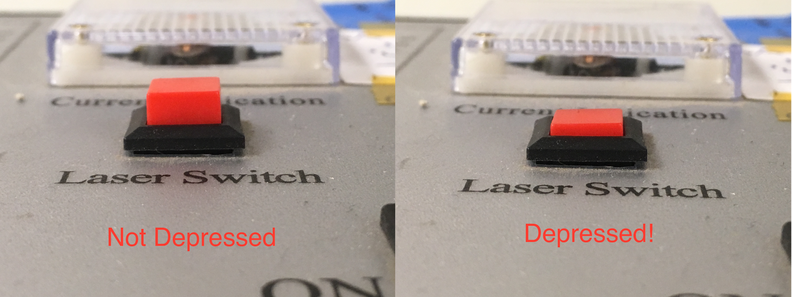
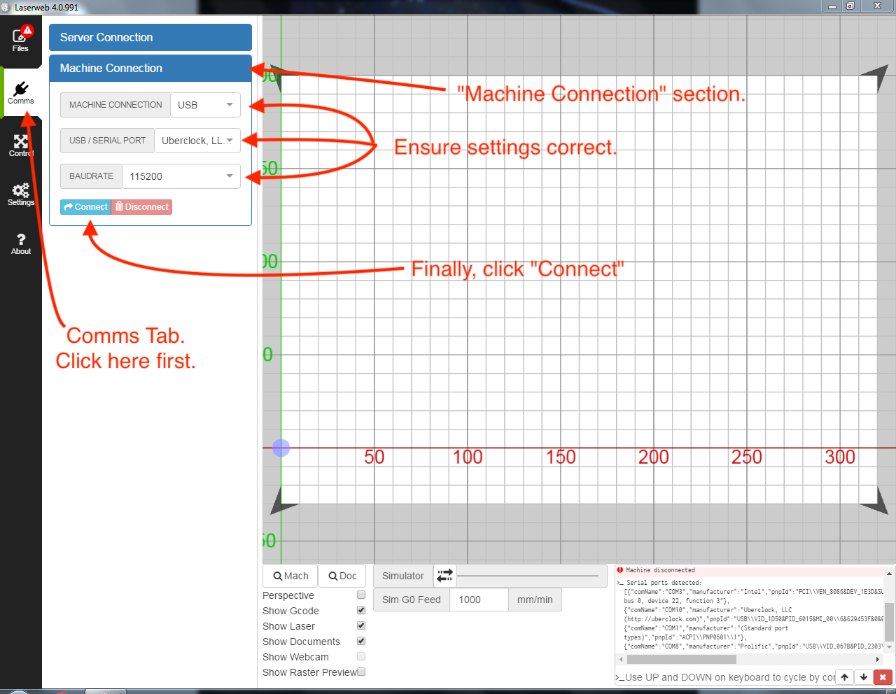

---
title: 'K-40 (Mini Laser) SOP'
...

Before You Start:
=================

Design:
-------

> Designing for a Laser Cutter (link external)

File Prep for KD-40:
--------------------

The KD-40 uses LaserWeb as its control software. Therefore, you will
need to have design files prepared to be interpretable by LaserWeb.
(link external)

Safety & Laser Startup:
=======================

Startup Procedure
-----------------

1.  Ensure CW-3000 Industrial Chiller is turned on and green Normal
    indicator
    lit.{width="4.673611111111111in"
    height="3.5052088801399823in"}

2.  Ensure Hakko Fume Extractor System Model HJ3100 is turned
    on.{width="4.692708880139983in"
    height="3.5168339895013125in"}

3.  Turn on K-40 main power switch
    {width="4.6875in"
    height="3.5156255468066493in"}

4.  Ensure K-40 Laser Switch is depressed. It can be a little hard to
    tell whether this one is depressed or not, but it works like a
    ballpoint pen. Give it a click or two, and you should be able to
    feel the difference. Picture included to
    help.{width="4.77127624671916in"
    height="1.796875546806649in"}

5.  Ensure you are logged into the control computer. Username will be
    eploven and password will be Fire-Hamster (case
    sensitive).{width="5.145833333333333in"
    height="3.8593755468066493in"}

6.  Ensure LaserWeb is open. Double click the shortcut on the control
    computer.{width="5.451403105861767in"
    height="4.359375546806649in"}

7.  Connect LaswerWeb to the machine: Click on Comms on the left side
    and open the Machine Connection tab. Make sure the settings are
    correct (“MACHINE CONNECTION” should be set to USB, “USB / SERIAL
    PORT” should be set to “Uberclock LLC (...) @COM10”, and “BAUDRATE”
    should be set to “115200”. Finally, click the connect
    button.{width="5.057292213473316in"
    height="3.9231200787401574in"}

8.  Now you are ready for material prep.

Material & Machine Prep:
========================

Material Prep
-------------

1.  Ensure the piece of material you want to cut is small enough that
    will fit within the cutter. The maximum size of piece that will fit
    on the toolbed is (35.5cm, 23cm), but, notably, the area actually
    cuttable by the K-40 is only (32cm, 22cm),

2.  Lift the hood of the laser cutter.
    {width="4.909722222222222in"
    height="3.682292213473316in"}

3.  Inside there will likely already be a small piece of cardboard.
    **Leave this in the cutter! Its purpose is to cover a large hole in
    the bottom of the cutting area!**
    {width="5.576388888888889in"
    height="4.182292213473316in"}

4.  Place your material in the cutting area, on top of the preexisting
    cardboard backer if present. It is safe to (gently) move the laser
    head manually if
    necessary.{width="5.506944444444445in"
    height="4.130208880139983in"}

5.  Close the laser cutter
    hood.{width="5.301964129483815in"
    height="3.9739588801399823in"}

6.  You are now ready to calibrate & home the laser cutter.

Calibrating & Homing
--------------------

1.  Firstly, we need to make sure the correct machine profile is loaded
    in LaserWeb. Go to the settings tab, and ensure the Machine Profiles
    section is open. Using the topmost dropdown, select “k40” if it is
    not selected already. Then, click the apply
    button.{width="5.453125546806649in"
    height="3.320813648293963in"}

2.  After you click apply, you’ll need to say “OK” to the popup asking
    you to confirm settings
    overwrite{width="6.5in"
    height="3.9583333333333335in"}

3.  You are now ready to do “Workspace” Prep.

“Workspace” Prep:
=================

What is a workspace in LaserWeb?
--------------------------------

LaserWeb is a strange beast as far as machining software goes!
Operations performed with LaserWeb are organized into a hierarchy of
several layers, the topmost layer being your workspace.

Workspaces are somewhat akin to “jobs.” They describe all of the files
that will be used by your cut, their arrangement on the cutting bed,

Creating a new workspace
------------------------

Importing Files
---------------

 Prepping files to be converted to GCODE
----------------------------------------

KD-40 Material Settings
-----------------------

Generating GCODE
----------------

Job Execution:
==============
