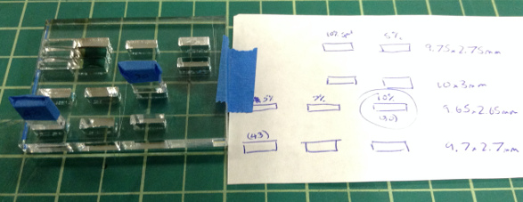

### Partial Cuts

It is possible to cut channels by varying the laser power and focus. 80% power gives v-shaped channel about halfway through 1/8" acrylic when the laser is moved up a little bit from focused.

Several channels were cut in 1/8" acrylic with 59mm, 60mm, and 61mm focus depth, and the approximate depths and widths were measured using calipers. I wouldn't trust these values too far.

Cut Speed | Cut Power | Depth (mm) | Width (mm) | Depth (mm) | Width (mm) | Depth (mm) | Width (mm)
 -------- | --------- | ---------- | ---------- | ---------- | ---------- | ---------- | ---------- 
          |           | 59mm       |            | 60mm       |            | 61mm       |
    80%   |    100%   |   2.26     |   0.50     |    1.73    |   0.44     |    1.82    |   0.62
   100%   |    100%   |   2.13     |   0.50     |    1.50    |   0.42     |    1.71    |   0.60
   100%   |     80%   |   2.05     |   0.50     |    1.25    |   0.42     |    1.51    |   0.60
   100%   |     60%   |   1.71     |   0.47     |    1.11    |   0.35     |    1.22    |   0.58
   100%   |     40%   |   1.47     |   0.45     |    0.70    |   0.33     |    0.92    |   0.56
   100%   |     20%   |   1.13     |   0.42     |    0.56    |   0.27     |    0.75    |   0.53

### Fitted Slots

Sometimes it may be desirable (e.g. for aesthetic reasons) to create parts and slots that fit together snugly without using more robust techniques like T-slots. The laser cutter isn't capable of creating precise square corners, but it can be used to create parts that fit together nicely as long as they don't have to provide very high stability.

Two pieces of 20x10mm 1/8" acrylic were cut at 43% and 30% speed and 100% power. Several test slots were cut into a piece of 1/4" acrylic at different speeds and with different dimensions (see test board), and the 1/8" pieces were inserted to test fit. The test board and 1/8" pieces are above the laser printer. The best fits were achieved with:

1/8" Cut Speed | Slot Dimensions | Slot Cut Speed
-------------- | --------------- | --------------
30%            | 9.65x2.65mm     | 10%
43%            | 9.7x2.7mm       | 5%

The slots cut at speeds slower than 10% tended to display some warping and melting on the bottom side.