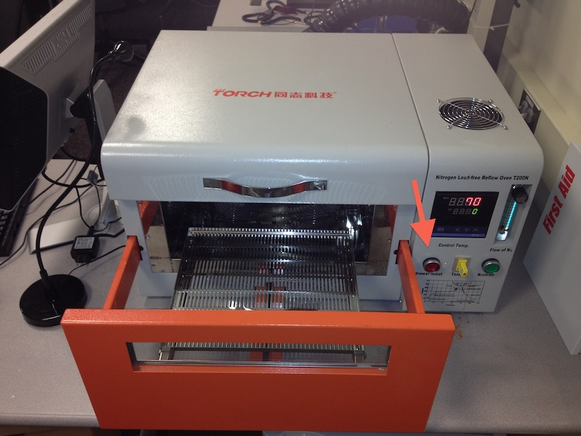

## Torch T200N+ Reflow Oven Standard Operating Procedure

# Reflow overview

1. Turn on oven
1. Launch oven control software ("Reflow Soldering Control System")
1. Login with defaults (type: T200N+; user: TORCH; password: TORCH)
1. Open "Meter Settings" window
1. Load LeadedProfile.html or PbFreeProfile.html using the "open" button on the right side
1. Load the "Parameter Settings" from the oven
  1. Connect to the machine using the "Connect" button on the right side
  1. Hit the "Get" button in the "Control" section on the bottom of the screen.  This will take a few seconds.
  1. Hit the "AutoCount" towards the top of the "Parameter Settings" section
  1. Hit "Save" in the Parameter Settings "Control" section towards the bottom (not the one on the right)
  1. Close the connection to the oven using the "Close COM" button on the right side
1. Close the window using the "OK Return" button on the right side
1. In the pull-down menu in the upper right of the plot area, select "Temerature Curve".
  - This setting cannot be changed once connected to the oven!
  - "Temperature Curve" will plot the oven's temperature sensor.
  - "Actual Curve" will plot the external thermocouple plugged into the front of the oven.
1. Connect to the oven using the "Open COM" button
1. Setup and turn-on the exhaust fan
1. Load your board into the oven
1. Start the reflow cycle using the "Begin Check" button
1. Once the cool-down cycle completes, and the oven temperature has dropped to ~80C, open door and allow to cool down further to ~55C
1. Remove board

# Detailed reflow instructions

1. Turn on oven with switch on the back in the upper right corner 
2. Open oven control software
  1. Start->All Programs -> Reflow Soldering Control System -> Reflow Soldering Control System
  2. Use default login info (type: T200N+; user: TORCH; password: TORCH)
    - 
3. Open the "Meter Settings" using the tool bar button
    - 
4. Load a temperature profile
  1. Open the profile using the "Open" button on the right side
    - 
  2. Select the LeadedProfile.html or PbFreeProfile for leaded or lead-free solder paste reflow, respectively. These files can be found in `C:\Profiles\`
5. Load the "Parameter Settings" from the oven
  1. Connect to the machine using the "Connect" button on the right side
    - 
  2. Hit the "Get" button in the "Control" section on the bottom of the screen.  This will take a few seconds.
    - 
  3. Hit the "AutoCount" towards the top of the "Parameter Settings" section
    - 
  4. Hit "Save" in the Parameter Settings "Control" section towards the bottom (not the one on the right)
    - 
  5. Close the connection to the oven using the "Close COM" button on the right side
    - 
  6. Close the window using the "OK Return" button on the right side
    - 
4. Back in the main window, prepare to reflow
  1. In the pull-down menu in the upper right of the plot area, select "Temerature Curve".
    - 
    - This setting cannot be changed once connected to the oven!
    - "Temperature Curve" will plot the oven's temperature sensor.
    - "Actual Curve" will plot the external thermocouple plugged into the front of the oven.  This thermocouple can be taped to your board using kapton tape to measure the actual board temperature during reflow.  If done, make sure the thermal couple wire does not get pinched in the door slides.
  2. Connect to the oven using the "Open COM" button in the upper left
    - 
5. Setup the exhaust fan
  1. Position the right-side solder-bench exhaust fan flexi-tube over the oven's exhaust port (back side of the oven, lower center)
    - 
  2. Turn on the exhaust fan using the switch on the lower left side of the white box under the solder bench
    - 
6. Load your board into the oven
  1. Push the red "Drawer in/out" button on the oven
    - 
  2. Arrange your board(s) in the center of the oven tray.  If you are doing a 2nd-side reflow (solder already on the bottom), be sure to stand your board off the tray using scrap PCB pieces, or other temperature safe standoffs.
  3. Push the red "Drawer in/out" button again to close the door.  Beware the finger crusher!  There is no safety mechanism to stop the drawer from closing if it encounters an obstacle, and the motor is quite powerful.  If necessary, push the red "Drawer in/out" button with remaining good hand to reverse the closing.
7. Start the reflow cycle
  1. Push the "Begin Check" button on the toolbar in the main window.  If a pop-up fails to appear, try pushing and holding the "Begin Check" button for a second.
    - 
  2. Verify the peak temperature in the pop-up is correct for your chosen profile (250C for leaded; 260C for PbFree) and hit OK if correct.
    - 
    - If not, try canceling, and redo the "Begin Check".
    - If still not right, try opening the the "Meter Setting" window, verify the max temperature in the profile is correct, hit "Save" in the "Control" section at the bottom of the window, and close the window using the "OK Return" button.
  3. Verify the temperature displayed on the oven (red, upper number) is climbing.
    - 
    - If not, try canceling, and redo the "Begin Check".
  4. The plot in the main window should also show the temperature increase, provided "Temperature Curve" was selected in the pull-down menu in the upper right of the plot area prior to connecting to the oven.
    - 
  5. The reflow cycle has begun and the oven will beep for a few seconds once peak temperature has been reached.
    - 
8. Completing the reflow cycle.
  1. After peak temperature is reached and the alarm sounds, wait until the oven has cooled back down until ~80C
  2. Open the oven door using the red "Drawer in/out" button
  3. Allow the board to cool off a bit more until it is cool enough to touch (~55C)
  4. Remove board
9. Repeat from step 6 to reflow another board, or shut down the machine
  1. Close the oven door
  2. Close the connection to the machine using the "CloseCOM" button in the top toolbar
    - 
  3. Close the software
  4. Switch off the machine
  5. Switch off the exhaust fan
