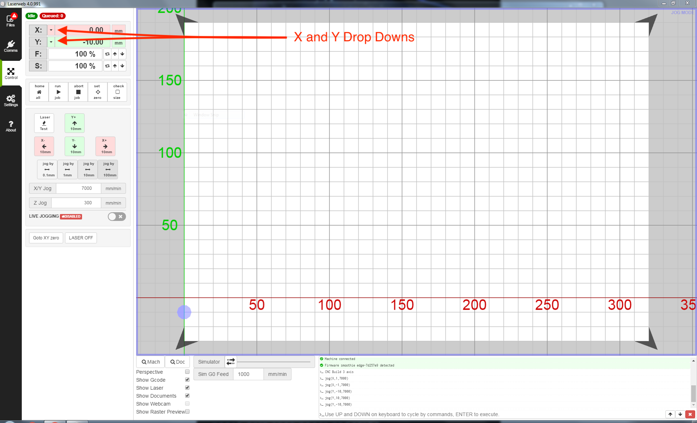
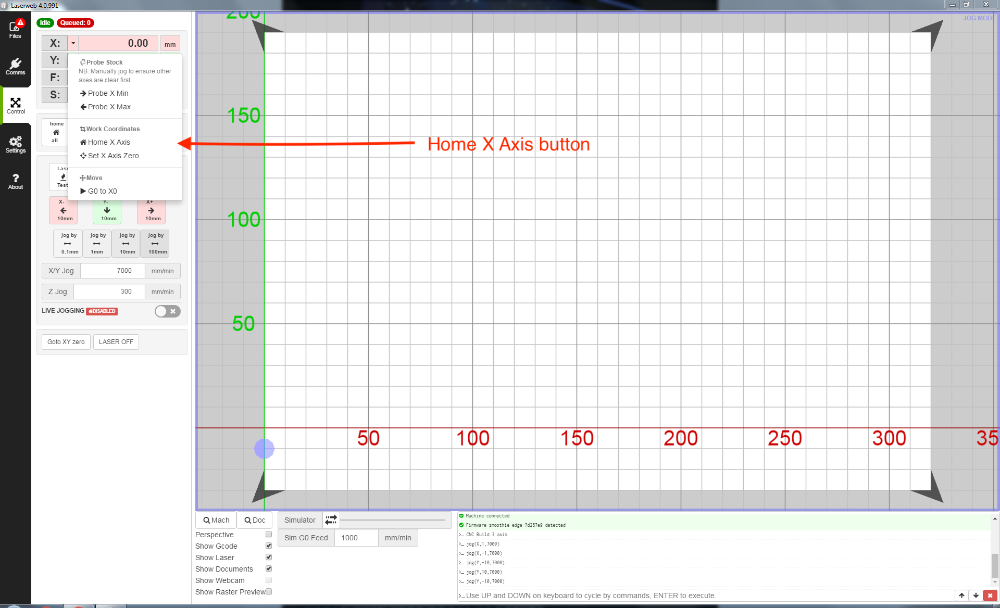
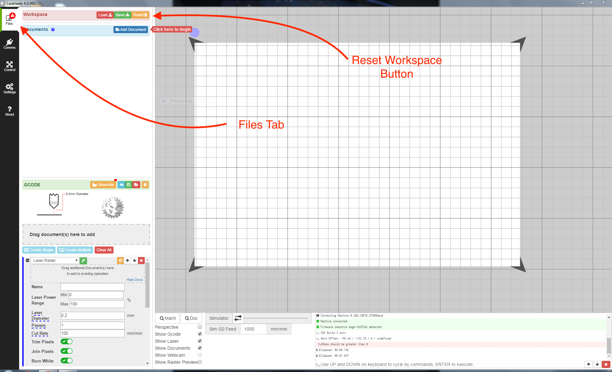
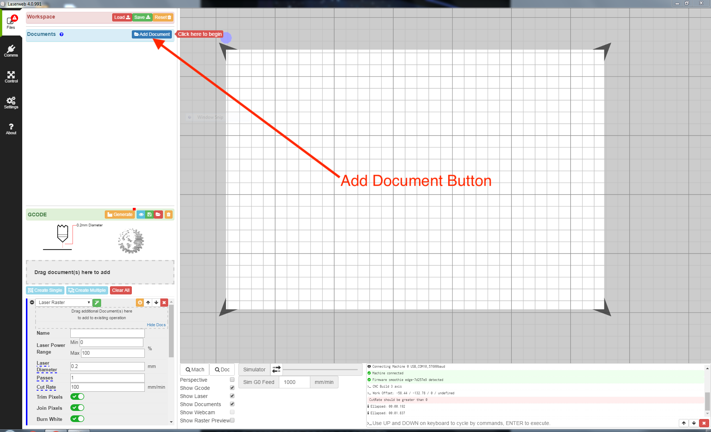
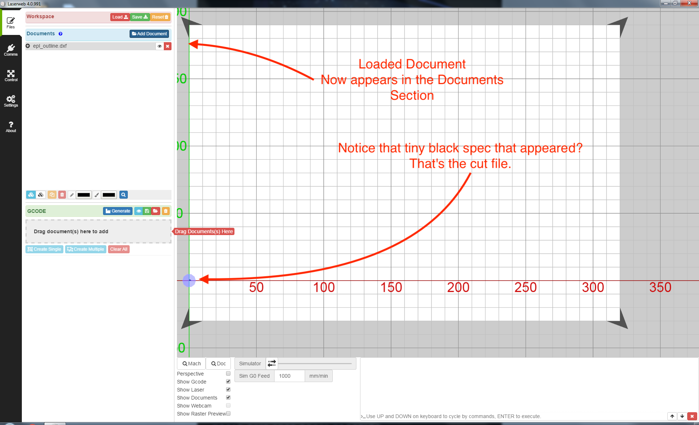
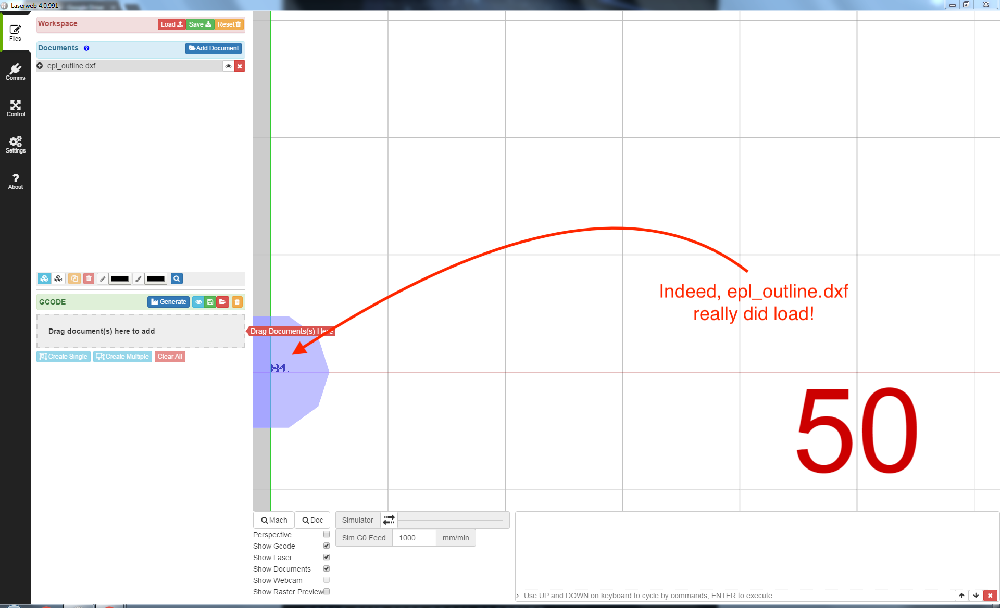
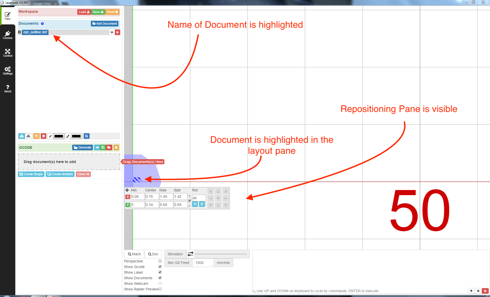
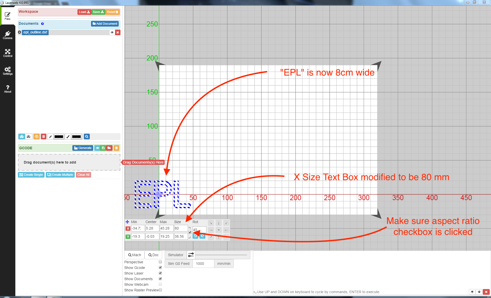
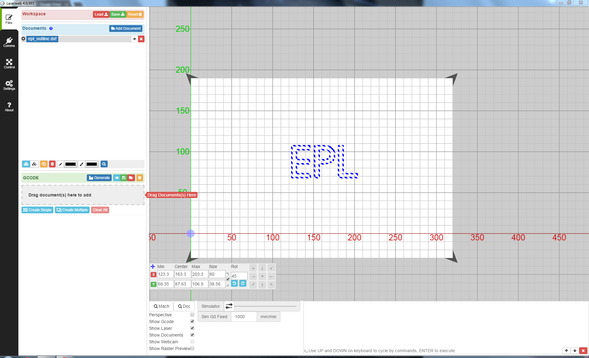

# K-40 (Mini Laser) SOP

## Useful Links
[How-To-Laser-Cut-a-Stencil](How-To-Laser-Cut-a-Stencil)  
[K-40manual](K-40manual.pdf)  
[Make-a-Stencil](Make-a-Stencil)  

## Before You Start:

This laser is primarily used to cut solder stencils to apply solder paste to routed or printed boards for use with surface mount components and the reflow oven.

If you have a board designed in EagleCAD that you would like to create a solder stencil for, follow the instructions below.

### Exporting from EAGLE
1. Download [cream-dxf.ulp](https://github.com/SWITCHSCIENCE/ssci-eagle-public/raw/master/cream-dxf.ulp) to your EAGLE ulp folder.
2. Open the board file in Eagle.
3. Type "run cream-dxf.ulp" into the command line.
4. Apply the following settings:
    * Uncheck "Cut two times..."
    * Leave "Cut off corners..." unchecked.
    * Leave shrink width at 0.05 mm, or alter if you would like.
5. Click Run.

This will generate *filename-tcream.dxf* and *filename-bcream.dxf* files in the folder containing your board (.brd) file. These can be imported either to LaserWeb for this laser, or to RDWorks for the big laser.

### Other Designs

The KD-40 uses LaserWeb as its control software. LaserWeb only sometimes takes DXFs if they are in R12 format which is an older format that most vector graphics software can no longer export. It is recommended to use .svg files which can be produced by most vector graphics software such as Adobe Illustrator or Inkscape.

## Safety & Laser Startup

### Startup Procedure

1.  Ensure CW-3000 Industrial Chiller is turned on and green Normal indicator lit.  
    {:width="600px"}

2.  Ensure Hakko Fume Extractor System Model HJ3100 is turned on.  
    {:width="600px"}

3.  Turn on K-40 main power switch  
    {:width="600px"}

4.  Ensure K-40 Laser Switch is depressed. It can be a little hard to
    tell whether this one is depressed or not, but it works like a
    ballpoint pen. Give it a click or two, and you should be able to
    feel the difference. Picture included to help.  
    {:width="600px"}

5.  Ensure you are logged into the control computer. Username will be
    eploven and password will be Fire-Hamster (case sensitive).  
    {:width="600px"}

6.  Ensure LaserWeb is open. Double click the shortcut on the control computer.  
    {:width="600px"}

7.  Connect LaswerWeb to the machine: Click on Comms on the left side
    and open the Machine Connection tab. Make sure the settings are
    correct (“MACHINE CONNECTION” should be set to USB, “USB / SERIAL
    PORT” should be set to “Uberclock LLC (...) @COM10”, and “BAUDRATE”
    should be set to “115200”. Finally, click the connect button.  
    {:width="600px"}

8.  Now you are ready for material prep.

## Material & Machine Prep

### Material Prep

1.  Ensure the piece of material you want to cut is small enough that
    will fit within the cutter. The maximum size of piece that will fit
    on the toolbed is (35.5cm, 23cm), but, notably, the area actually
    cuttable by the K-40 is only (32cm, 22cm),

2.  Lift the hood of the laser cutter.  
    {:width="600px"}

3.  Inside there will likely already be a small piece of cardboard.
    **Leave this in the cutter! Its purpose is to cover a large hole in the bottom of the cutting area!**  
    {:width="600px"}

4.  Place your material in the cutting area, on top of the preexisting cardboard backer if present. 
    It is safe to (gently) move the laser head manually if necessary.  
    {:width="600px"}

5.  Close the laser cutter hood.  
    {:width="600px"}

6.  You are now ready to calibrate & home the laser cutter.

### Calibrating & Homing

1.  Firstly, we need to make sure the correct machine profile is loaded
    in LaserWeb. Go to the settings tab, and ensure the Machine Profiles
    section is open. Using the topmost dropdown, select “k40” if it is
    not selected already. Then, click the apply
    button.  
    {:width="600px"}

2.  After you click apply, you’ll need to say “OK” to the popup asking
    you to confirm settings
    overwrite  
    {:width="600px"}

3.  Now, we can home the cutter. Go to the Control tab. This interface lets you do three important things:
	
	* Manually control the laser head
	
	* Initiate your cut
	
	* Home the laser head
	
	We will be doing the lattermost of these. 
	
	You will notice an X and Y dropdown in the upper left:
	
	{:width="600px"}

4.  Click the X drop down and click “Set X Axis Zero”

	{:width="600px"}

5.  Do the same for the Y Axis. (Please note! The Home All button does not work! Don’t try to use it. Home X and Y separately as instructed above instead)

6.  You are now ready to do “Workspace” Prep.

## “Workspace” Prep
Before we continue, here is some info about how LaserWeb works:

### What is a workspace in LaserWeb?
LaserWeb is a strange beast as far as machining software goes. Operations performed with LaserWeb are organized into a hierarchy of several layers, the topmost layer being your workspace.

Workspaces are best thought of as “job-design” files. They describe all of the source documents that will be used by your cut, their arrangement on the cutting bed, which documents are to be cut, and the settings that will be used to generate g-code for them. If you load a completed workspace, you only need to connect to and calibrate the machine (including loading its profile), generate g-code, and then you can run the job. Everything else is saved.

### What is the LaserWeb workflow?
#### 1) Documents
Inside your workspace are a number of what are called “documents.” A document is just a source file that contains cutting or rastering geometry.

Documents can be of one of two types: line, and raster:
Line filetypes describe, you guessed it, a series of lines to be cut.
Raster filetypes are an image that is to be “rastered” pixel-by-pixel, line by line onto the material. You can think of it like you’re dot-matrix-printing onto the material using a high-power laser beam, and indeed, I myself have used used this laser cutter for the sole purpose of printing diagrams onto paper precisely before.

When you add a line document to a workspace, all of the line segments get added separately to the workspace. You can manipulate teach line segment separately, or select all of the lines as a whole and rotate/scale them simultaneously. We will be doing the latter in this SOP.

Raster documents, on the other hand, behave pretty much like images in a graphics program. You can rotate, scale, position them, but not much else.
All document modifications are saved as part of the workspace.

#### 2) GCODE Queue
Once you have all of your documents in your workspace and have them positioned, you must add them to the GCODE Queue in order for them to be cut (this is done by drag and drop, instructions come later). Once documents are in the GCODE Queue, you can select all manner of settings regarding how they are to be cut, including pass count and cut rate. These settings are saved as part of the workspace. You can save/load gcod to/from separate files, however.

#### 3) GCODE Generation
Once all the settings are entered, you must tell LaserWeb to generate GCODE. This generated GCODE serves as instructions for the laser cutter. These instructions are not saved as part of the workspace. They will be automatically sent to the control section for you to run at will once generated.

#### 4) Run job!
Once GCODE is generated, you can run the job.

### Creating a new workspace:
Now that you have been introduced to the nuances of LaserWeb, we can return to our job. Start by navigating to the Files tab -- this is where all of the workspace controls live. Once you are there, click Reset to create a brand new Workspace.

{:width="600px"}

### Importing Documents

1.	Now that you have a fresh workspace you can import your documents. Do so by clicking the “Add Documents” button in the Documents section. In the resultant file dialog, select your cutting or rastering files and click Open.

	{:width="600px"}

	Supported Cut File Types: .svg, .dxf;
	
	Supported Raster File Types: .png, .jpg, .jpeg, .bmp;
	
	(Advanced: Supported Machine Code File Types:.gcode, .g, .gc, .nc, .tap)

3.  Now that you have added a document, you will see something akin to the following: 

	{:width="600px"}
	
4.  You should take note of two things:
	
	*  The name of the file you opened is now in the Documents section on the left.
	
	*  Your document should now be displayed in the layout pane, even if it doesn’t seem like it at first.
	
	For instance, in the above example, epl_outline.dxf opened as a tiny little speck! Zooming in, we see:
	
	{:width="600px"}

6.  Look at that! That’s downright tiny! That simply won’t do. We’ll fix that in the next step.

### Positioning (and resizing) Documents

Now that we’ve loaded in our documents, it is time to size and position them as we like.

1.  Start by clicking on the name (text!) of the document you want to modify in the Documents tab. This will select the document. In the layout pane. If you succeed, you should see this:
	
	{:width="600px"}
	
	Notice that:

	* The name of the document you selected is highlighted
	
	* The document is highlighted in the layout pane
	
	* Most importantly, the repositioning pane has appeared.
	
2.  We will continue by resizing our cut to the correct size. I will ensure the check box is checked to preserve aspect ratio, and then type in a new value for size x to change the change the width to 80mm. The result is: 

	{:width="600px"}

3.  Finally, by clicking and dragging on any portion of the blue/white highlighted outline, you can drag the entire document to the center of the layout pane (or to wherever you want the cut to occur within the cutting bed) The result:
	
	{:width="600px"}

### Adding Documents to the GCODE Queue
Now that we have imported and arranged our documents, it is time to generate GCODE for them. GCODE is essentially just a bunch of actual machine instructions to be sent to the cutter. It describes the actual path the laser will take.

### Configuring GCODE Settings

### Good settings on k-40 for various materials

### Generating GCODE

## Job Execution
