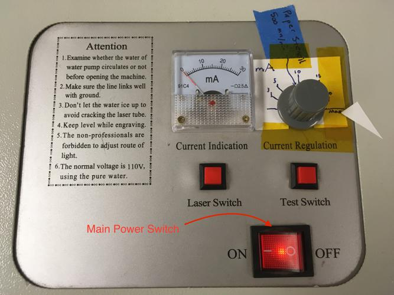
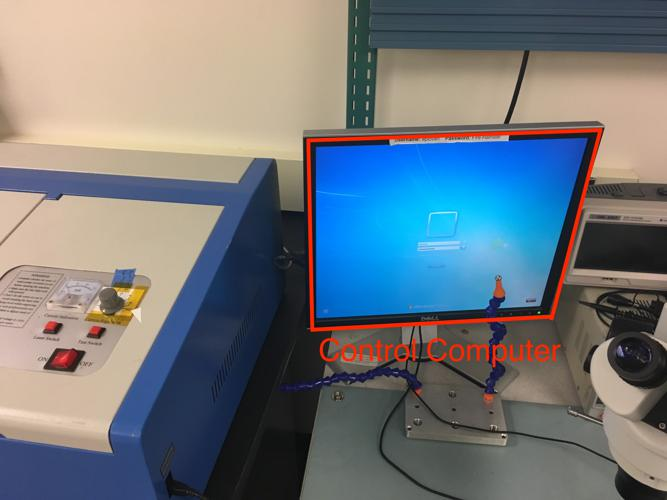
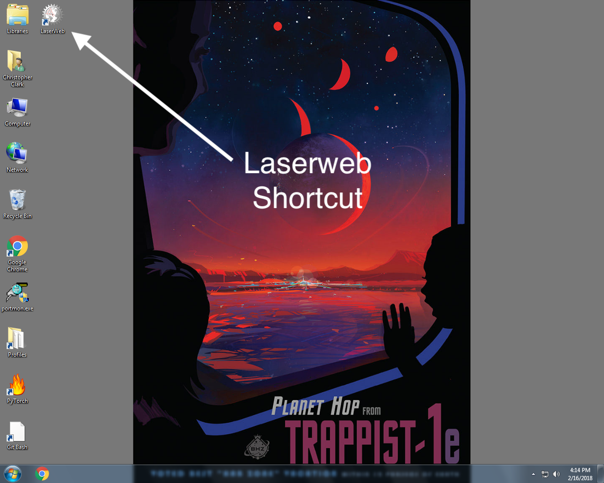
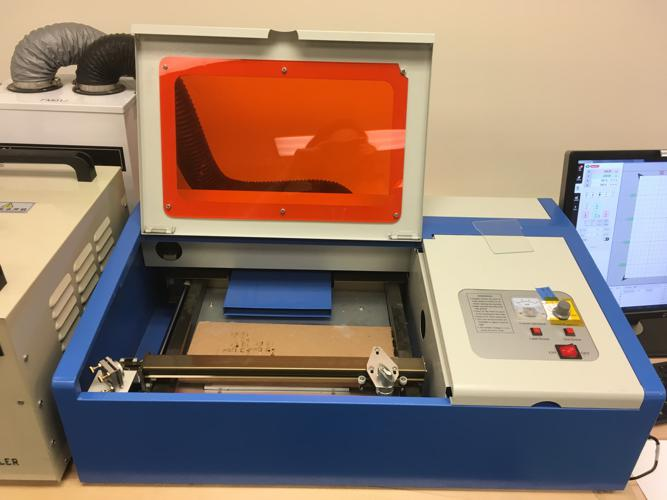
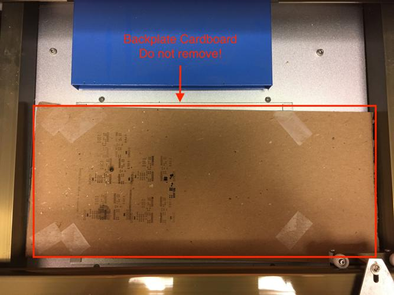
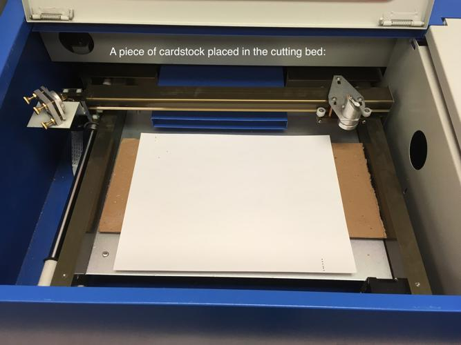
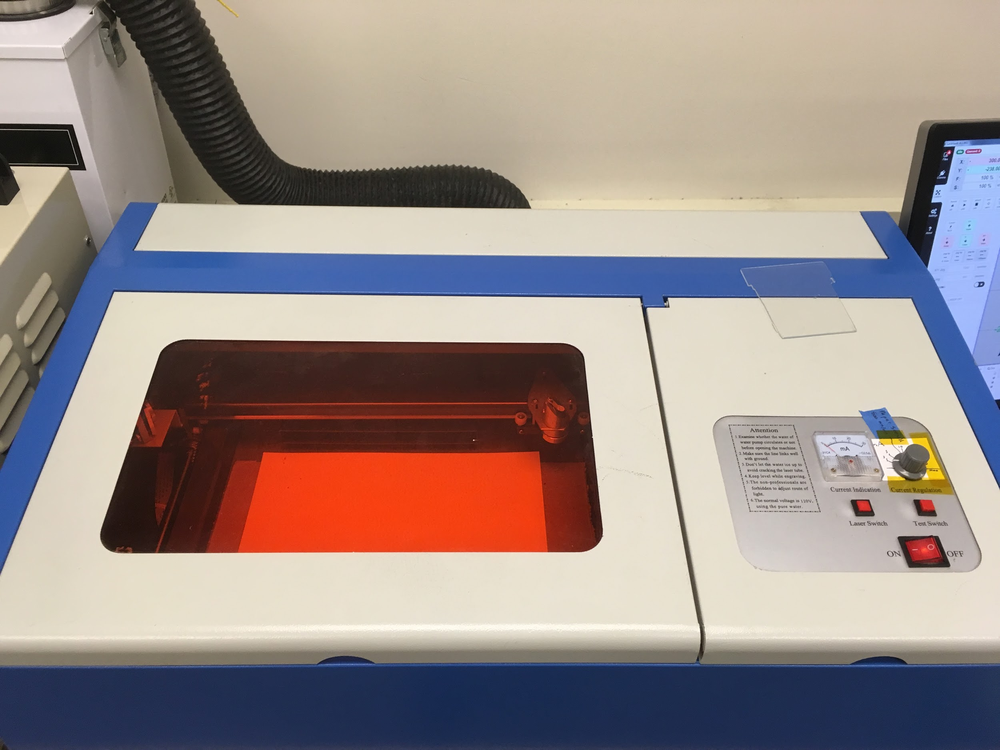

# K-40 (Mini Laser) SOP

## Useful Links
[How-To-Laser-Cut-a-Stencil](How-To-Laser-Cut-a-Stencil)  
[K-40manual](K-40manual.pdf)  
[Make-a-Stencil](Make-a-Stencil)  

## Before You Start:

This laser is primarily used to cut solder stencils to apply solder paste to routed or printed boards for use with surface mount components and the reflow oven.

If you have a board designed in EagleCAD that you would like to create a solder stencil for, follow the instructions below.

### Exporting from EAGLE
1. Download [cream-dxf.ulp](https://github.com/SWITCHSCIENCE/ssci-eagle-public/raw/master/cream-dxf.ulp) to your EAGLE ulp folder.
2. Open the board file in Eagle.
3. Type "run cream-dxf.ulp" into the command line.
4. Apply the following settings:
    * Uncheck "Cut two times..."
    * Leave "Cut off corners..." unchecked.
    * Leave shrink width at 0.05 mm, or alter if you would like.
5. Click Run.

This will generate *filename-tcream.dxf* and *filename-bcream.dxf* files in the folder containing your board (.brd) file. These can be imported either to LaserWeb for this laser, or to RDWorks for the big laser.

### Other Designs

The KD-40 uses LaserWeb as its control software. LaserWeb only sometimes takes DXFs if they are in R12 format which is an older format that most vector graphics software can no longer export. It is recommended to use .svg files which can be produced by most vector graphics software such as Adobe Illustrator or Inkscape.

## Safety & Laser Startup

### Startup Procedure

1.  Ensure CW-3000 Industrial Chiller is turned on and green Normal indicator lit.  
    {:width="600px"}

2.  Ensure Hakko Fume Extractor System Model HJ3100 is turned on.  
    {:width="600px"}

3.  Turn on K-40 main power switch  
    {:width="600px"}

4.  Ensure K-40 Laser Switch is depressed. It can be a little hard to
    tell whether this one is depressed or not, but it works like a
    ballpoint pen. Give it a click or two, and you should be able to
    feel the difference. Picture included to help.  
    {:width="600px"}

5.  Ensure you are logged into the control computer. Username will be
    eploven and password will be Fire-Hamster (case sensitive).  
    {:width="600px"}

6.  Ensure LaserWeb is open. Double click the shortcut on the control computer.  
    {:width="600px"}

7.  Connect LaswerWeb to the machine: Click on Comms on the left side
    and open the Machine Connection tab. Make sure the settings are
    correct (“MACHINE CONNECTION” should be set to USB, “USB / SERIAL
    PORT” should be set to “Uberclock LLC (...) @COM10”, and “BAUDRATE”
    should be set to “115200”. Finally, click the connect button.  
    {:width="600px"}

8.  Now you are ready for material prep.

## Material & Machine Prep

### Material Prep

1.  Ensure the piece of material you want to cut is small enough that
    will fit within the cutter. The maximum size of piece that will fit
    on the toolbed is (35.5cm, 23cm), but, notably, the area actually
    cuttable by the K-40 is only (32cm, 22cm),

2.  Lift the hood of the laser cutter.  
    {:width="600px"}

3.  Inside there will likely already be a small piece of cardboard.
    **Leave this in the cutter! Its purpose is to cover a large hole in the bottom of the cutting area!**  
    {:width="600px"}

4.  Place your material in the cutting area, on top of the preexisting cardboard backer if present. 
    It is safe to (gently) move the laser head manually if necessary.  
    {:width="600px"}

5.  Close the laser cutter hood.  
    {:width="600px"}

6.  You are now ready to calibrate & home the laser cutter.

### Calibrating & Homing

1.  Firstly, we need to make sure the correct machine profile is loaded
    in LaserWeb. Go to the settings tab, and ensure the Machine Profiles
    section is open. Using the topmost dropdown, select “k40” if it is
    not selected already. Then, click the apply
    button.  
    {:width="600px"}

2.  After you click apply, you’ll need to say “OK” to the popup asking
    you to confirm settings
    overwrite  
    {:width="600px"}

3.  You are now ready to do “Workspace” Prep.

## “Workspace” Prep

### What is a workspace in LaserWeb?

LaserWeb is a strange beast as far as machining software goes!
Operations performed with LaserWeb are organized into a hierarchy of
several layers, the topmost layer being your workspace.

Workspaces are somewhat akin to “jobs.” They describe all of the files
that will be used by your cut, their arrangement on the cutting bed,

### Creating a new workspace

### Importing Files

### Prepping files to be converted to GCODE

### KD-40 Material Settings

### Generating GCODE

## Job Execution
