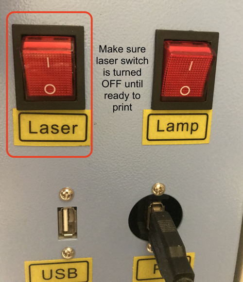
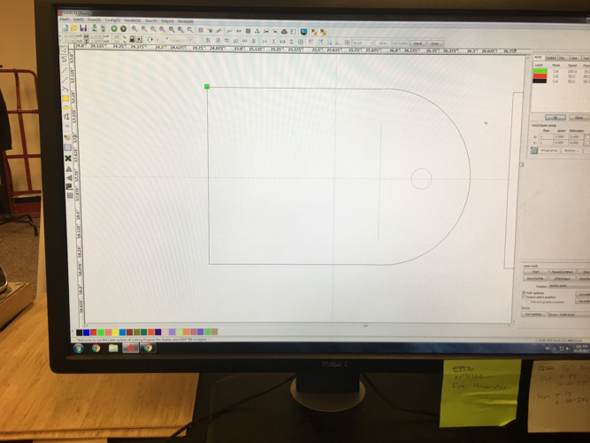
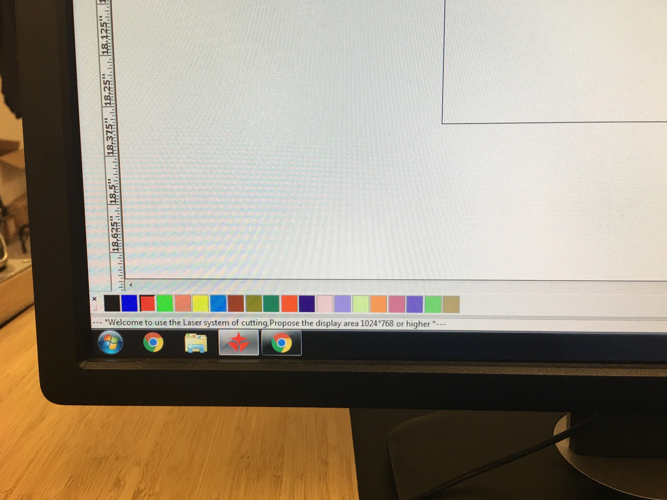
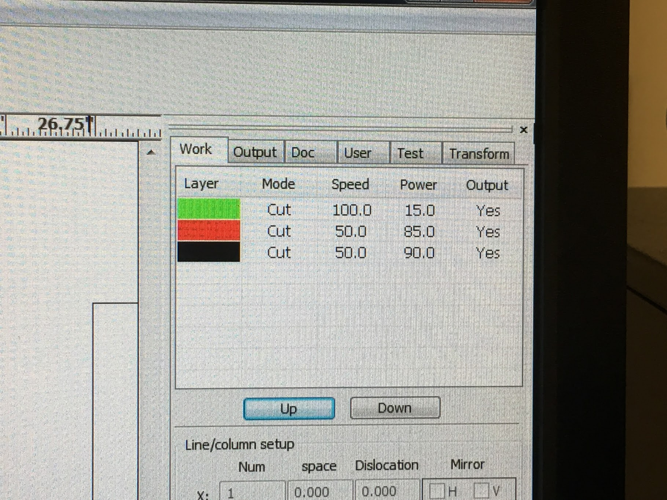
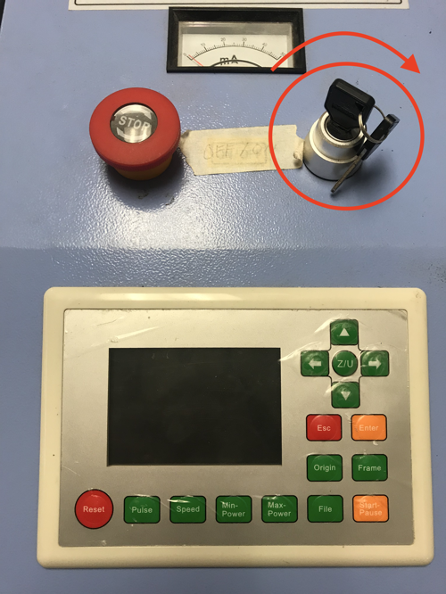
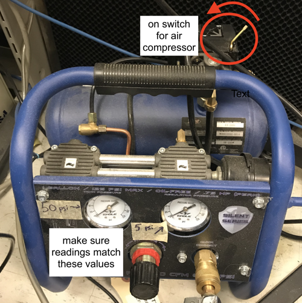
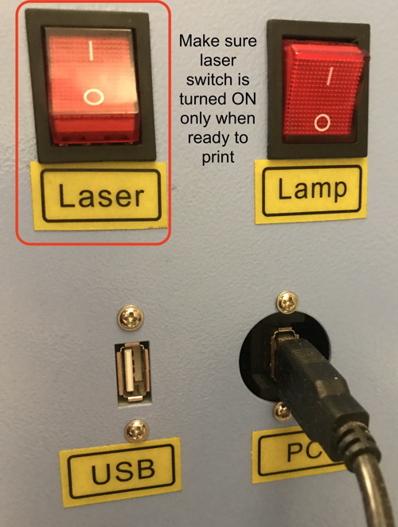


# Global TODOs 
- [X] Resize the images to something that's sane for the web.
- [X] Rename the images to something descriptive.
- [X] Rearrange the secions. (see comment below)
- [ ] Add moar pix.
    - [ ] laser safety goggles.
    - [ ] Burned retina.
    - [ ] new filter
    - [ ] green box in software
    - [ ] what cutting, engraving, and rastering look like


## Table of Contents
{:.no_toc}
* ToC
{:toc}

# About This Machine

## 

TODO: 
- [ ] Find out the nominal power output. 
- [ ] Get the bed dimensions.


This machine is for cutting detailed, two-dimensional geometry into large, flat materials.
It's ideal for making boxes, enclosures, and control panels! 

This is much faster than 3D printing.
It's also capable of producing much larger, stronger, cheaper, and more accurate parts.
Of course, this comes at the cost of stronger design-for-manufacturing constraints. 
(Your parts have to be 2D sheets/plates.)

## Materials
Ask a manager if you would like to cut any materials that don't appear on either of these lists.  
**DO NOT CUT ANY UNAPPROVED MATERIALS AS THEY CAN RELEASE TOXIC FUMES**

### Pre-Approved
These materials are fine to use.
A mystery material that looks like one of these does not count!
For example, people often confuse polycarbonate and acrylic. 

{:class="table table-striped"}
| Material        | Minimum Thickness   | Maximum Thickness     |
| --------        | -----------------   | -----------------     |
| Acrylic         | 1/16 in             | 1/4 in                |
| Bamboo          | 1/32 in             | 1/4 in                |
| Cardboard       | 1/32 in             | 1/4 in                |
| Masking Tape    | 1 layer             | 2 layers              |
| Paper (Printer) | 1 sheet (held down) | 10 sheets (held down) |
| Poster Board    | normal              | normal                |
| Wood (General)  | 1/8 in              | 1/4 in                |
| Wood (Ply)      | 1/8 in              | 1/8 in                |

### Banned
It's never okay to cut these materials on the laser.

{:class="table table-striped"}
| Material                               | Problem
| --------                               | -------
| PVC (Polyvinylchloride)                | toxic, corrosive gas
| ABS (Acrylonitrile Butadiene Styrene)  | toxic gas
| Teflon, PTFE (Polytetrafluoroethylene) | toxic, corrosive gas
| Vinyl                                  | toxic, corrosive gas
| PC (Polycarbonate)                     | self-sustaining fire
| PE, HDPE, LDPE (Polyethylene)          | melts and splatters
| Artificial Leather, Pleather           | usually contains PVC
| Architectural Modelling Board          | because
| Anything containing chlorine           | toxic, corrosive gas
| Anything containing fluorine           | toxic, corrosive gas
| Metals                                 | reflective
| Glass                                  | reflective

## Useful Links
- [Manufacturer's website][OEM]
- [Maker Case][makercase] and [Make a Box][makeabox] will generate great lase-able boxes for the mechanically challenged. 

## Machine Safety
* **Make sure the fire extinguisher is nearby.**
* IR beams are invisible but very damaging. Never run the laser with hood up, and always wear eye protection.
	* The orange glasses will help protect from indirect reflections from the laser, but will **NOT** protect from direct exposure. to the laser. 
	* Orange glasses are located in the large red tool box.
* It's good practice to keep the IR laser switched **OFF** (downward "0" position) until you are sure you are ready for cutting.
  The switch should not glow when the laser is disabled.
  

### Dangers

#### Fire

#### Lazor Beemz

#### High Voltage

#### Toxicity

### Contingencies

#### Fire
If there is a _sustained_ fire in the chamber:
- Hit the E-Stop button.
- Leave the hood closed.
- Get a manager to help immediately.
- Managers:
    - Fetch the fire extinguisher.
    - If the fire does not put itself out:
        - Disconnect the air compressor. (Don't just turn it off.)
        - Turn off the air filter.
        - If the fire still does not go out:
            - Open the hood. 
            - Immediately spray the fire with the fire extinguisher.
            - Immediately close the hood.
            - Contact campus safety: {{ site.data.phones.safety_emergency.number }}.
                - They can also be reached via the lab's landline at {{ site.data.phones.safety_landline.number }}.
            - Evacuate the EPL.
            - If the fire is still going:
                - Pull the fire alarm.

Note that flammable gasses will occaisonally get stuck within the honeycomb grid under the material being cut.
These can create momentary flames under the material.
This is especially noticable with acrylic.
This is normal and not a concern. 

#### Crashes
If the cutting head or the gantry crash into anything, immediately hit the E-Stop button and get a manager.

#### Emissions
If you see smoke building up inside the chamber, smell/see smoke leaving the chamber, or notice a strong chemical smell:
- Pause your job.
- Disable the laser, using the "Laser" switch on the right.
- Ask a manager to verify that the air filter system is working.

## How to Get Help

# Using This Machine
Here are the basics of operating this machine.

## Cut Geometry
This laser cutter will work with [vector files][vector], like DXF, for cutting, engraving, and rastering. 
Images, like JPG and PNG, can only be [rastered][raster].

### Exporting Your Geometry
If you just need a box/enclosure: 
- Go to [Maker Case][makercase]. 
- Choose your desired dimensions.
- Select finger style joining.
- If you want a tight/friction fit, select 0.010 inch kerf.
    - This can be fine-tuned to your material, but 0.010" is probably fine.
- Download a DXF.

* CAD Programs and DXF files:
	* Solidworks:
		* Open the *part* you wish to cut
		* Change the measurement system to \'mmgs\' (bottom right corner) and ensure your part has the correct dimensions in millimeters. (25.4mm/inch)
			* The main reason for bad DXF files from SolidWorks is using a different measurement system such as IPS(Inch, pound, second) or MKS(Meter, kilogram, second). Use your desired system to design the part but switch to mmgs afterwards to create the DXF file.
		* Right click the desired face you wish to create a pattern from and select "export DXF/DWG"
		* Complete the following prompts to save the file.

### Importing Your Geometry
1. Login to the computer next to the laser cutter.
1. Open RDWorks.
1. Import the file you wish to work with.
    - Click File -> Import
        - You can import most vector files and images, but a safe bet is to use DXF vector files.  
           This image doesn't seem to clarify anything.
1. Check your job.
    - There are several issues that can happen upon importing a vector image.
		- If the vectors are messed up, in which case you will have to manually edit your job by clicking "Edit Nodes", and adding nodes to the parts you want to remove, or move. It takes practice.
        - Your vector image is scaled way too small. 
           Select your vector shapes, and check the width and length in the 
           upper left corner (not the x and y values, that is the position of your piece). 
           The program has a tendency to take inch dimensions and just turn 
           them into millimeters (not convert, just changes it, ex. 6 inches becomes 6 mm). 
           To fix this, you should export your vector file in millimeters. 
           Alternatively, you can fix this by highlighting all of your shapes, 
           and converting your dimensions in inches into millimeters 
           (multiply each dimension by 25.4) and entering that in for the 
           height and width. 

## Safety Checks

## Power and Speed Settings
Image files (.jpg, .png, etc.) will **always** raster, meaning it will not cut. 
It will just etch the image onto the material. 
If you want to cut, you need to add vector curves.
These can be imported from other software or added directly in RDWorks.

Different materials and thicknesses will require different laser powers or speeds to cut through the material.

In the upper right hand corner of RDWorks you should see a small window that will probably have a single black block followed by cut and speed settings. It is possible to use different cuts and speeds for different parts of your job by using different "colors" to identify different layers on your piece.

1. Click on the vector you wish to edit the cut settings for.  
   This image does not clarify anything.
1. Click on one of the colors at the bottom of the software to change it. The shape should change to that color and a new color and item should appear in your layer window in the upper right hand window.
    - Note that the color only identifies the layer of the vector. 
      Any vector you change to this color will have those cut settings.  
      
1. Double click on the layer you wish to edit in the upper right-hand window.  
   
1. In the dialog box that pops up, edit the speed of laser to your desired settings.
1. Edit the minimum and maximum power of the laser to your desired settings.
    - Usually you will just make the minimum and the maximum the same.
    - Sometimes it gives you the option to change two power settings. Just uncheck one of them.
1. You can change the cut type from cut (will just use the laser to etch the lines on your vector) to scan (will use the laser to ‘fill’ in your vector shape--usually used to etch opaque shapes)
    - Note: Scanning large images can take a very long time as opposed to cutting. 
      If you can cut instead of scan, please do so. 
      Also make sure you are using much lower power settings and higher speed settings for scanning.

Alternatively, if you just want to use the same cut settings throughout your job, just change the single black layer that is there by default and directly edit the settings there.

### Determining Settings
It's strongly recommended that you perform some test cuts to ensure you'll get usable, desirable results.
See the [Test Cuts](test-cuts) section for more information.
Usually, three to six small circles are all that's needed to find acceptable settings.
You shouldn't need to do large arrays of test cuts like the examples below.
Below you can find some examples of cuts made in common materials.

#### 1/16" Clear Acrylic

#### 1/16" Bamboo

## Aligning and Testing
1. When you think your job is ready in RDWorks, open the hood (make sure the IR laser switch is **still** OFF) and place your material under the laser head.
    1. __The green square in RDWorks corresponds to wherever the cut head is when you start your job.__ This means that the laser-bed-sized page in RDWorks _does not_ correspond to where your cuts will occur! The green square is all that maters. It will usually be positioned to the upper left of your piece. So, you usually want to place your material down so the laser head is directly above the upper left of your material.
    TODO: add a picture of the green box.
    1. You will need to focus the laser for your material using the focusing tool by placing it on top of your material, and using the top adjustment grip on the laser head to loosen it and slide the entire laser head so that the tip of the laser rests slightly on the top of the focusing tool. Gently tighten the adjustment grip and remove the focusing tool before closing the hood.)
1. Adjust the lens height so the bottom edge of the purple tape is 2 in. from the surface of the material to cut.
    1. *Note: Be careful to not over-tighten the focusing knob!*  
       
1. Close the hood, and click "Start" in the laser control on RDWorks.
    1. Since the IR laser shouldn’t be on yet, it will not burn your piece. This is just to make sure that the laser will stay on your piece and not cut off of it (which may damage the laser bed).  
      
1. Once you are sure that the laser will stay on your piece, proceed to the next step.

## Turn Everything On

#### Chiller On
- Turn on the water chiller to the right of the laser.  
  **This step is important so the laser doesn’t overheat!**
    - It may sound an alarm for a few seconds but it should go away quickly.  
      

#### Controller On
- Turn the key on the top of the laser to the on position.  
  

#### Filter On
1. Before turning on the beam for cutting, turn on the air filter to the left of the laser. The switch is behind it.
   TODO: Replace this with an up-do-date image.

#### Air On
1. Then turn on the green air compressor to the right of the machine by pushing the red switch into the down position.
    - Air should be flowing out of the laser head continuously at this point. If it is not, check that the handle on the valve is zip-tied into the on position.
    - The air pressure in the line should be around 10 psi. Adjust the pressure using the knob to the right of the switch and read the pressure off of the right gauge.
    - Double check that a _gentle_ stream of air is leaving the end of the lens assembly. 
        - If it isn't, make sure the valve on the blue air line leading to the laser is open.  
          

## Operation

### Pre-Cut Checklist
- __Do not proceed unless:__
    1. You've fully read and fully understood this SOP from start to finish.
    1. You've been trained by an EPL manager on *this particular* machine.
    1. You've been approved by an EPL manager to use *this particular* machine.
    1. You know where the fire extinguisher is.
    1. All of the side panels and the hood are closed.
    1. You and anyone else monitoring the job are wearing orange IR laser safety glasses.
    1. The chiller, air filter, and air compressor are all running.
    1. The cutting head is delivering a gentle, steady stream of air.
    1. The website shows this mahchine is currently working (not "down" or "having issues").
        - This is visible [at the top of this page](#), or on [the main EPL page](/).
        - If the machine is having issues, ask a manager if it will interfere with your job. You can also find out more on the maintenance log, viewable at [the top of this page](#).

### Laser Enable
1. Turn the "Laser" switch on the side of the cutter __ON__ (upward "1" position).

### Run the Job
1. Press start on RDWorks to start the cutting job.
    - __Do NOT walk away from your job for any amount of time, for any reason.__  
      Monitor your job for the full duration. 
    - Keep the hood closed during the entire job.
    - Do not stare at the cut. Eye damage may occur with prolonged exposure, even with protection.
    - Keep your orange IR laser safety goggles on during the entire job.
    - If problems occur, pause or E-Stop the machine according to the [Contingencies](#contingencies) section above, 
      or for any other reason.  
      

### Laser Disable
1. When you job finishes, the machine will beep. Disable the laser using the switch on the right of the machine.  
   
1. Open the hood and check that your job cut properly. This can be done by gently pressing down on the material and observing that it moves independently from the surrounding material.
    - If it didn’t you may have to change your cut settings accordingly and/or make additional passes.

## Shutdown
1. Clear the bed of any little pieces of material (these can cause fires if left there).
1. If you are completely done, follow the shut-off procedure in the following sequence:
    - Turn off the air compressor.
    - Turn off the air filter.
    - Turn off the laser cutter by turning the key into the off position.
    - Wait about 10-15 minutes from your last cut before turning off the water chiller.
        - However, please do not just leave it running.
1. Close RDWorks. (saving your job is optional, but recommended)

## Cleanup

# Tips and Tricks

## Focusing the Laser

## Test Cuts

## Checking for Complete Cuts

## Multiple Passes

## Finishing and Assembly

## Part Design

## How to Make Tea With This Machine


# Quick Links
[OEM]: http://www.qdcnc.net/product/qd1390_laser_cutting_machine
[vector]: https://en.wikipedia.org/wiki/Vector_graphics
[raster]: https://en.wikipedia.org/wiki/Raster_scan
[makercase]: https://www.makercase.com/
[makeabox]: https://makeabox.io/
[]: 
[]: 
[]: 

