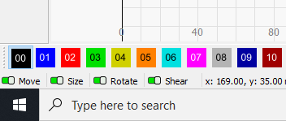
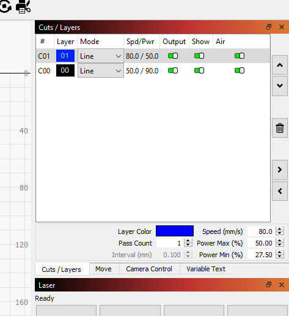
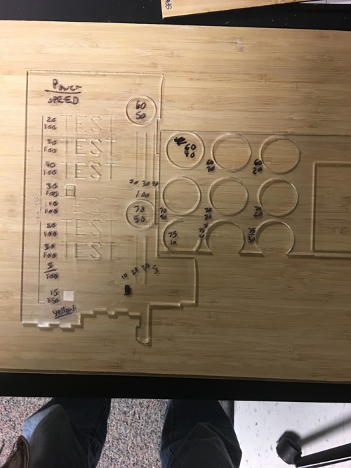
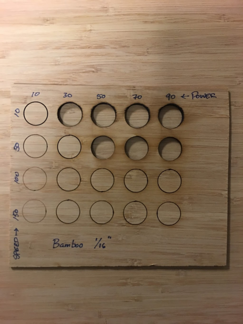
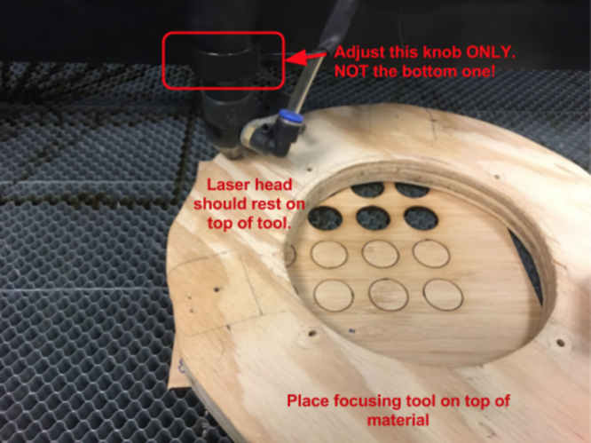
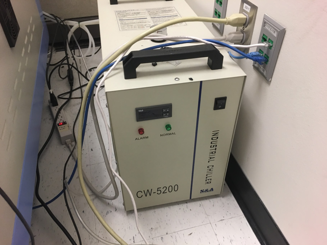
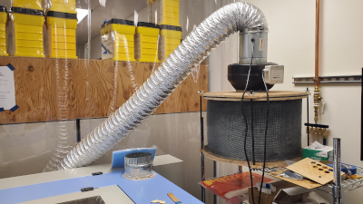
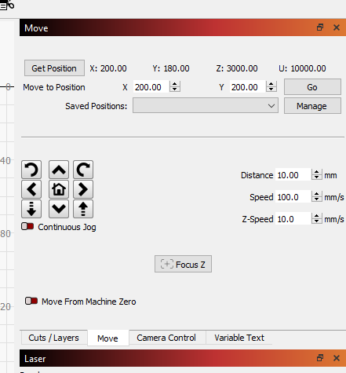
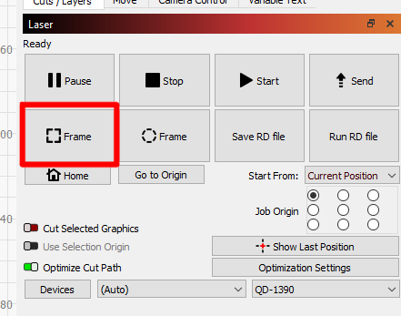
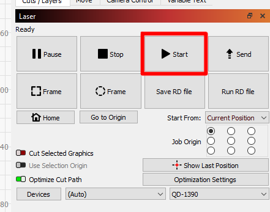


TODO add stuff:
Close vinyl curtains

# Global TODOs
- [X] Resize the images to something that's sane for the web.
- [X] Rename the images to something descriptive.
- [X] Rearrange the secions. (see comment below)
- [ ] Add moar pix.
    - [ ] laser safety goggles.
    - [ ] Burned retina.
    - [ ] new filter
    - [ ] green box in software
    - [ ] what cutting, engraving, and rastering look like
    - [ ] what the pause button is




# About This Machine

## 

TODO:
- [ ] Find out the nominal power output.
- [ ] Get the bed dimensions.


This machine is for cutting detailed, two-dimensional geometry into large, flat materials.
It's ideal for making boxes, enclosures, and control panels!

This is much faster than 3D printing.
It's also capable of producing much larger, stronger, cheaper, and more accurate parts.
Of course, this comes at the cost of stronger design-for-manufacturing constraints.
(Your parts have to be 2D sheets/plates.)

## Materials
Ask a manager if you would like to cut any materials that don't appear on either of these lists.  
**DO NOT CUT ANY UNAPPROVED MATERIALS AS THEY CAN RELEASE TOXIC FUMES**

### Pre-Approved
These materials are fine to use.
A mystery material that looks like one of these does not count!
For example, people often confuse polycarbonate and acrylic.

{:class="table table-striped"}
| Material        | Minimum Thickness   | Maximum Thickness     |
| --------        | -----------------   | -----------------     |
| Acrylic         | 1/16 in             | 1/4 in                |
| Bamboo          | 1/32 in             | 1/4 in                |
| Cardboard       | 1/32 in             | 1/4 in                |
| Masking Tape    | 1 layer             | 2 layers              |
| Paper (Printer) | 1 sheet (held down) | 10 sheets (held down) |
| Poster Board    | normal              | normal                |
| Wood (General)  | 1/8 in              | 1/4 in                |
| Wood (Ply)      | 1/8 in              | 1/8 in                |

### Banned
It's never okay to cut these materials on the laser.

{:class="table table-striped"}
| Material                               | Problem
| --------                               | -------
| PVC (Polyvinylchloride)                | toxic, corrosive gas
| ABS (Acrylonitrile Butadiene Styrene)  | toxic gas
| Teflon, PTFE (Polytetrafluoroethylene) | toxic, corrosive gas
| Vinyl                                  | toxic, corrosive gas
| PC (Polycarbonate)                     | self-sustaining fire
| PE, HDPE, LDPE (Polyethylene)          | melts and splatters
| Artificial Leather, Pleather           | usually contains PVC
| Architectural Modelling Board          | because
| Anything containing chlorine           | toxic, corrosive gas
| Anything containing fluorine           | toxic, corrosive gas

## Useful Links
- [Manufacturer's website][OEM]
- [Maker Case][makercase] and [Make a Box][makeabox] will generate great lase-able boxes for the mechanically challenged.

## Machine Safety
This is an awesome tool that can hurt people in scary ways.
Like most such tools, it's easy to stay safe by being conscious of the danger and following good habits.

### Dangers
This section outlines the dangers this machine poses, who is at risk, and the best practices to stay safe.

#### Fire
This machine can set the work piece on fire.
This poses a risk to the people in the lab, the machine, and the engineering building.
Fires can be avoided by using the approved materials and following the procedures in this SOP.

- __Never__ leave this machine unattended while running!
- __Always__ identify where the fire extinguisher is before using this machine.

#### Laser Beam
This machine uses an invisible infra-red (IR) laser for cutting
and a visible red laser for targeting.
This poses a risk to __everyone in the lab__.
Serious eye damage can be avoided by following the procedures in this SOP.

- The panels and hood should __never__ be opened when the laser is enabled.
- Reflective objects should __never__ be placed in the chamber.
- Do not stare at the cut

When lasing, the material is heated to extreme temperatures.
This produces very bright, broad spectrum light, including ultra-violet light.
This poses a risk to people nearby the machine.
Eye damage can be avoided by not staring directly at the area being lased.

#### High Voltage

Be careful when maintaining machine.

TODO: How high is the voltage? Very high
The laser tube uses high voltage.
This poses a risk to people maintaining the machine or improperly operating the machine. Give high voltages lines a wide berth.
Burns and heart failure can be avoided by removing the keys from the system when maintenance is performed and by checking that the laser tube is not exposed when in use.

#### Toxicity

This machine produces harmful smoke and vapors when cutting. Immediately report any escaping smoke or strong smells to a manager.

This poses a risk to the people in the lab and nearby rooms in the engineering building.
Negative health effects can be avoided by following the procedures in this document, avoiding use of materials which create harmful gasses, and properly maintaining the air filter.

#### Motors

Keep away from moving parts.

This machine uses computer-controlled motors and does not sense how much force they're outputting. If someone or something is in its way, it will just plow through. This poses a risk to people operating the machine. Injuries can be avoided by staying clear of the X-Y gantry when it's in motion.

### Contingencies
Here are some likely worst-cases and what to do if they happen.

#### Fire
 revise when shop air is connected 
If there is a _sustained_ fire in the chamber:
- Hit the E-Stop button.
- Leave the hood closed.
- Get a manager to help immediately.
- Managers:
    - Fetch the fire extinguisher.
    - If the fire does not put itself out:
        - Disconnect the air compressor. (Don't just turn it off.)
        - Turn off the air filter.
        - If the fire still does not go out:
            - Open the hood.
            - Immediately spray the fire with the fire extinguisher.
            - Immediately close the hood.
            - Contact campus safety: {{ site.data.phones.safety_emergency.number }}.
                - They can also be reached via the lab's landline at {{ site.data.phones.safety_landline.number }}.
            - Evacuate the EPL.
            - If the fire is still going:
                - Pull the fire alarm.

Note that flammable gasses will occasionally get stuck on the rails under the material being cut.
These can create momentary flames under the material.
This is especially noticeably with acrylic.
This is normal and not a concern.

#### Laser Exposure
- Immediately hit the E-Stop button.
- Inform a manager of the incident.
- For exposure to the eyes, seek immediate medical attention. For exposure to the skin, treat it as a burn and seek medical attention if necessary.

#### Electrical Shocks
- Immediately hit the E-Stop button.
- Inform a manager of the incident.
- If you experience any symptoms, seek immediate medical attention. (unconsciousness, confusion, burns, numbness, tingling, paralysis, hearing/vision/speech problems, difficulty breathing, seizures, et cetera)

#### Emissions
If you see smoke building up inside the chamber, smell/see smoke leaving the chamber, or notice a strong chemical smell:
- Pause your job.
- Wait for the smoke/vapors to be filtered out. This can take a few minutes. Do not open the hood during this time.
- Ask a manager to verify that the air filter system is working.

#### Crashes
If the cutting head or the gantry crash into anything, immediately hit the E-Stop button and get a manager.

#### Caught Limbs, Fingers, or Hair
Immediately hit the E-Stop button if someone's limbs, fingers, or hair are caught by the X-Y gantry.
When the motors are unpowered, they can be moved easily.


## How to Get Help
TODO: Link to outside resources for laser-cutting knowledge.


# Using This Machine
Here are the basics of operating this machine.

## Cut Geometry
This laser cutter will work with [vector files][vector], like SVG or DXF, for cutting, engraving, and rastering.
Images, like JPG and PNG, can only be [rastered][raster].
 TODO trace stuff in LightBurn 

### Exporting Your Geometry
You want an SVG or a DXF that's in units of millimeters. A PDF may also work.

#### Quick and Easy Box
If you just need a box/enclosure:
- Go to [Maker Case][makercase].
- Choose your desired dimensions.
- Select finger style joining.
- If you want a tight/friction fit, select 0.010 inch kerf.
    - This can be fine-tuned to your material, but 0.010" is probably fine.
- Download a DXF.

#### SolidWorks
1. Open the *part* you wish to cut
1. Change the measurement system to \'mmgs\' (bottom right corner) and ensure your part has the correct dimensions in millimeters. (25.4 mm/inch)
    - The main reason for bad DXF files from SolidWorks is using a different measurement system such as IPS(Inch, pound, second) or MKS(Meter, kilogram, second). Use your desired system to design the part but switch to mmgs afterwards to create the DXF file.
1. Right click the desired face you wish to create a pattern from and select "export DXF/DWG"
1. Complete the following prompts to save the file.

TODO:
- [ ] Go through the process that uses File -> Save -> (set file type to DXF) -> Ok  
      and record that here.


#### Inkscape
1. Set your document units to mm
    - Go to `File` -> `Document Properties`
    - In `Page` under `General` set `Display units:` to `mm`
1. Save your file normally as a `.svg` (either `Inkscape SVG` or `Plain SVG` works fine)


TODO:
- [ ] Go through the process of creating simple geometry in Inkscape and porting it to RDWorks.  
      There's a trick about which spline type to use when exporting, and I don't know it off the top of my head.
- [ ] Also experiment with:
- transparent or what happens with fill/stroke/patterns/clones.


### Importing Your Geometry
1. Login to the computer next to the laser cutter.
1. Open LightBurn.
1. Import the file you wish to work with.
    - Click File -> Import
        - You can import most vector files and images, but a safe bet is to use SVG or DXF vector files.  
1. Check your geometry.
    - Check that the paths are the correct shape. If they aren't, you have a couple options:
        1. Go back to your CAD program and select a different "spline type" and/or "line type" when exporting.
        1. If you can't change the spline and line types, you can manually edit the nodes.  
           This is tricky and you'll likely end up with some not-quite-right geometry.
    - Check that the bounding boxes of the paths are correct.  
      TODO: Add a screenshot of where the bounding boxes are shown.
        - Select a path and check the width and height in the upper left corner.  
          The X and Y values are not what you want. Those are just the position of the path.
        - Note that LightBurn displays this information in units of millimeters, not inches. (1 in = 25.4 mm)
        - If the paths are the wrong size, go back to your CAD program and change the units to millimeters.  
          Alternatively, you can fix this on the fly by scaling the offending paths by a factor of __25.4__.

## Pre-Job Checklist
TODO turn on ceiling fan from wall switch behind wire rack

TODO:
- [ ] Get a picture of this tray.
- [ ] Fill out this section more.

1. Check [the top of this page](#) or [the main EPL page](/) to see if this machine is "down" or "having issues".
    - If the machine is down, you may not use it!
    - If it's having issues, ask a manager what they are.
      You may be able to get more details on the machine's maintenance log at the top of this page.
1. Double check with a manager that the laser, filter, and chiller are all okay to use.
1. Check that your material is on the [approved materials list](#materials) and __not__ the [banned materials list](#banned).
    - If it's not on either list, ask a manager.
1. Identify where the fire extinguisher is.
1. Make sure there isn't excessive debris in the tray under the chamber.
    - __Danger: make sure the laser is disabled before checking the tray!__
1. Make sure none of the side or rear maintenance panels are open.
    - If they are, ask a manager if it's okay to close them.
    - The panels __may not__ remain open when the laser is enabled!

## Power and Speed Settings
Image files (.jpg, .png, etc.) will **always** raster, meaning it will not cut.
It will just etch the image onto the material.
If you want to cut, you need to add vector curves.
These can be imported from other software or added directly in LightBurn. Inkscape can do this, maybe add some instructions for that

Different materials and thicknesses will require different laser powers or speeds to cut through the material.

In the upper right hand corner of LightBurn you should see a small window that will probably have a single black block followed by cut and speed settings. It is possible to use different cuts and speeds for different parts of your job by using different "colors" to identify different layers on your piece.

1. Click on the vector you wish to edit the cut settings for.  
1. Click on one of the colors at the bottom of the software to change it. The shape should change to that color and a new color and item should appear in your layer window in the upper right hand window.
    - Note that the color only identifies the layer of the vector.
      Any vector you change to this color will have those cut settings.  
      
1. Double click on the layer you wish to edit in the upper right-hand window.  
   
1. In the dialog box that pops up, edit the speed of laser to your desired settings.
1. Edit the minimum and maximum power of the laser to your desired settings.
    - Usually you will just make the minimum and the maximum the same.
    - Sometimes it gives you the option to change two power settings. Just uncheck one of them.
    - __NEVER__ set the laser power above 90%
1. You can change the cut type from line (will just use the laser to etch the lines on your vector) to fill (will use the laser to ‘fill’ in your vector shape--usually used to etch opaque shapes)
    - Note: Scanning large images can take a very long time as opposed to cutting.
      If you can cut instead of scan, please do so.
      Also make sure you are using much lower power settings and higher speed settings for scanning.

Alternatively, if you just want to use the same cut settings throughout your job, just change the single black layer that is there by default and directly edit the settings there.

You may need to develop your own cut settings for your material.
See the [Test Cuts](#test-cuts) section for more information.
It's __strongly recommended__ that you perform test cuts before running your job!

### Determining Settings
It's strongly recommended that you perform some test cuts to ensure you'll get usable, desirable results.
See the [Test Cuts](#test-cuts) section for more information.
Usually, three to six small circles are all that's needed to find acceptable settings.
You shouldn't need to do large arrays of test cuts like the examples below.
Below you can find some examples of cuts made in common materials.

#### 1/16" Clear Acrylic

#### 1/16" Bamboo

## Physical Prep
When your job is ready in RDWorks:

1. Open the hood.
1. Place your material under the laser head.

### Position Your Work
__The green square in LightBurn corresponds to wherever the cut head is when you start your job.__  
This means that the laser-bed-sized page in LightBurn _does not_ correspond to where your cuts will occur!  
The green square is all that maters. It will usually be positioned to the upper left of your piece.
So, you usually want to _place the upper left of your material directly below wherever the cut head is_.

TODO:
Add a picture of the green box.  
Also, try to add a depiction that's like
"See where the square and the head are? This will miss the stock entirely.".


It's __strongly recommended__ that you also [preview your job](#previewing-your-job) before running it.

### Adjust the Focus
1. Place the focusing tool on your material. (The focusing tool is 20.0mm tall)
1. Loosen the top knurled ring.
1. Slide the lens assembly to rest on top of the focusing tool.
1. Gently tighten the top knurled ring to secure the lens assembly.
    - *Do not over-tighten the focusing knob!*  
       
1. Remove the focusing tool from the bed.

## Turn Everything On
However, do not enable the laser yet!

1. Turn on the power strip on the wire rack under the computer.
1. Check that everything is working as described below

#### Chiller
  **This is important so the laser doesn’t overheat!**
    - It may sound an alarm for a few seconds but it should go away quickly.
    - The green normal light is currently burnt out.
    
      
      

#### Filter On

Ensure the air hose to the filter is connected the back of the laser

#### Air On
1. Check that the air assist is working
    - Flip the "Air Assist" switch on the right side of the machine to the "ON" position. Air should now be coming out of the laser head.
    - Flip the switch back to the "Auto" position

## Operation
It's time to cut!

#### Set position
Use the move controls in LightBurn to position the laser head where you want it to be. This lines up with the green box in LightBurn. Remember that the area in LightBurn *does not* match the laser bed.

### Pre-Cut Checklist
- __Do not proceed unless:__
    1. You've fully read and fully understood this SOP from start to finish.
    1. You've been trained by an EPL manager on *this particular* machine.
    1. You've been approved by an EPL manager to use *this particular* machine.
    1. You're not using any of the [banned materials](#banned).
    1. You know where the fire extinguisher is.
    1. All of the side panels, the hood, and the back panel are closed.
    1. The chiller, and air filter are both running.
    1. The cutting head is delivering a gentle, steady stream of air when air assist is on
    1. The website shows this mahchine is currently working (not "down" or "having issues").
        - This is visible [at the top of this page](#), or on [the main EPL page](/).
        - If the machine is having issues, ask a manager if it will interfere with your job. You can also find out more on the maintenance log, viewable at [the top of this page](#).
    1. You've checked with a manager that it's okay to use this machine today.

## Previewing Your Job
  You should check that the laser will stay on your piece and not stray onto the bed.

  1. Set any raster layers' output to "no", since these take a long time to execute.
      - You may want to add a zero-power layer that outlines the rastered areas, if that's important to your work.
  1. Make sure `Start From:` is set to `Current Position`
  1. Close the hood, and click "Frame" in the laser control on LightBurn.
      - Danger: __Do not run your job with the hood open!__
        Even if the laser is disabled, you can be seriously injured by the moving X-Y gantry.
        You should also _never rely on a single safety measure_ like the enable/disable switch.  
        
  1. Return any raster layers' output to what it was before.

  If the preview is taking a long time, you may want to cancel the job and set the layers to a higher speed.
  Just don't forget to set them back to the correct speed for the final job.

### Laser Enable
Make sure that the machine door is closed. The laser will be automatically enabled when the door is closed and disabled when the door is open.

### Run the Job
1. Press start on LightBurn to start the cutting job.
    - __Do NOT walk away from your job for any amount of time, for any reason.__  
      Monitor your job for the full duration.
    - Keep the hood closed during the entire job.
    - If problems occur, pause or E-Stop the machine according to the [Contingencies](#contingencies) section above,
      or for any other reason.  
      

### Laser Disable
1. When you job finishes, the machine will beep.

### Post-Cut
1. Wait for the smoke and vapors to get sucked out of the chamber. This takes anywhere from seconds to minutes, depending on how long the job was. Don't make the lab smell any more than you have to.
1. Open the hood and [check that your job cut properly](#checking-for-complete-cuts). This can be done by gently pressing down on the material and observing that it moves independently from the surrounding material.
    - If it didn’t you may have to change your cut settings accordingly and/or make additional passes.

# Post-Operation
This is what you do when your cut job's done.

## Shutdown
If you are completely done:
1. Wait about 10-15 minutes from your last cut before turning off everything else by turning off the power strip on the wire rack
    - However, please do not just leave it running.
1. Close LightBurn. (saving your job is optional, but recommended)

## Cleanup
1. Clear the bed of any little pieces of material. These can cause fires if left there.
1. Empty the tray below the chamber.
1. Either take your scrap with you.
    - Alternatively, break it into useful-sized pieces before leaving it in the scrap bin.
        - Nobody wants your 1 inch wide sticks and they clutter up the bin.
1. Ask a manager if you forgot to clean up anything.
1. __Don't forget to pay for your session and any material you purchased!__

# Tips and Tricks

## Courtesy
Laser jobs tend to take a long time to set up, especially if you're inexperienced.
Double-check the calendar (on the [main page][/]) and ask the on-duty managers if you'll have time to finish.

If you need to pause your job to step out for a few minutes, check that that's okay with the managers.
Also, leave a note on your work piece.
Without a note, we will assume it's fine to move the material into the scrap bin.

Remember that the laser is in the machine shop.
Share the space with the other people.
Be aware that they're using dangerous equipment and startling or bumping them could cause serious injuries!

## Test Cuts
__The usual procedures for [using this machine](#using-this-machine) still apply for test cuts.__
Treat your test cuts like any other job.

1. Make a small (10 mm) square in LightBurn.
    - A square is more useful than a circle or a line,
      since the machine performs slightly differently on sharp corners.
1. Create a new layer and put the square on it.
1. Set all the other layer's output to "no", leaving the test cut layer's output as "yes".
1. Input some initial cut settings like `speed = 50` and `power = 50`.
1. Position the cut head over some portion of your piece that you won't be using.
1. Run this like a normal job. ([Observe all the usual procedures!](#using-this-machine))
1. Make a note of your cut settings on the piece using a marker.
1. Search through different cut settings until you get acceptable results.

Generally, high power and high speed settings yield better results.
However, you should use the minimum power necessary to get your desired results.

## Checking for Complete Cuts
Remember that if you pick up your piece, you won't be able to place it back on the bed exactly where it was.
So, you need to be able to test for complete cuts while it's still sitting on the bed.
This is usually done by gently pressing on one of two parts that _should_ be separate and observing if they move relative to each other.
You can also gently hold down the waste material and try to lift the part with the blade of a knife.

## Inconsistent Cuts
This laser doesn't give consistent results across the bed.
The upper left quadrant receives the most power, while the lower right quadrant receives the least.
Keep this in mind when doing test cuts and positioning your piece.

This is especially noticeable on large jobs which take up lots of the bed.
The same cut settings may fully cut one portion of the work, but only engrave another portion.

Additionally, very tight curves (corners and radii under about 3 mm) effectively have more aggressive cut settings,
since the laser is essentially "double cutting" the inside of the curve.

## Multiple Passes
If you get incomplete cuts or barely-visible engraving and you haven't moved your piece,  
you can try running your job again.
Usually, this is enough to complete the cut.

If you're cutting very thick material, this is a useful technique since you might not be able to cut through in a single pass without melting or burning your material.
It may be necessary to [adjust the lens](#adjust-the-focus) down for subsequent passes.

__It's not acceptable to take multiple passes to reduce the smell produced from cutting.__
If your job is creating an offensive smell, notify a manager immediately!
This may be a sign that the air filter isn't working or you're using an inappropriate material.


## Finishing and Assembly

## Part Design

## How to Make Tea With This Machine


# Quick Links
[OEM]: http://www.qdcnc.net/product/qd1390_laser_cutting_machine
[vector]: https://en.wikipedia.org/wiki/Vector_graphics
[raster]: https://en.wikipedia.org/wiki/Raster_scan
[makercase]: https://www.makercase.com/
[makeabox]: https://makeabox.io/
[]:
[]:
[]:
