# Why you’re here

So you have a DXF file that you’ve exported from SolidWorks, Fusion 360, Eagle, or some other software, and you want to cut it on the *Full Spectrum Laser*? No problem. It’s not as easy as simply importing it directly into the *RetinaEngrave software* that the *Full Spectrum Laser* uses unfortunately, but we can get there with a bit of a workaround.

# What you’ll need

* RetinaEngrave Software (installed on eplaser1 computer)

* Full Spectrum Laser (connected to eplaser1 computer)

* Inkscape (installed on eplaser1 computer)

# Converting DXF to XPS in Inkscape

Open Inkscape

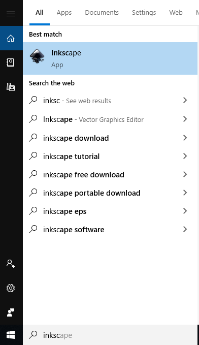

After Inkscape opens, go to File > Open. Then navigate to where you have saved your DXF file.

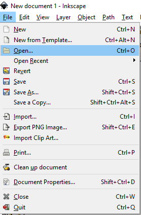

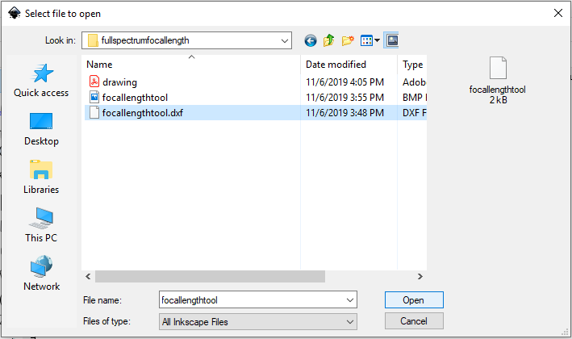

Click Open. This will create a pop-up window with some settings for importing a DXF into Inkscape. 

In most cases, the setting you want will be: "Manual Scale" and “Manual Scale Factor: 1.0”, but the settings may vary. 

For example, the software producing your DXF may be measuring in inches instead of millimeters and you may have to make the appropriate conversion in the manual scale factor to resize it to the right size (i.e. 25.4). You may have to play around with this until you get a scale factor that looks correct.

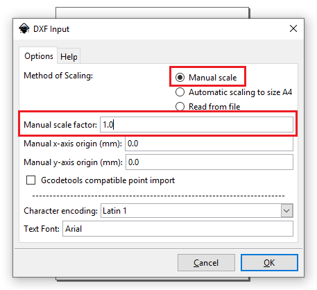

You should now see your artwork on the Inkscape canvas. You may want to move items around, but it is not necessary to.

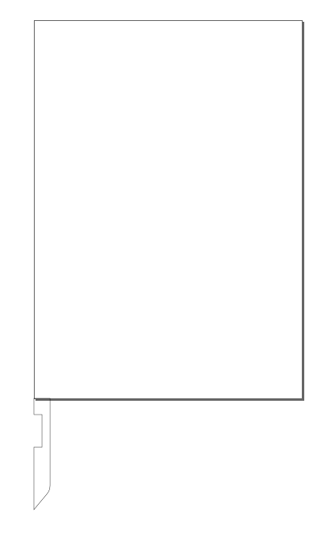

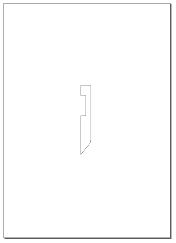

Finally in Inkscape we need to convert this into an XPS file. Unintuitively, this is done by "Printing" the file, NOT saving it or exporting it. Click File > Print (or CTRL+P) to print the document.

In the Printing options, ensure that the printer selected is the  "Microsoft XPS Document Writer". Then hit “Print”.

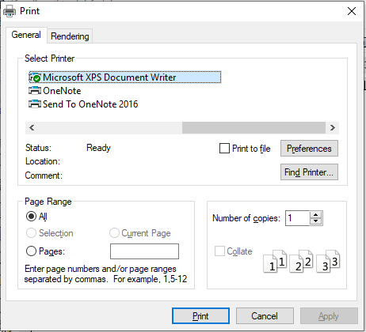

A window will pop up prompting you save the file with an extension of ".oxps". Click the drop-down menu for the “Save as Type” option, and change this from “.oxps” to “.xps”. Feel free to change the location where you are saving this file, give it a name, and then click “Save”.

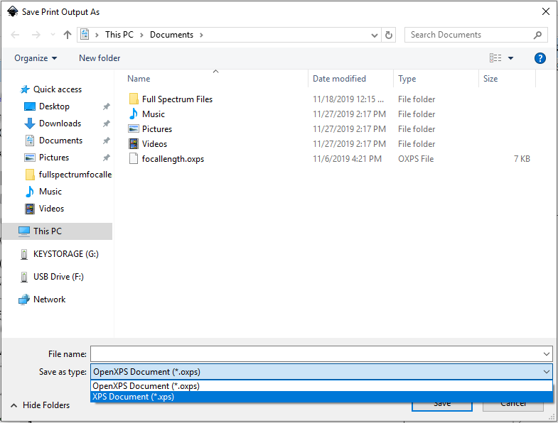

We are done with Inkscape now. Close Inkscape.

# Open XPS file in RetinaEngrave

Open RetinaEngrave

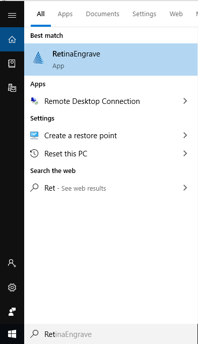

If prompted to choose the Laser type, choose the "Hobby 12x20"

Click "File" > “Open File or Project”. Navigate to where we saved our “.xps” file, and click open.

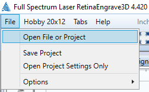

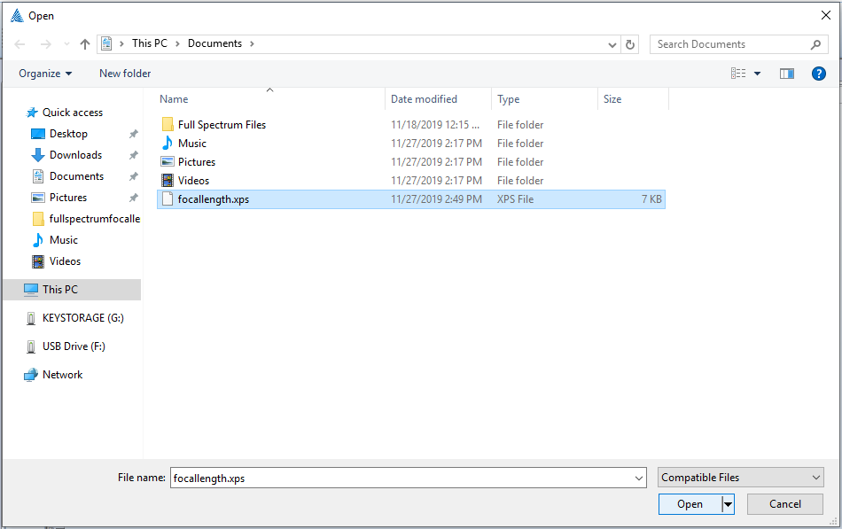

Click on the "Vector Cut" tab.

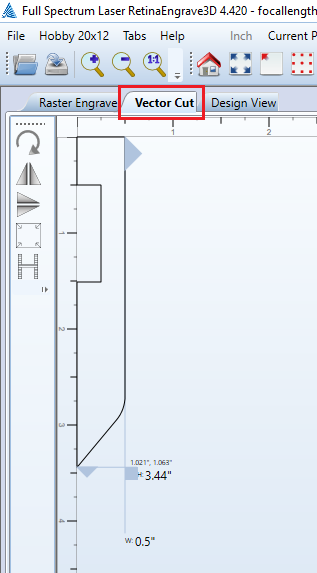

From here on out, follow the regular Full Spectrum Laser SOP for the rest of your cut.

