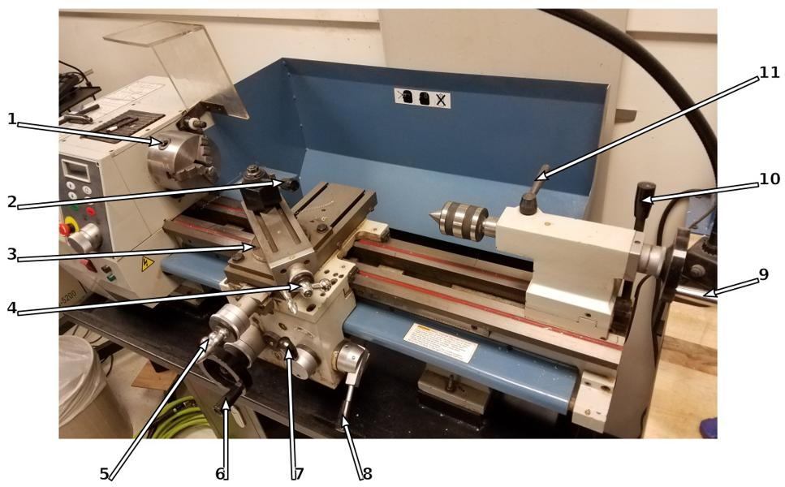


TODO: 
- Find out how large of a thing you can put in the 3-jaw chuck.




# About this Machine
The lathe is good for making round parts, composed of concentric cylinders and cones. 
When used with care, you can hold tolerances around 0.001 inches, but you should
expect tolerances around 0.007". 
It can be used to cut nearly any material that doesn't create dust. 
(So, __no wood__!)
The 3-jaw chuck can accommodate pieces up to ?? in diameter.

## Useful Links
- [manufacturer website](https://littlemachineshop.com/products/product_view.php?ProductID=3540)
- You can find the manual [here](3540_Bench_Lathe_Users_Guide.pdf).

## Machine Safety
Read the manual and this SOP completely before operating the lathe.
Remember that you are responsible for your own safety and the safety of those near you when operating the lathe.

- Always wear safety glasses when performing ANY operation on the machine tools. 
    - Your prescription glasses are *not* safety glasses!
- Make sure that long hair is tied up and that any dangling clothing/jewelry is removed, including gloves. 
- If something goes wrong, __immediately__ hit the emergency stop.
- Closed toes shoes are required at all times in the machine tool area. 
- Never use machine tools if you are alone in the lab.
- Never leave a running machine unattended.
- Never leave the key in the chuck.
- Never touch the chuck or workpiece when the machine is running.
- Clamp tools securely, cutting forces are significant and can turn improperly clamped work pieces into projectiles.
Just because *you* are unable to jiggle the workpiece doesn't mean the machine will be unable to.
- If something sounds odd. Stop the machine and check for loose parts/tooling.

## How to Get Help
Include a list of which documents, websites, people, or mailing lists should be consulted in case of problems.

## Control Panel

| label | function 
| ----- | --------
|  1 | power switch
|  2 | emergency stop (twist to reset)
|  3 | start spindle (remembers last setting)
|  4 | adjust spindle speed
|  5 | present spindle speed (rpm)
|  6 | spindle direction
|  7 | stop spindle
|  8 | disengage spindle (__DO NOT USE!__)
|  9 | fuse
| 10 | power indicator

## Machine Controls

| label | function 
| ----- | --------
|  1 | chuck adjustment
|  2 | tool post lock
|  3 | cross-slide angle locking screws (2x)
|  4 | cross-slide wheel
|  5 | X-axis wheel
|  6 | Z-axis wheel
|  7 | half nut lever\* (left = disengaged)
|  8 | power feed lever\* (middle = disengaged)
|  9 | tail-stock wheel (moves tail stock tool)
| 10 | tail-stock lock
| 11 | tail-stock tool lock

\* The half nut lever and power feed lever must be disengaged unless you *really need them* and *really know how to use them*! You must check with a manager to make sure you're using them correctly. They must not be used at the same time, otherwise you could break the machine. 

# Using this Machine
When you are moving the carriage hand wheel (large black wheel on front of the lathe) can move the tool by 0.02 inches on the either toward or away from the headstock. 
Use this hand wheel to position the carriage prior to starting and pull it towards you to
disengage it when you're about to start.

The cross slide feed handle(silver colored right above the carriage hand wheel) moves the cross slide in and out to make your cuts.
It makes movements of 0.001 inches 

Compound rest feed handle is used to move the tool toward or away from your workpiece in 0.001 inch increments on the markings

## Setup
Confirm that the following conditions are met.

Make sure that your stock piece is secured in the chuck 

If your workpiece extends over 6 inches past the chuck you should secure it with the tail-stock to help stabilize the work piece
The black lever on the tail-stock locks into place lift it up to lock and push it down to adjust its position.

To power up the lathe:
  1. Turn the E-stop button to the right to ensure that it is in the on position.
  2. Press the top half of the power switch.
  3. Use the speed control buttons to adjust the spindle speed.

## Operation
Show how to actually *do the thing*.

## Shutdown
Explain how to safely shut down the machine.
  1. Press the red Stop button. To stop the lath in normal use.
  2. Press the red E-stop button. To stop the lath in case of an emergency
  
## Cleanup
- Use a brush to remove any chips from the carriage and the ways.
- Use gloves and/or pliers to remove any long/tangled chips and place them in the recycling bin.
- Use the shop vac to remove the remaining small chips. __Do not vacuum up any long or tangled chips!__ They will clog the vacuum.
- Place any usable scraps in the scrap pile. Place the remaining scraps in the recycling.

# Tips and Tricks
List some sections describing advanced techniques.

## How to Make Tea with this Machine


# Quick Links
[]: 
[]: 
[]: 
[]: 
[]: 
[]: 
[]: 

