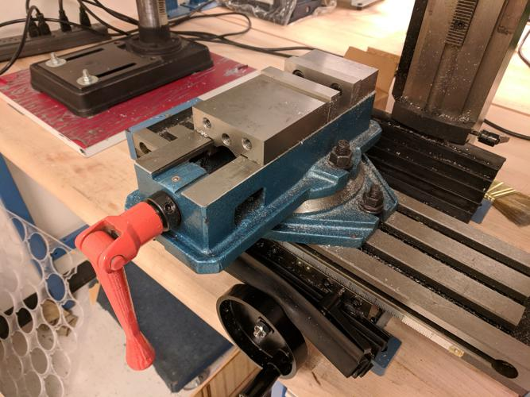
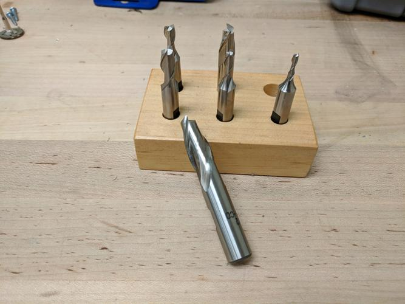
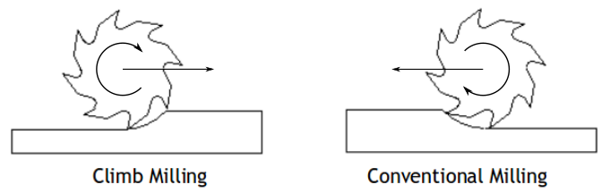
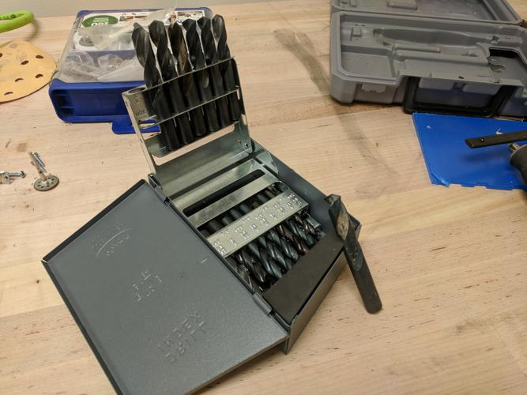

## Table of Contents
{:.no_toc}
* ToC
{:toc}

# About this Machine

This is the Little Machine Shop HiTorque Mini Mill 3900. 

This machine is good for making precise cuts at right angles, drilling holes, and creating flat surfaces.
It can operate on materials like aluminum and mild/unhardened steel, or anything softer. 
(Note, if you're machining steel, you must provide your own tooling. This is to avoid excessive wear on lab cutters and drills.)

This mill has manual control over three axes, with dials on X and Y, and a depth stop.
The X and Y axes have significant [backlash](https://en.wikipedia.org/wiki/Backlash_(engineering)), which you may need to take into account if you require tight tolerances.

"High torque" is relative. 
For a mill, this is a very low-torque machine.
It's easy to stall the motor at high speeds.

## Useful Links
- [manufacturer manual][manual]
- [3900MiniMillSOP][old SOP2]
- [Little-Machine-Shop-3-axis-manual-mill][old SOP1]

- [manufacturer website][mfg site]

## Machine Safety
Read the [manual] and this SoP completely before operating the mill.
Remember that you are responsible for your own safety and the safety of those near you when operating the mill.

- Always wear safety glasses when performing ANY operation on the machine tools. Your prescription glasses are *not* safety glasses!
- Make sure that long hair is tied up and that any dangling clothing/jewelry is removed, including gloves. 
- Closed toes shoes are required at all times in the machine tool area. 
- Never use machine tools if you are alone in the lab.
- Never use climb milling on metals in the EPL.
- Never use a depth of cut of more than 0.040 inches in the EPL.

The mill will spray sharp/serrated chips of material when cutting.
These can cause serious eye injuries.

When drilling metals, long strands of material can whip around the drill bit. 
These can cause moderate lacerations.
Briefly remove pressure from the drill bit to interrupt these strands.

Sometimes drills and endmills can shatter, ejecting themselves at high speed.
This can be reduced by avoiding climb-milling and deep cuts.
Do not use dull or damaged cutters.
Always confirm that the tool is centered before starting an operation.

Improperly clamped workpieces can be grabbed by a drill or endmill and ejected at high speed.
Just because *you* are unable to jiggle the workpiece doesn't mean the machine will be unable to.

## How to Get Help
Don't hesitate to ask a lab manager if you need help. 
MCECS also has a dedicated [machine shop], if you need more in-depth help or equipment.

TODO: include a list of intro-to-machining videos

# Using this Machine
These sections describe the standard usage and common pitfalls.

## Setup
Describe how to check that the machine is okay to use.
Describe make the machine ready to use.

Confirm that the following conditions are met.
- The power is off. (red button left of the spindle)
- The speed is set to zero. (dial left of spindle)
- The draw bar cover is in place. (black cap above spindle)
- The spindle locking pin is removed from the spindle.
- There is no tool already present in the spindle. (See the Changing Tools section)
- The table is clean and clear of debris.
- If a vise is present
	- The vise is clean and clear of debris.
	- The vise is securely clamped to the table.
	- The vise wrench is removed from the vise.

## Operation

### Fixturing

Make sure that your stock is securely fastened in the vise such that you can complete the intended operation without moving the part and without crashing the tooling into the vise.

Make sure your workpiece is not extending out from the vise farther than half the width of the vise jaws.
Otherwise, the part may vibrate dangerously during machining operations.

Remember that the stationary jaw and base of the vise are your datum surfaces, meaning they're what you rely on to be flat and square.
If want to verify that the vise is square to the axes of the table, please refer to the [manual].

Finger clamps are an excellent way to clamp large workpieces that don't fit in the vise.
Please refer to the [manual] for their use.

### Changing Tools
Always confirm that the power is off and the speed is set to zero before changing tools!

Use compressed air, towels, and/or oil to clean items. 
Water may be used for cleaning and cooling, however you _must_ dry it off and wipe a thin layer of oil over any affected surfaces when done.

Note that tooling in the US is almost exclusively in imperial units. This is because it is still cheaper to continue manufacturing tooling in imperial units than to switch to metric.

#### Inserting a Tool
Confirm that the power is off and the speed is set to zero.

Select the smallest collet that will fit your tool. 
If a tool does not freely slide into a collet, the collet is too small.
Using a too-small or too-large collet for a given tool will permanently damage the collet.
Confirm that the collet and tool shank (the smooth end of the tool) are clean.

Remove the draw-bar cap.
Hold the tool in the collet with one hand and insert the tool-collet assembly into the spindle.
Tighten the draw bar to pull in the collet until it holds the tool lightly.
Insert the spindle locking pin into the side of the spindle.
Use a wrench to tighten the draw bar while holding the spindle locking pin.

__Replace the draw bar cap and remove the spindle locking pin.__

Confirm that the tool is not loose by trying to wiggle it by hand.
If it's loose, remove the tool and check that you're using the correct collet.
Confirm that the tool is centered by rotating the spindle by hand.
Confirm that the tool is centered again by turning on the spindle at a low speed and looking for wobble.
If the tool is off-center, remove it and inspect the collet and tool for debris.

#### Removing a Tool
Confirm that the power is off and the speed is set to zero.

Remove the draw bar cap, and insert the spindle locking pin.
Use a wrench to loosen the draw bar while holding the spindle locking pin.
Hold the tool and collet while loosening the draw bar by hand until the tool and collet drop free.

__Replace the draw bar cap and remove the spindle locking pin.__

Clean any debris off of the tool and collet.
Check the collet and tool for signs of tarnishing or rust. 
If you find any, apply oil to a towel and wipe on a thin layer.
Return the tool and collet to the appropriate boxes.

### Milling

End mills are the work horse of manual milling. They come in a variety of sizes and shapes.

_Only two flute cutters_ may be used with aluminum and copper. 
Cutters with more flutes will clog and become unusable.
(Flutes are the helical things on the side. Count them by looking at the end of the tool.)

Unless you're using a center-cutting endmill, you'll need to drill a pilot hole before plunging with an endmill. 
See the [manual] for more information.

TODO: stuff about DoC, speeds and feeds

#### Climb Milling

It's important to pay attention to whether or not you're using conventional or climb milling.
When climb milling, the cutter has a tendency to pull itself deeper into the cut.
If your setup is not rigid enough, this can result in a __sudden and catastrophic failure!__
It can also make chatter worse.
Yes, it's tempting to do a "back and forth" cut when facing a surface. Suck it up.
If it's still not obvious, __you shouldn't be using climb milling__!

Climb milling is generally only a problem with metals, but keep it in mind when machining plastics.

### Drilling

Drill bits are just like every other drill bit ever. Please keep machine tool drills separate from other drill bits in the lab.

### Locating Features

### Chatter
If part of your setup is not rigid enough, it will vibrate during cutting.
This is called chatter.
This will result in a poor/inaccurate surface finish and can cause a tool to fracture (dangerous).

Machining is naturally a loud process. 
However, if you notice a *very* loud singing or growling sound coming from the tool or workpiece,
you may be inducing chatter.

Usually, chatter can be eliminated by gripping the tool further down the shank, selecting a shorter aspect-ratio tool, or clamping your workpiece to reduce the aspect ratio of any un-clamped areas.
As a general rule, un-clamped areas should not have an aspect ratio of more than 2:1.
So, a 1 inch bar should not extend more than 2 inches from the vice without additional support.

If you need to work on pieces with large aspect ratios, consider using finger clamps, as described in the [manual].

## Shutdown
Explain how to safely shut down the machine.

## Cleanup
Explain how to reset the work station for the next user.

# Tips and Tricks
List some sections describing advaned techniques.

TODO: taking parts to dimension

## How to Make Tea with this Machine

[mfg site]: https://littlemachineshop.com/
[old SOP1]: Little-Machine-Shop-3-axis-manual-mill
[old SOP2]: 3900MiniMillSOP
[manual]: 3900_Mini_Mill_Users_Guide.pdf
[machine shop]: https://www.pdx.edu/mme/machine-shop
[]: 
[]: 
[]: 
[]: 
[]: 
