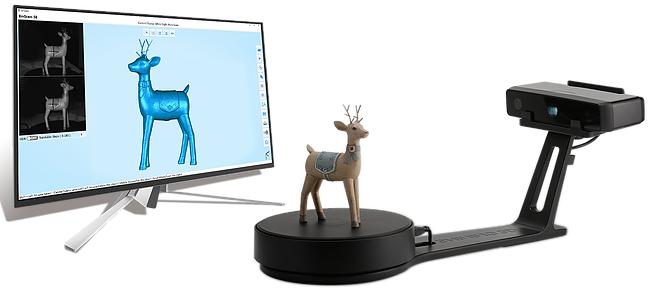

**Note: This is an alpha version of the SOP.**

## Table of Contents
<!-- {:.no_toc} -->
* ToC
{:toc}
A ToC is optional, but preferred for longer documents.
Simply paste the above code into the document.
See this document's source for an explanation.

# About this Machine

Write a short description of what this machine's good for plus its advantages, disadvantages, and quirks

The EinScan-SP is a 3D optical scanning tool featuring a 360° automatic turntable.
It is able to scan a volume between 30×30×30 mm and 200×200×200 mm automatically on the turntable, 
or 1200 ×1200×1200mm manually using a fixed mount.

## Useful Links
- [manufacturer website](https://www.einscan.com/einscan-se-sp)
- [Quick Start Guide] - The majority of the material in this SOP is copied from this guide.
- more links to manufacturer docs, calculators, outside tutorials, etc.  
It's preferred that critical documents like manuals, TDSs, and MSDSs be kept in the repo when possible/allowed.
Markdown contains a feature to define a bunch of named links at the bottom of your document.
This can make it easier to create your "useful links" list and to refer to them throughout the document.

## Machine Safety
Include notes about possible hazards and the necessary procedures and equipment to avoid them.
Make it clear that the user is responsible for their own safety 
and that of the people around them while using this tool.

## How to Get Help
Include a list of which documents, websites, people, or mailing lists should be consulted in case of problems.

# Using this Machine
These sections describe the standard usage and common pitfalls.

## Calibration

Calibration MUST be performed any time the scanner or turntable is moved. It MAY be performed before every use, but it is not necessary. To calibrate:
1. Insert the calibration board into the board holder.
2. Place the calibration board and board holder onto the center of the turntable, facing the scanner.
3. Open the software as instructed in the Getting Started section aboves. Select EinScan-SP as the scanner model and go to NEXT. ~~Getting started with calibration button,~~ following the on-screen instructions to turn the calibration board in 3 directions. 
NOTE: Only rotate the calibration board during calibration, not at other times.

## Setup
Describe how to check that the machine is okay to use.
Describe make the machine ready to use.

## Operation
Show how to actually *do the thing*.

## Shutdown
Explain how to safely shut down the machine.

## Cleanup
Explain how to reset the work station for the next user.

# Tips and Tricks
List some sections describing advaned techniques.

## Getting Started

## Using the Scanner

## Reference Material

[Quick Start Guide]: EinScan-SP-Quick-Guide-compressed.pdf
