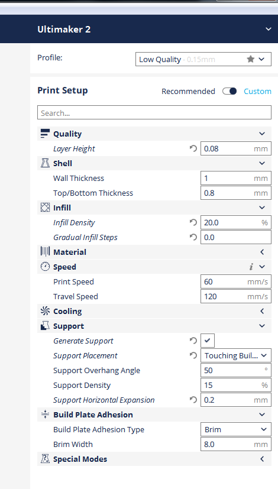

[Link to Ultimaker 2 user manual]( https://ultimaker.com/en/resources/16955-changing-filament)

# About the Ultimaker 2
The Ultimaker 2 3D printer is for printing solid 3D models from digital files. It has a print bed size of 22.3 cm × 22.3 cm × 20.5 cm. It prints only in PLA (PolyLactic Acid) filament. 

# Your STL file
You will need to have your part in .stl  (Stereolithographic) format. Most CAD programs such as Solidworks can export in this format. It is preferable that the part is designed in metric and more specifically millimeters (mm), as Cura is unable to scale between inches and millimeters. 
Some CAD programs offer to export in mm scale even when the part is designed in inches, but this sometimes doesn’t work and the part will appear extremely small on the print bed. To eliminate headaches, design your part in millimeters. 

## Using Cura
Cura (2.7.0) is the software you will use to slice your 3D model(s) into layers and export them as toolpaths. 

## Arranging your part
- Open up Cura. 
- Import your part into Cura using File>Open File
- You can also drag and drop the files into Cura using the file explorer. 

- You will need to make sure your part is oriented correctly. Here, the part has overhangs. Since the part will be built from the bottom up, overhangs will make your part anywhere between difficult and impossible to print. Overhangs are depicted in red. 

- You can change the part’s orientation by using the toolbox on the left. 

- Grab the hoop handles and rotate it so that a) the part is completely flat with the print bed, and b) overhangs are minimal. Red is the X-axis, green is the Y-axis, blue is the Z-axis. 

- Once you have the part properly oriented, you can change things such as scale and position using the additional tools on the left. You can also mirror the part, in case you want to flip it over the x, y, or z-axis.  
Right-clicking on the part yields additional dialogs. You can multiply the part so that you can print more than one, or arrange multiple parts so that they cluster in the center in the most efficient way. You can also clear the print bed or change the type of filament used in the extruder (the Ultimaker 2 has only one extruder, but the Ultimaker 3 has two extruders). 

# Print Settings

## Recommended mode

Once all your parts are arranged on the bed and you are ready to print, head over to the toolbar on the right for your print settings. “Recommended” mode is a simpler view which allows you to control only infill percentage, support placement, and whether or not to include a raft for better build plate adhesion. 

To change the print quality, select the dropdown on the top of the toolbar. This fills in all the other settings automatically. Notice how in this image the print is set to “Low Quality.” 

## Custom Mode

## Infill Density

You can adjust your infill settings using the dialog box. More infill produces a stronger part, but uses more filament and takes more time. Less infill will print faster but the part will be weaker.

## Supports

Supports are done through a menu on the right side of the interface. For the Ultimaker 2, you merely have to check the box and you will have access to the following settings: 

The Ultimaker 2 has only one extruder, so the support material will be the same material as your part. 

- _Support Placement_: Choose where you want to place your supports. Choose “Touching Buildplate” if you only want to generate support material from the build plate. Choose “Everywhere” if you want to generate support material anywhere there is an overhang, even if that overhang is over your part.  
- _Support Overhang Angle_: The minimal angle from the build plate at which supports will be generated. Decreasing this number will generate more supports because more angles will be considered overhangs. 
Support Density: This is the infill density for supports. Just like infill density for your part, increasing it will make your support stronger but the print will take longer and will use more filament. 
- _Support Horizontal Expansion_: This setting will make your support larger. If the overhanging portion of your part is very small, you may want to increase this setting to make sure it has support. 

## Preparing the Print
Click “Prepare” in the bottom-right corner of the menu.

**Finally,** when you are ready to go, plug in the SD card reader into your computer. 

