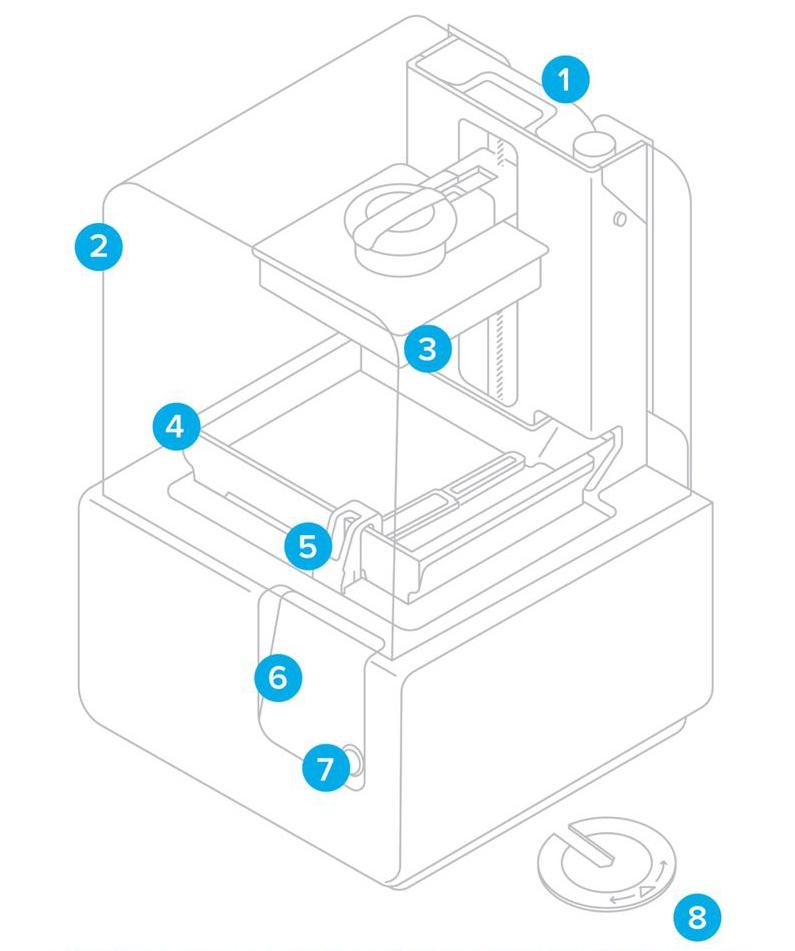
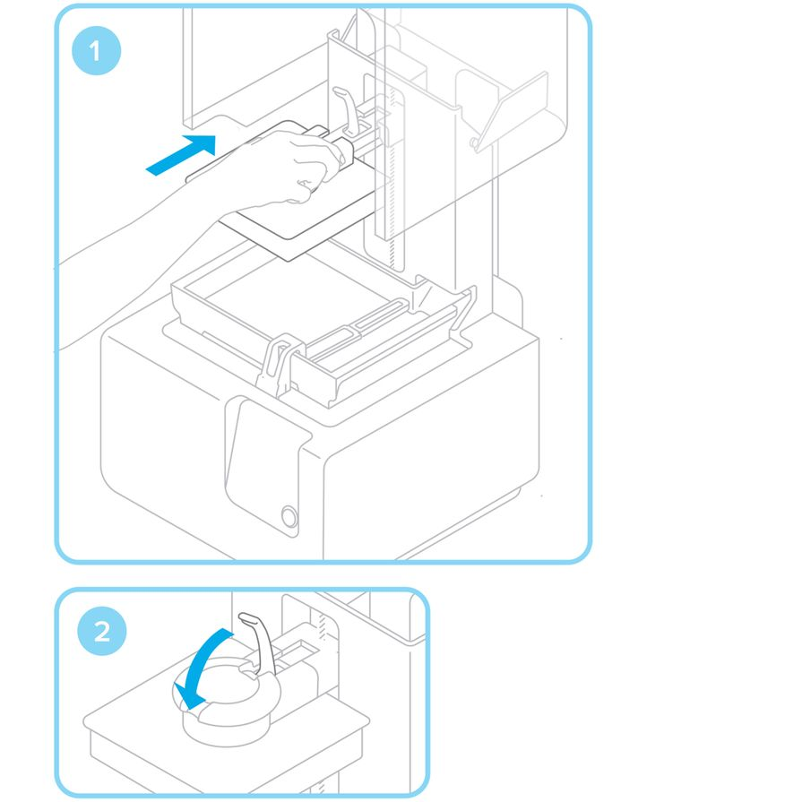
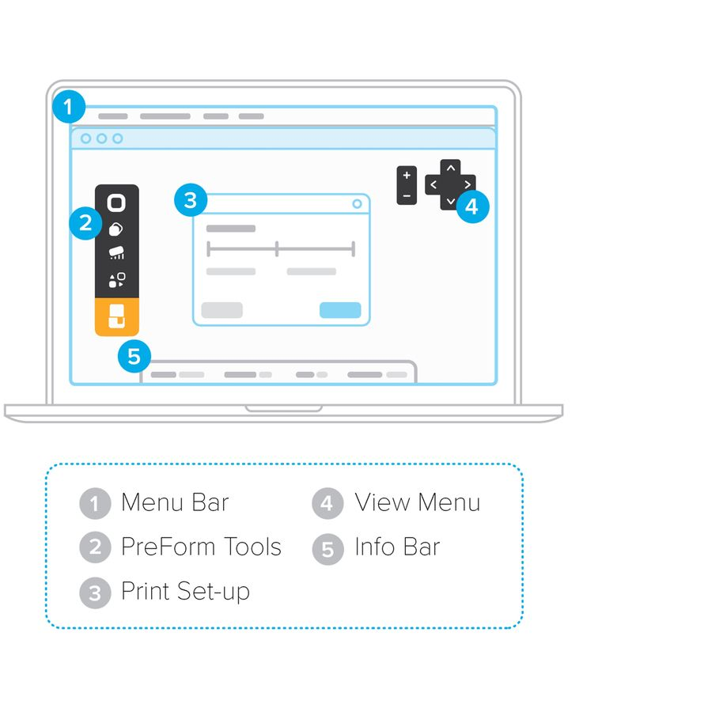
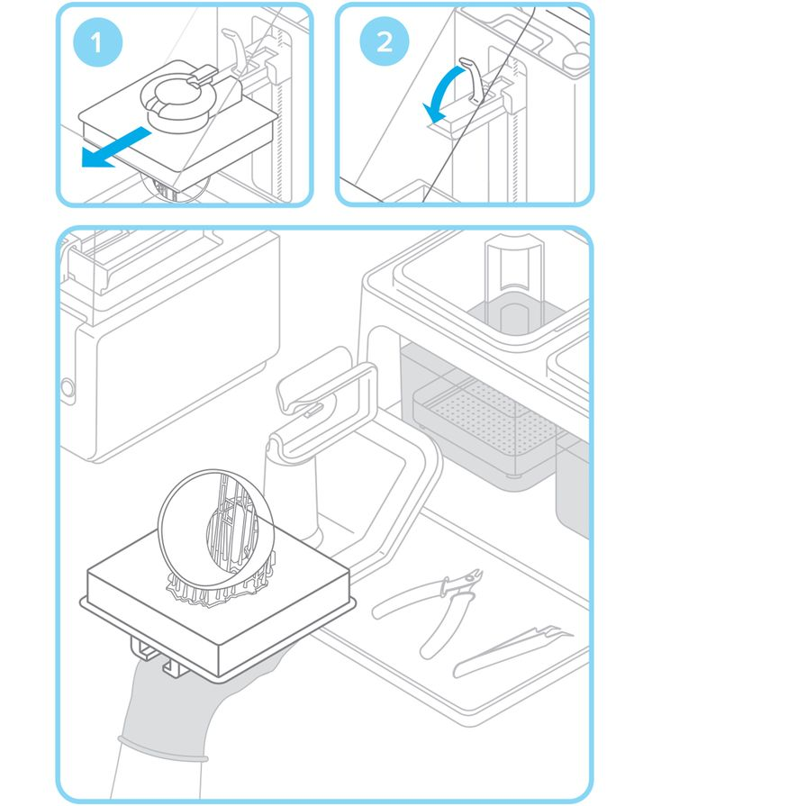
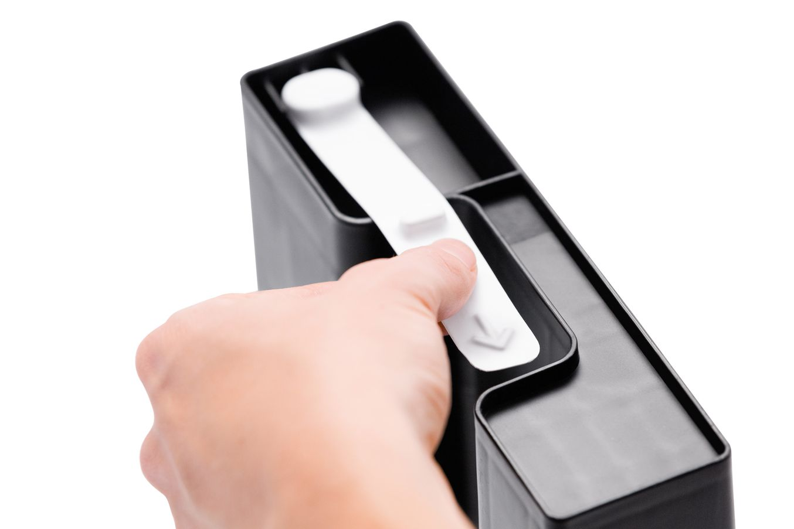
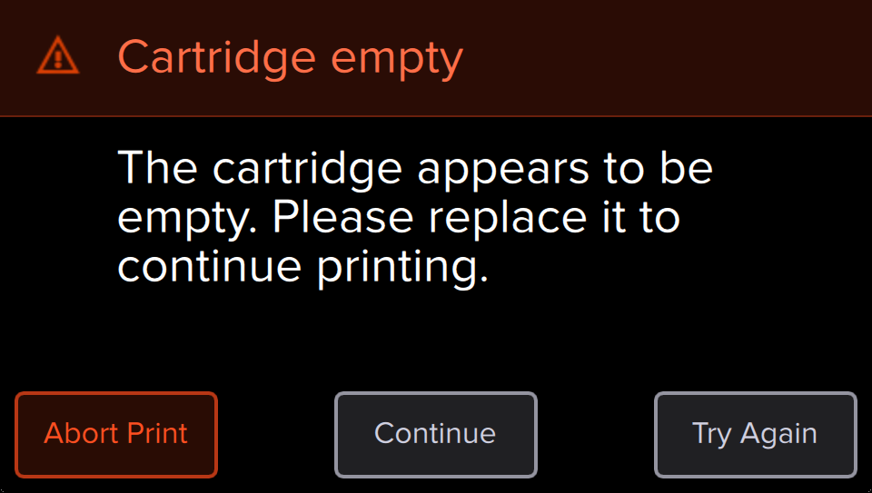
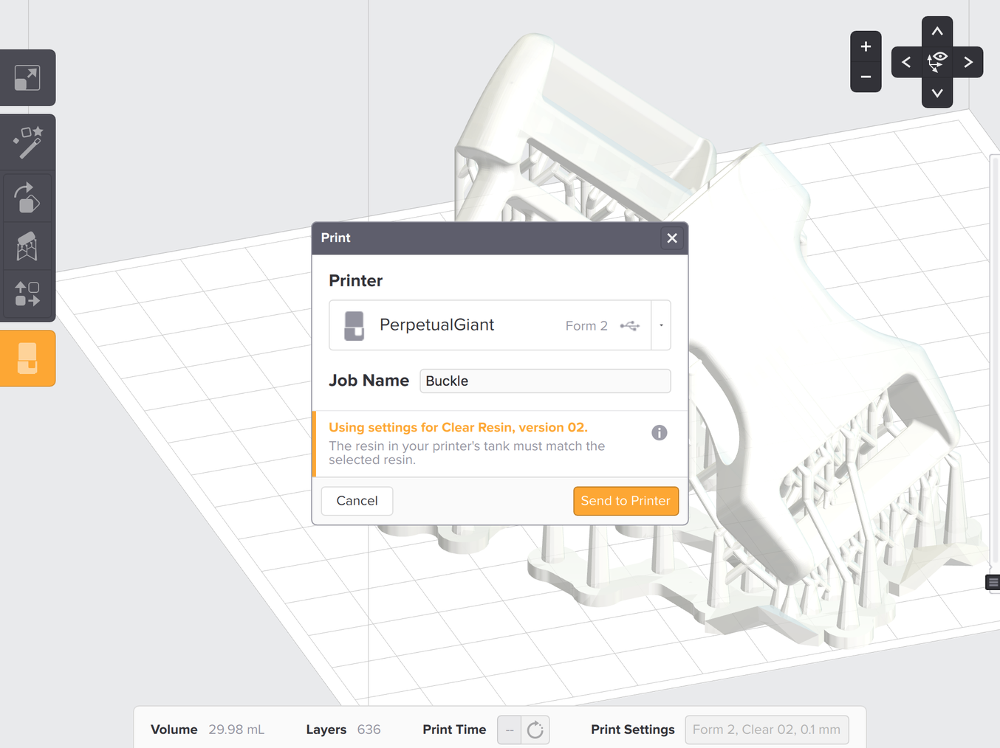

# Formlabs 2 Quick Start Guide
{width="6.5in" height="5.042in"}
Welcome to the EPL! We’re excited you’re getting started with
the Formlabs 3D printer. This guide will provide a walkthrough
for how to safely and efficiently use the Formlabs 3D printer so
you can get going with your project. If you have any additional
questions, please ask any EPL student managers for help, or
email us at [EPL@pdx.edu](mailto:EPL@pdx.edu).

## Before you get started…

1.  Log into the controller PC for the FormLabs Form 2 3D printer 
2.  Ensure that the printer is - 
    - not currently working on any other jobs 
    - Is clear for a new print (not containing any remnants of previous print jobs) 
    - Does not currently show any errors on its on-screen display 
3.  Start the FormLabs PreForm software to load and prepare your 3D model for printing
4.  Refer to step 9 on this SOP for preparing your print job with the PreForm Software

{width="6.389306649168854in" height="7.671875546806649in"}

## Printer Components

1.  Cartridge 
    -   This is the container that stores the resin. There is a vent opening on the top, similar to a shampoo bottle that will need to be open during printing. There are several different types of resins that the Formlabs can print with. The printer needs to know which kind of resin is being used, so it will prompt you to confirm before printing. This information can be found on the cartridge label. (for example FLGPCL04) 
2.  Cover 
    -   The orange tinted plastic cover should stay down unless a print is being removed, resin is being swapped, or an adjustment is being made. This keeps UV light from the hardening the resin in the tank. 
3.  Build Platform 
    -   The Build Platform is what your printed part sticks to. The Build Platform moves down into the resin. The UV laser shines up through the resin tank to harden the resin onto the Build Platform, layer by layer. When the print is done, this can be removed by using the latch on top of the Build platform, by moving the latch up and sliding the plate back towards the user.
4.  Resin Tank 
    -   The Resin Tank is a tray that houses a pool of resin. The laser sits below this tank and shines into it to harden the resin onto the Build Platform. The Resin Tank can be removed and should have a lid placed on it to keep the resin from drying out. Each type of resin material has its own resin tank. They are stored on the shelf to the left of the Formlabs printer. The Resin Tank is removed by first removing the wiper (detailed below) then moving the tank all the way to the right and using two hands to pull the tank back towards the user.
5.  Wiper 
    -   The wiper sits inside the Resin Tank and agitates the resin during printing. This keeps a fluid layer of resin available for the laser to harden onto the build plate. It must be removed before the Resin Tank can be removed. This is done by opening the Cover, sliding the Wiper all the way to the right, then using two hands to pull the wiper directly back toward the user.
6.  Touchscreen
    -   The Touchscreen is the main interface for the printer. After you upload your design to the Formlabs using the printer, this is what you’ll use to find your file and get your print started.
7.  Button
    -   Located next to the Touchscreen, the button is what you will use to start your print.
8.  Leveling Tool
    -   These are used to make sure that the Resin Tank is level and each layer of your print has a coating of resin. The managers in the EPL will take care of making these adjustments if they are needed.

## Prepare

### Insert Resin Tank with Wiper

__It is important to note that the resin tank is paired with a specific material, please make sure that you are using the correct resin tank for the material you wish to use.__

{width="3.0052919947506562in" height="4.661458880139983in"}

Remove the tank lid and align the four small feet of the resin tank with the corresponding holes in the tank carrier; push forward into place.

### Lock Wiper

{width="5.755208880139983in" height="5.755208880139983in"}

Ensuring the wiper is straight, align the foot of the wiper with the corresponding hole and push forward, snapping it into place.

### Insert Build Platform

{width="5.557292213473316in" height="5.557292213473316in"}

Align the build platform with the platform carrier and push it into place, locking the handle down to secure.

### Insert Resin Cartridge

{width="5.671875546806649in" height="5.671875546806649in"}

Align the cartridge with the opening in the back of the printer. Push down until it sits securely. Be sure to remove the orange valve cover from the underside and press open the cap before starting a print, so that your resin tank fills correctly.

## Print

### Download PreForm

{width="6.5in" height="6.5in"}

Visit the product page to download the latest version of our software
PreForm.

Opening PreForm, you will see the boundaries of the build volume and the
build platform, which is inverted from the print orientation. Click
through PreForm tools to explore basic functions for setting up your
print.

### Prepare File for Print

{width="6.5in" height="6.5in"}

Open your STL or OBJ files. Most parts print better when support at an
angle. For automatic set-up, use PreForm tools to “orient all,”
“generate all,” and “layout all.” PreForm will do these steps in
sequence if you select “One Click Print.”

Confirm your print's material and layer height, then click the orange
print icon. Select which printer to upload the file to from the printer
dialogue.

### Confirm Print on Printer

{width="6.5in" height="6.5in"}

You will see your file uploading to the print queue on your printer's
touchscreen. Select the file name and confirm the print by pushing the
button on your printer.

### Pre-Print Checks

{width="6.5in" height="6.5in"}

Before printing, the resin tank will fill and heat up to around 35° C.
Once the tank is full, your print will automatically start.

## Finish

### Remove the Build Platform

{width="6.5in" height="6.5in"}

When your print is finished, wear gloves to remove the build platform.
Turn the platform over to prevent dripping while transferring to the
finish kit. Make sure to close the printer cover.

### 13. Remove Your Print

{width="6.5in"
height="6.5in"}

Attach the build platform to the jig and slide the removal tool under
the base of your prints to release the part. Use the removal tabs for
easy entry points.

You may also need to use a chisel to scrape of any residual resin from
the build platform plate.

### 14. Using Form Wash to Wash Your Print

Note: Most of this section is taken from this page: https://support.formlabs.com/s/article/Using-Form-Wash?language=en_US

The Form Wash automates the washing process. It is ready for use once the wash bucket has been filled between the minimum and maximum fill lines and the hydrometer is calibrated. Choose whether to wash the part on the build platform or in the basket.

#### Form Wash Controls

When connected to power, the display and knob provide the primary interface to program and operate Form Wash. Rotate the knob counterclockwise or clockwise to move between items in the menu, and press the knob to select an option.

The following options are available from the main menu on the Form Wash display:

* "Start" option lowers the mount and basket and initiates the washing process.
* “Open” option raises the mount and basket.
* “Sleep” option lowers the mount and basket. The wash cycle will not start until “Start” is selected.
* Time: Press the knob to select and adjust the time, indicated in minutes. [Check each material’s recommended wash time before beginning a cycle.](https://support.formlabs.com/s/article/Form-Wash-Time-Settings?language=en_US)

After beginning a wash cycle, the display shows the remaining time and additional menu options. Choose “Pause” to stop the agitation and lift the platform and basket mount, while maintaining the remaining time in the wash cycle. Choose “End” to cancel the remaining time in the wash cycle while also stopping the agitation and lifting the platform and basket mount.

`Wear gloves when handling parts and surfaces with IPA or uncured resin.`

[*Form Wash agitates the alcohol bath
and removes parts from the bath after a set
time*](https://support.formlabs.com/hc/articles/115001174104).

<!-- 
{width="6.5in"
height="6.5in"} 
When using the Finish Kit, fill two rinse buckets with isopropyl alcohol
(IPA). Keep the lids closed and keep out of the reach of children; IPA
is flammable. Drop your print in the rinse bucket and leave for 10 minutes. Agitate
your part and repeat with the second rinse bucket. This two step process
will help your IPA last longer
-->

### Finish Your Print

{width="6.5in" height="6.5in"}

Once dry, use the flush cutters to remove supports from your print. You
can sand support marks and polish your parts for a clean finish. You may
need to UV post-cure your part if using our Functional Resins.

-----------

## Automatic Resin Handling

The Form 2 comes with a redesigned resin handling system for a better
printing experience. Learn how it works and how to use it here.

The best way to use the Form 2 is to dedicate a resin tank to each type
of resin cartridge. With ID chips on the cartridge and tank, the printer
will help track resin consumption to automatically refill a low resin
tank or provide usage data to determine the right time to replace a used
tank.  

{width="3.6406255468066493in" height="2.423889982502187in"}  
{width="4.307292213473316in" height="2.752123797025372in"}

## Inserting a Resin Cartridge

### Shake the Resin

Before inserting a new cartridge, shake the cartridge to ensure the
resin is well-mixed.

### Remove the Valve Cover

{width="6.5in" height="4.333333333333333in"}

Remove the protective orange valve cover from the underside of the
cartridge. Consider storing the cover to protect the valve during
storage.

### WARNING

Do not remove the rubber valve at the bottom of the cartridge. This bite
valve controls the release of the resin. Removing the rubber bite valve
would allow resin to continuously flow and cause extreme damage to the
machine.

### Align the Cartridge

Align the cartridge with the opening at the back of the printer. Push
down on the cartridge handle until the top of the cartridge is level
with the printer.

### Open the Vent Cap

{width="6.5in" height="4.333333333333333in"}

Be sure to press open the vent cap before starting a print, so that your
resin tank fills correctly.

### TIP

Make sure the material in your resin tank always matches the resin type
in the installed cartridge.

## Resin Dispensing

The Form 2 self-regulates the volume of resin in the tank with a sensor
behind the resin tank. The printer will begin filling an empty tank once
a print starts and maintain the level of resin in the tank during the
print. Once the cartridge is empty and cannot dispense additional resin,
the print will pause with a *message on the touchscreen.*

{width="6.5in" height="3.6805555555555554in"}

## Removing a Resin Cartridge

When changing resin types, always change both the tank and cartridge.

### Close the Vent Cap

{width="6.5in" height="4.333333333333333in"}

### Remove Cartridge from Printer

Store the cartridge upright with the valve cover installed to protect
storage surfaces.

### TIP

Remove the cartridge before removing the tank to prevent the cartridge
valve from dripping into the catch pool below.

## Uploading

Use [*PreForm*](https://formlabs.com/tools/preform/) to scale, orient,
and create or modify the supports for each model, then save the print as
a FORM file before uploading. Once the Form 2 is connected, upload
directly to the printer and start the print.

Confirm the type of resin and layer height before sending a FORM file to
the Form 2. To start the upload process, select the orange printer icon
in the PreForm toolbar.

{width="6.5in" height="4.861111111111111in"}

If the orange icon is not available, the printer may not be properly
connected to the same local network. Check to see that you do not have
other open instances of PreForm and learn more about [*connecting to
your Form 2.*](https://support.formlabs.com/hc/articles/115000011130)
Save any files before restarting PreForm, and re-connect your printer to
establish a proper connection

### TIP

When connecting via USB, the print will upload more quickly if you wait
to start the print until the file is fully uploaded, then you can
disconnect the cable.

## Confirming

From the print queue view, the Form 2’s touchscreen will display the
FORM file’s upload in progress. Use the screen to select the file name
and start the print.

Follow the onscreen prompts. The Form 2 will automatically fill and warm
the tank, then the print will start automatically.

### TIP

Shake the resin cartridge approximately every two weeks to keep the
formula well-mixed for the best print quality.

## Managing Uploaded Prints

The Form 2 can save FORM files to easily restart recently stored print
jobs from the queue.

### Start a Previous Print

To start a saved file, confirm your resin tank and cartridge match the
file’s settings, then simply select the file’s name from the queue to
begin the print.

### Delete a Print Job

To delete a print from the queue, select the file name from the list and
then select the delete icon on the touchscreen's bottom left corner.

## Using Sleep Mode vs. Turning Off the Form 2

Put the printer into Sleep Mode to deactivate the screen between prints.
Turn off the Form 2 completely when moving or storing the printer and to
conserve power.

### Put the Form 2 to Sleep

To put the Form 2 into Sleep Mode, press and hold the push button for
6–10 seconds until the display turns off. Press the push button to wake
the printer from Sleep Mode.

### Turn Off the Form 2

To turn off the Form 2 completely, disconnect the power cord from the
power source.
