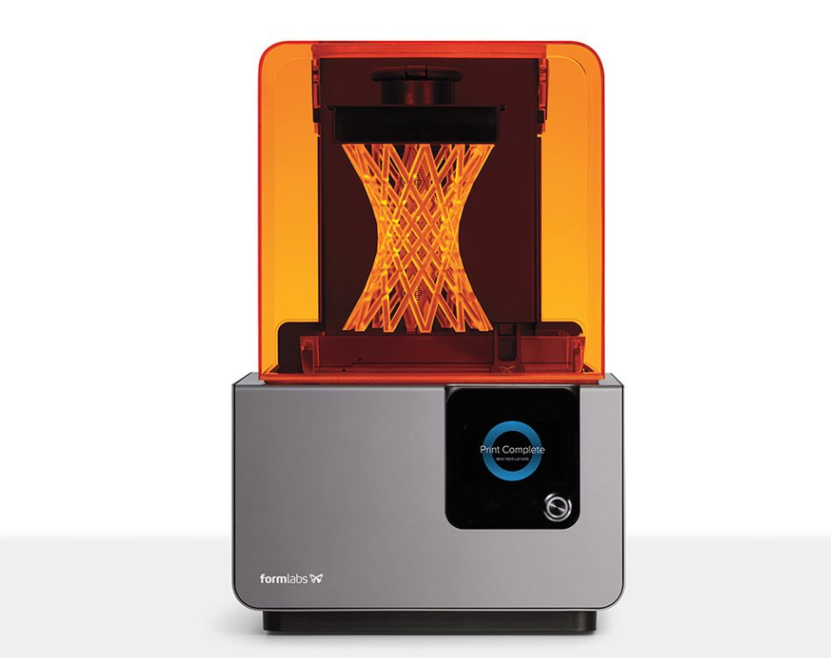
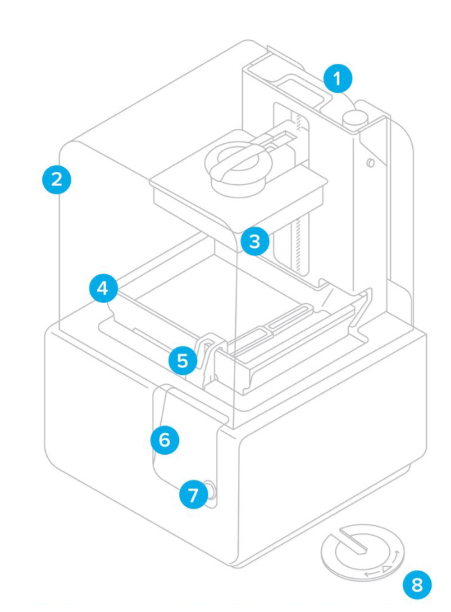
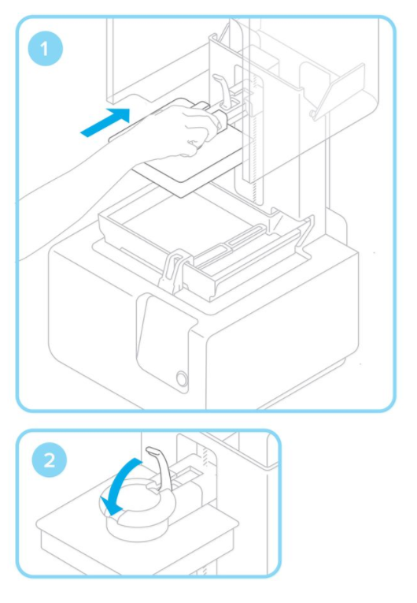
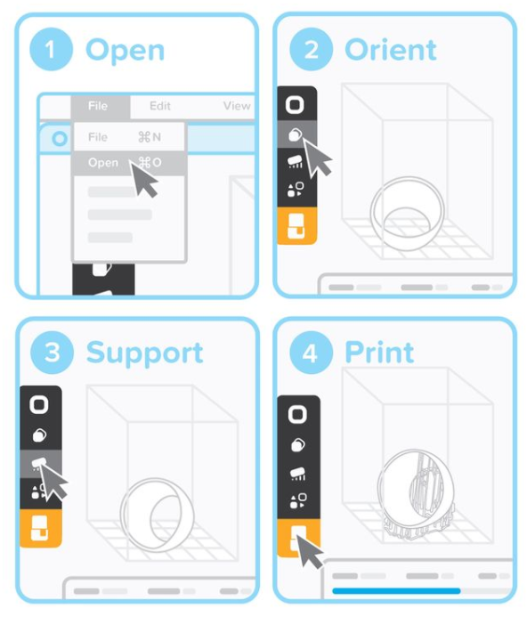
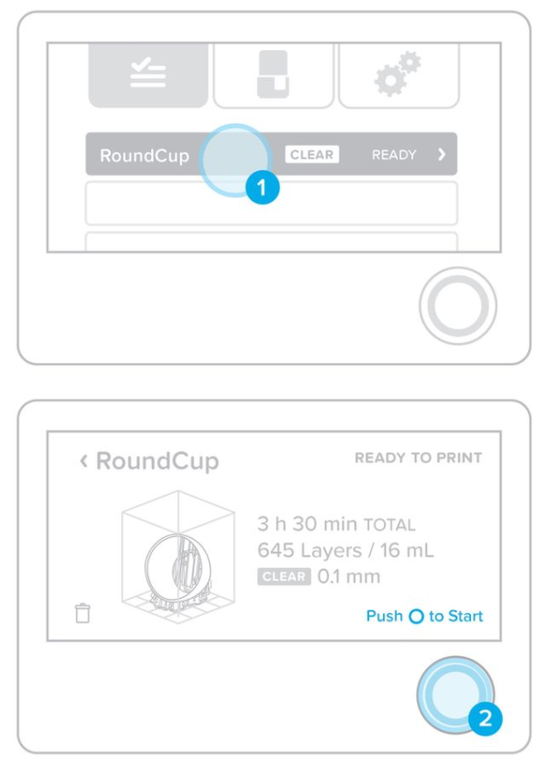

# [Form Labs Setup (For Managers)](Formlabs2QuickStartGuide)

 # Formlabs 2 Quick Start Guide  

Welcome to the EPL! We’re excited you’re getting started with
the Formlabs 3D printer. This guide will provide a walkthrough
for how to safely and efficiently use the Formlabs 3D printer so
you can get going with your project. If you have any additional
questions, please ask any EPL student managers for help, or
email us at EPL@pdx.edu.

## Printer Components:  

1. **Cartridge:**
This is the container that stores the resin. There is a vent opening on the top, similar to a shampoo bottle that will need to be open during printing. There are several different types of resins that the Formlabs can print with. The printer needs to know which kind of resin is being used, so it will prompt you to confirm before printing. This information can be found on the cartridge label. (for example FLGPCL04)
2. **Cover:**
The orange tinted plastic cover should stay down unless a print is being removed, resin is being swapped, or an adjustment is being made. This keeps UV light from the hardening the resin in the tank.
3. **Build Platform:**
The Build Platform is what your printed part sticks to. The Build Platform moves down into the resin. The UV laser shines up through the resin tank to harden the resin onto the Build Platform, layer by layer. When the print is done, this can be removed by using the latch on top of the Build platform, by moving the latch up and sliding the plate back towards the user.
4. **Resin Tank:**
The Resin Tank is a tray that houses a pool of resin. The laser sits below this tank and shines into it to harden the resin onto the Build Platform. The Resin Tank can be removed and should have a lid placed on it to keep the resin from drying out. Each type of resin material has its own resin tank. They are stored on the shelf to the left of the Formlabs printer. The Resin Tank is removed by first removing the wiper (detailed below) then moving the tank all the way to the right and using two hands to pull the tank back towards the user.
5. **Wiper:**
The wiper sits inside the Resin Tank and agitates the resin during printing. This keeps a fluid layer of resin available for the laser to harden onto the build plate. It must be removed before the Resin Tank can be removed. This is done by opening the Cover, sliding the Wiper all the way to the right, then using two hands to pull the wiper directly back toward the user.
6. **Touchscreen:**
The Touchscreen is the main interface for the printer. After you upload your design to the Formlabs using the printer, this is what you’ll use to find your file and get your print started.
7. **Button:**
Located next to the Touchscreen, the button is what you will use to start your print.
8. **Leveling Tool:**
These are used to make sure that the Resin Tank is level and each layer of your print has a coating of resin. The managers in the EPL will take care of making these adjustments if they are needed.  

## Prepare:  
### 1. Insert Resin Tank with Wiper  
It is important to note that the resin tank is paired with a specific material, please make sure that you are using the correct resin tank for the material you wish to use.  

Remove the tank lid and align the four small feet of the resin tank with the corresponding holes in the tank carrier; push forward into place.  

### 2. Lock Wiper  

  

Ensuring the wiper is straight, align the foot of the wiper with the corresponding hole and push forward, snapping it into place.  

### 3. Insert Build Platform  

  

Align the build platform with the platform carrier and push it into place, locking the handle down to secure.  

### 4. Insert Resin Cartridge  

  

Align the cartridge with the opening in the back of the printer. Push down until it sits securely. Be sure to remove the orange valve cover from the underside and press open the cap before starting a print, so that your resin tank fills correctly.  

## Printing:
Begin by opening the PreForm software located in the start menu on the workstation near the formlabs machine.  

Open your STL or OBJ files. Most parts print better when support at an angle. For automatic set-up, use PreForm tools to “orient all,” “generate all,” and “layout all.” PreForm will do these steps in sequence if you select “One Click Print.”
Confirm your print's material and layer height, then click the orange print icon. Select which printer to upload the file to from the printer dialogue.  

## Confirm Print on Printer:

You will see your file uploading to the print queue on your printer's touchscreen. Select the file name and confirm the print by pushing the button on your printer.  

 
