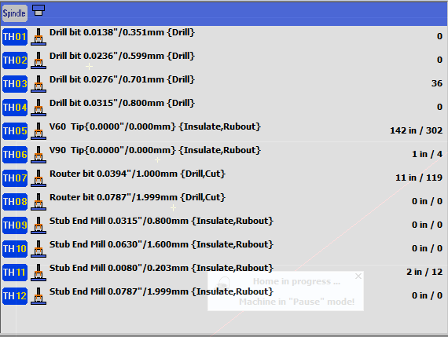

## Tool Change Guide 

To change or replace a tool, you can either use the wizard in PhCNC, or you can follow these instructions. 

# When to change Tools

Sometimes you will need to change out the tool on the A406. Usually its because it has broken, but on rare occasions you will need a totally different tool (Not recommended: see the Recommended Tools guide below for the usual orientation).

# Recommended tools

# Pull the tool and open the machine control panel 

Pull the tool you need to replace from the tool holder. In this example, tool 9 was pulled out. 

Go into CNC mode and hit ¡°Park.¡± Make sure it is not in Emergency Stop mode. 

 

Next you will have to go to the ATC Control Panel 

 

Even though you have pulled the tool, PhCNC still does not know that its tool holder slot is empty. Run ¡°Tool Holders check.¡±

Now you should see that the tool you pulled is blank in the list. 

  

# Replace the tool

Double click on the newly-empty tool. You should get a popup instructing you to change the tool. 

 

The ¡°target¡± button referred in this dialog is a silver button on the left side of the A406, on the edge closest to you. When you press it, you should hear the collet open. When you release it, you should hear it close. 

Take your new tool, hold down the target button to open the collet, and insert it into the drill. Release the target button, and the collet should grasp the new tool. 

Click OK on the dialog and the A406 will do its thing, including hitting the target button with its new tool. Keep your hands clear of the head in during this process. 

Once the tool is in place, you may have to press ¡°Return Tool¡± on the ATC control panel dialog. The A406 will then place the tool back in the tool holder. 

# Define your tool. 

Now you will have to define the new tool in the PhCNC software. The ATC control panel should now show that your tool is ¡°undefined.¡± 

 

Double click on your undefined tool and you will get a window with several options. You should see your new tool at the bottom.

 

Click on the new tool and put in its diameter, type, and operation. The rest you can leave as ¡°default.¡± 

Once you close the window, you should see that your tool is now defined. Congratulations, you have defined your tool! 

 

[Index](index.html)
