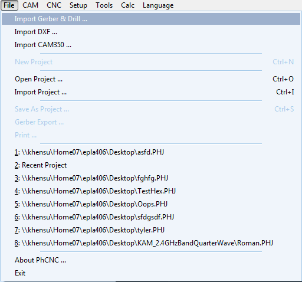
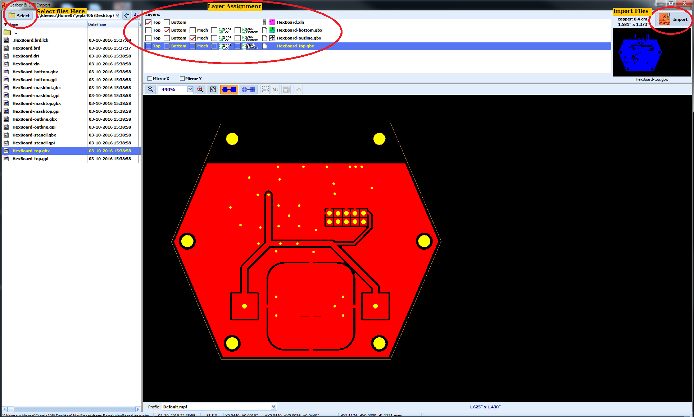
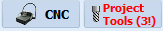
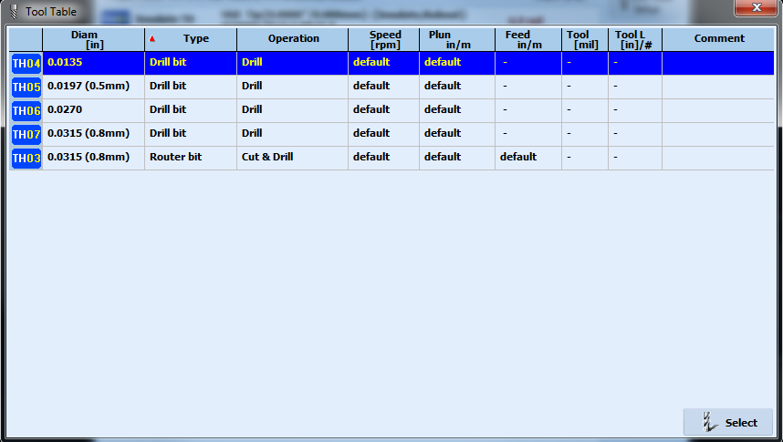
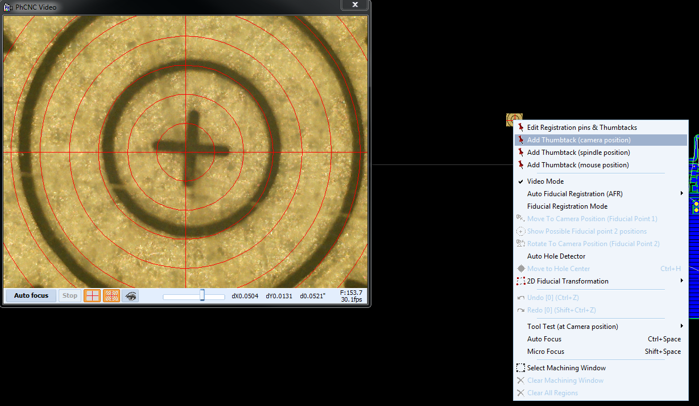
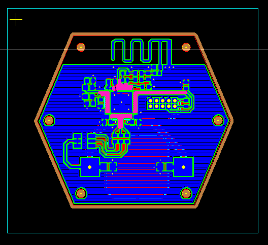
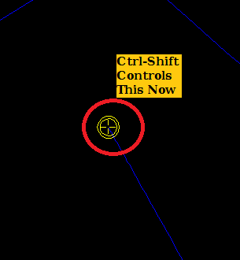
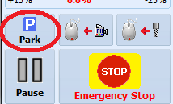


----- An Explanation of the ToC -----
The `## Table of Contents` just provides a section heading (h2) for the ToC.
The `{:.no_toc}` assigns the class name `no_toc` to the header, to exclude it from the ToC.
`1. Table of Contents` is a dummy unordered list for the next line to operate on.
`{:toc}` turns the previous unordered list into a ToC.


## Table of Contents
{:.no_toc}
1. Table of Contents
{:toc}

# About the A406

The A406 claims to be able to do:

- 6/6 mils using the 60 degree "V-tip" (routing bit, or "universal cutting tools" in LPKF land).
- 8/8 mils using the 90 degree v-tip.

Why should you use the A406 over the LPKF? If you need more manual control over the process, if you're a little bit more of a power PCB person, then according to our experience, you should get better results from the A406. The LPKF software is more user friendly (for some definition of friendly), but the system is still remarkably flaky given how much we paid for it.

[Link to A406 Users Manual](http://www.accuratecnc.com/PhCNC_download_files/PhCNC%20User's%20Manual%20EN.pdf)

[A406 Tool Settings](A406-Tool-Settings.html)

[Debugging](A406-Debugging.html)

# Useful Links

[A406-Debugging](A406-Debugging)  
[A406-materials](A406-materials)  
[A406-target-calibration](A406-target-calibration)  
[A406-Tool-Settings](A406-Tool-Settings)  

# Using the A406

The A406 does not have a safety cover. Its steppers are very strong. Before turning on the machine or performing any operation, make sure the table area is clear of obstacles. Resist the temptation to place anything besides the pcb blank on the work area of the machine. Most importantly, **keep your hands away from the working area whenever the head is moving!**

1. Turn on the machine. The power switch is located just above the power cord entry on the left rear of the machine.
1. Start the PhCNC software There are two 'views', CAM and CNC. Toggle between them by clicking on the "CNC" button on the top of screen. 
1. The Emergency Stop button will be lit because the machine has not been homed. This is true whenever the software is started or after a user-initiated emergency stop. Click the emergency stop button. A dialog will appear. Choose 'Yes' to home the machine.

## Import Your CAD files

1. Go to the CAM view by clicking the "CNC" button.
1. Import your artwork by selecting File -> Import Gerber & Drill (GV) or clicking on the "Import" button (the left top button).

1. Use the 'Select' button on the upper left to navigate to your Gerber/Excellon file directory. You should see a list of files in the left column.
1. Files on the left must be 'mapped' for the import process. You will need three or four files depending on if your board is one or two layers:
   - Top copper 
   - Bottom copper (if applicable)
   - Outline
   - Drills
1. Mapping is done by selecting a filename on the left, then checking the appropriate box on the right.
   - The Gerber interpreter is automatic. 
   - Excellon data is trickier. When you select your drill file, you will have the option of 'Top' or 'Bottom'. This means you can drill holes from the top or bottom layer. Always choose 'Top', because PhCNC's natural processing order does the top of the board first, and if holes are drilled on the first side processed, they can be used as fiducials to align the second side. If you are lucky, the default decimal places and zero suppression settings will 'just work'. The software will draw the drill holes as yellow dots on your artwork. Look carefully and see if the holes seem to be in the right places. If they aren't, you'll need to double-click on the drill layer in the upper right pane and edit the settings. 
   - Don't forget to import an outline (mechanical) layer to define the cutout boundary.
1. Once all your layers have been mapped, click the 'Import' button on the upper right.

## Setting the insulation width

- Set the "Insulate" setting to your board trace/space setting. E.g., if your board is 8/8, choose 8 mils.  The "Insulate"
   - If you get warnings in the lower left status bar (look out for dark pink button), keep going down 0.1 or 0.2 mils until you don't have any warnings.

   

   - If you must play with the tools [consult the oracle](https://github.com/psu-epl/psu-epl.github.com/wiki/A406-Tool-Settings) for current best settings before continuing.

## Assign Project Tools

- Click on "Project Tools". 
   - The text in the button should be red because your tools aren't assigned. Blue text means you're good to go.

- Any tool that doesn't have a blue "TH" button to its left will need to be assigned a tool.

- Double click on that tool and select the tool from the dialog that appears. Only relevant tools will appear in that dialog (in other words, only isolation tools for isolation tools, etc).

- Generally use v60 V-Tip for 6/6 boards and v90 for 8/8 boards.
- When you click on the first of your drill tools, a new selection dialog will pop up because... because.
   - Click on "Apply default router tool" in order to use the 0.8 mm router bit for larger holes.
   - Double click on the button to the left of any drill that still needs to be assigned and assign that drill a drill.
   - Sometimes you choose a drill that has a different diameter than what you want. That's fine, you can even have multiple sizes in your file just use one drill.

## Position artwork on blank

- Click on "CNC" to go to CNC mode.

- Click on the "Camera follows mouse" button.

- You are now controlling the machine by camera location.

- Hold down the "left Control" key and right-click the mouse on the CAM view to move the camera to the upper left hand corner of where you want your artwork.  You can sight in exactly where you want you start cutting by using the translucent centering sheet.
- Make sure the foot around the tool is solidly on the PCB material, and not on tape, or overhanging the board, or whatnot.
   - You can use the +/- arrow buttons in the upper left hand corner to move the head in small steps.

- Right click and choose "Add Thumbtack at Camera Position".

- Click on "CNC" to back to CAM view.
- Choose the "Select/move/clone" button (looks like a cursor arrow)

- Select your artwork by click and dragging a selection box around it.

- Left click and hold to drag your board to the thumbtack, which in this view looks like a small yellow cross.

- Add your breakout tabs.
   - Hover over the outline of your board where you want the tabs
   - Hit Ctrl-T. You should see a red "X" and broken line in your outline.
   - It is easiest to remove your board if you only use two breakout tabs opposite each other.
   - Alternatively you can right click and select 

- Click on "CNC" to go to CNC mode.
- Click on the "Spindle follows mouse" button.

- You are now controlling the machine spindle position.

- Hold down the "left Control" key and right-click the mouse on the CAM view to move the head to the lower right hand corner of your artwork. This will make sure that you don't go off your material when you're routing the opposite corner. In other words, make sure your artwork actually fits.

## Check cut depth

- Click on the "Camera follows mouse" button.
- "Left Control + right mouse click" move an area outside of your artwork on an unused part of the PCB material.
- Zoom into the camera area.
- In the camera area, right click and choose "Tool test at camera position".

- Click OK at the suggested penetration depth (2.4 mils).

- Hit Control-Space to focus the camera.
- Make sure it's around 7-9 mils.
   - Click on the "0.001" button in the movement area in the upper left part of the screen.
   - Move the red cross hairs to one edge of the calibration mark. Then count the number of times you need to move the camera using the arrow buttons in order to measure the width of the cut.
- If it's not a good penetration depth, then continue doing calibration cuts at different depths until you find a good one. The calibration mark should be very clean, no smeared coppers and no "bright outlines" around the edge of the copper (which is actually burs). You should be able to run your fingers over it and feel nothing at all - if you feel a bump, that's a burr, which is bad. You should probably increase your depth and/or change your bit.
- Once you find a good depth, then:
   - Click on "ATC Control Panel" button

   - In the bottom section, in the Project Tools list, enter in the depth you found in the insulate tool's "Depth" column entry box.

## Go!

- Zoom out to see your artwork.
- In the "Program" drop down list in the upper right corner of the screen, choose "Entire Top".
   - "*" entries in this list are groups of phases.
- Choose "RUN(GO)"

## Flip the board

- Hit "Park" to get the head out of the way.

- Remove your PCB.
- Flip your board over. Doesn't actually matter how you flip it, but we recommend flipping the edge that is towards you away from you.
- IMPORTANT: deburr the the new surface. All of the drills will have little burrs that will cause the bottom layer to not route correctly. Use a razor blade, and gently sand it when you're done.

## Register your flipped board

- Choose two holes on your board to be fiducials. It's good if they're medium sized - not larger than like a few millimeters. Small holes are OK, probably, too. You want the holes to be in the opposite corners of the board, to make the registration as accurate as possible. One note: you can't have the fiducials be too close to the tool holder, because the head can't move that far towards the front of the machine.
- Put the acetate circly thingy with the arrows ("Hole Finder Tool") on top of your first fiducial hole you chose.
- Choose "Entire (Bottom)*" from the "Program:" drop down in the upper right hand corner.
- Click "camera follows mouse" button and then right click in the workspace area and choose "Fiducial Registration Mode" from the drop-down menu.

- Move head to the first fiducial hole by clicking "Camera follows mouse" button and control-right click.
- Focus the video using control-space bar.
- Zoom into your fiducial hole following the arrows.
- Now, zoom EXACTLY into the center of the hole using the red target circles. Use the "movement" arrow buttons in the upper left to get it exactly centered - "1 step" is the finest resolution you can get.
- Right click in the CNC window and choose "Fiducial Registration Mode"
- Go find the hole in your artwork that corresponds to this hole. Zoom WAY into the hole, center the mouse cursor right in the center of the cross hair in the hole, and right click and choose "Move to Camera Position (Fiducial 1)". 
- Now the yellow cross hair of the hole should be exactly in the center of the camera target circles.

- Put the hole finder tool over your second fiducial point.
- Use ctrl-right click to center the camera over the hole. Ctrl-space to focus.
- Center the camera EXACTLY over the second fiducial hole, using the movement arrows at the "1 step" resolution.
- Find the hole in your artwork, and zoom in on that hole.
- Put the mouse cursor in the exact middle of the yellow hole marker, right click, and choose "Rotate to camera position (fiducial 2)".

- Now all of the yellow hole markers in your artwork should line up with the actual holes on your board.
- You can go back and forth between holes at this point to optimize the fit, but don't go nuts here.
- That's it, your registered.
- At this point, we recommend doing another tool depth test just to make sure everything is OK (see above)
- Choose "RUN(GO)" and it'll do the bottom of your board.

 

