--- 
title: A406 SOP 
layout: doc 
author: 
date: 
numbering: true 

--- 

 
----- An Explanation of the ToC ----- 
The `## Table of Contents` just provides a section heading (h2) for the ToC. 
The `{:.no_toc}` assigns the class name `no_toc` to the header, to exclude it from the ToC. 
`1. Table of Contents` is a dummy unordered list for the next line to operate on. 
`{:toc}` turns the previous unordered list into a ToC. 
 

## Table of Contents 
{:.no_toc} 
1. Table of Contents 
{:toc} 

# About the A406 
The A406 claims to be able to do: 

- 6/6 mils using the 60 degree "V-tip" (routing bit, or "universal cutting tools" in LPKF land). \*
- 8/8 mils using the 90 degree v-tip. 

\* A 6/6 board means that the trace width and spacing between traces are each 6 mils. An 8/8 board means that the trace/space widths are each 8 mils.

Why should you use the A406 over the LPKF? If you need more manual control over the process, if you're a little bit more of a power PCB person, then according to our experience, you should get better results from the A406. The LPKF software is more user friendly, but still has a few issues. 

**What do you need to start a job?**
- A 6/6 mil or 8/8 mil PCB design (see "About the A406" for more details about what this means).
- 2-3 gerber files (top, outline, and bottom if board is two layers) \*
- 1 excellon file (for drill holes) \*
- A copper PCB blank (can be purchased from the EPL - sold double and single sided)

\*If you need help exporting gerber and excellon files from your Eagle board file, follow the instructions [here](https://support.jlcpcb.com/article/43-how-to-export-eagle-pcb-to-gerber-files).

[Link to A406 Users Manual](http://www.accuratecnc.com/PhCNC_download_files/PhCNC%20User's%20Manual%20EN.pdf)   
[A406 Tool Settings](A406-Tool-Settings)   
[Debugging](A406-Debugging)   
[Tool Change](A406-Tool-Change)   

# Useful Links 

[Exporting Gerber and Excellon Files from Eagle](https://support.jlcpcb.com/article/43-how-to-export-eagle-pcb-to-gerber-files)   
[A406-Debugging](A406-Debugging)   
[A406-materials](A406-materials)   
[A406-target-calibration](A406-target-calibration)   
[A406-Tool-Settings](A406-Tool-Settings)
[A406-Tool-Change](A406-Tool-Change)

# Using the A406

The A406 does not have a safety cover. Its steppers are very strong. Before turning on the machine or performing any operation, make sure the table area is clear of obstacles. Resist the temptation to place anything besides the pcb blank on the work area of the machine. Most importantly, **keep your hands away from the working area whenever the head is moving!**

1. Turn on the machine. The power switch is located just above the power cord entry on the left rear of the machine.

2. Turn on the air compressor for the collate.

3. Start the PhCNC64 software there are two ‘views’, CAM and CNC. The CAM view is where you can edit your circuit design and add features like tabs or fiducials. The CNC view allows you to see how the router will cut the board. 

    1. Toggle between them by clicking on the "CNC" or “CAM” button on the top of screen.

4. Home the machine by clicking the **Emergency Stop Button**. A dialog will appear similar to the one shown below.

    1. The Emergency Stop button will be lit because the machine has not been homed. This is true whenever the software is started or after a user-initiated emergency stop. While the machine is stopped, you cannot move the camera, change tools, or park the device. 

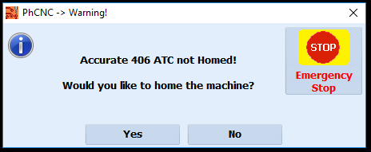

5. Choose ‘Yes’ to home the machine.

## Import Your CAD files

1. Go to the CAM view (it should say CAM at the top. If it says, CNC click the "CNC" button at the top). 

    1. *Note: when in cam view you are able to select ‘import Gerber & Drill’ under ‘file’, when in CNC mode you are unable.*

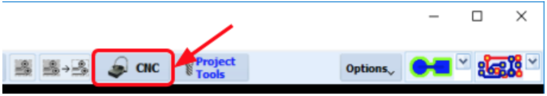

2. Import your circuit design by selecting "File" -> “Import Gerber & Drill…” or clicking on the Import button (the left top button).

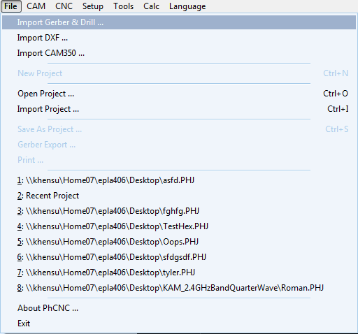

3. Use the ‘Select’ button on the upper left to navigate to your Gerber/Excellon file directory and press "OK" when you are in the correct directory. You should see a list of files appear in the left column.

    1. All of your gerber and excellon files MUST be in the same folder!

4. Files on the left must be ‘mapped’ for the import process. You will need three or four files depending on if your board is one or two layers:

    1. Top copper

    2. Bottom copper (if applicable)

    3. Outline (Mech)

    4. Drills

5. Mapping is done by selecting a filename on the left, then checking the appropriate box on the right. Map your outline file to the "Mech" layer. A dialog will appear similar to the one shown below.

    1. The Gerber interpreter is automatic.

    2. Excellon data is trickier. When you select your drill file, you will have the option of ‘Top’ or ‘Bottom’. This means you can drill holes from the top or bottom layer. Always choose ‘Top’, because PhCNC64’s natural processing order does the top of the board first, and if holes are drilled on the first side processed, they can be used as fiducials to align the second side.

        1. If you are lucky, the default decimal places and zero suppression settings will ‘just work’. The software will draw the drill holes as yellow dots on your design. Look carefully and see if the holes seem to be in the right places. If they aren’t, you’ll need to double-click on the drill layer in the upper right pane and edit the settings.

    3. Don’t forget to import an outline (mechanical) layer to define the cutout boundary.

    4. Only one Gerber file can be used for each layer. You cannot have two files for a top layer or two files for a bottom layer. If you need to combine data from two files, you will have to do that in CAD. 

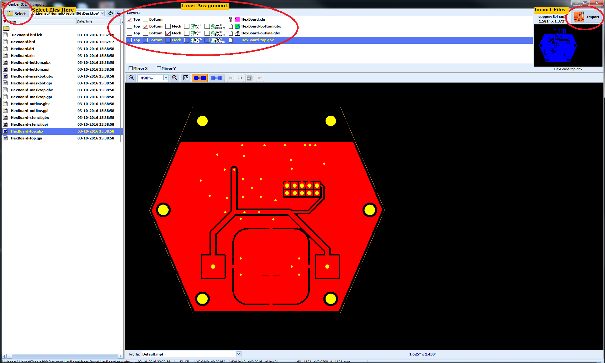

6. Once all your layers have been mapped, click the ‘Import’ button on the upper right.

## Setting the Insulation Width

1. Set the "Insulate" setting to your board trace/space settings that you designed on your CAD software.

    * If your board was designed to have 8 mil traces and 8 mil spaces (an 8/8 board), choose 8 mils for the insulation setting. 

    * Do this by clicking the "Insulate" button, and in the window that pops up, edit the “diameter (d)” field to match the appropriate value in inches.

        * If you want your trace spacing to be 8 mils, type in 0.0080 in the field. 

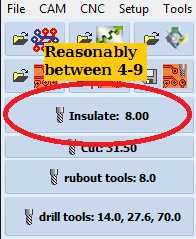

2. If you get warnings in the lower left status bar (look out for dark pink button), keep going down 0.1 or 0.2 mils until you don’t have any warnings. These pop up if your insulation settings are larger than you designed them to be on your PCB.

Other Notes:

* If you must play with the tools [consult the oracle](http://psu-epl.github.io/doc/equip/router/A406/A406-Tool-Settings) for current best settings before continuing.

* If you need to change or replace tools, [consult the tool change guide] (A406-Tool-Change).

## Assign Project Tools

1. Click on "Project Tools". 

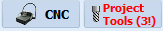

2. Next you will need to assign tools. The "Project Tools" button on the top will likely have red text, because tools have not been assigned for the job. 

    * The software will automatically assign some tools, but not all. This is because the software has determined that there are multiple tools could be used to isolate the traces and needs you to choose between them.

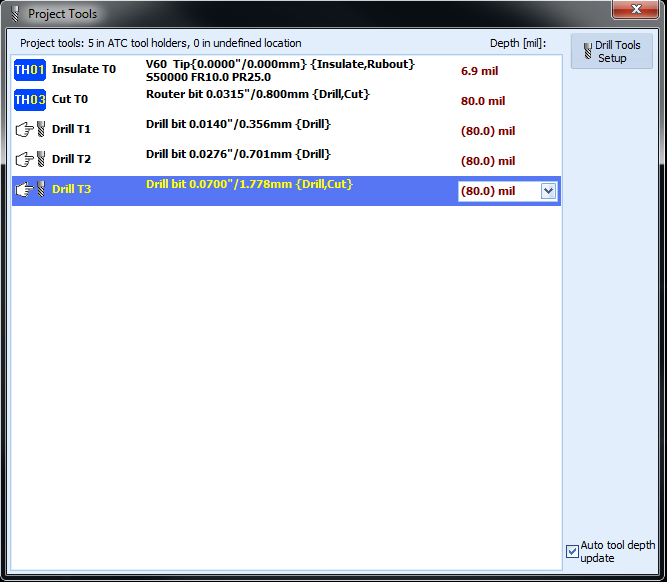

3. Any tool that **doesn’t have** a blue "TH ##" button to its left will need to be assigned a tool.

4. Double click on that tool. A dialog will appear similar to the one shown below that lists the tools that still need to be assigned. 

5. Click on the number labels to the side (i.e. #1, #2, and #3). Another window will appear like the one below, showing you which tools you can assign.

    * The best practice is to choose a tool that is slightly smaller than the width of the cut needed. For example, drill #1 has a max diameter of 0.0140", so in the dialog that pops up, you might select the tool in TH04, which has a diameter of 0.0135” which is less than the maximum diameter specified. If you can’t find a good matching tool choose the closest size you can as long as it is below the maximum diameter.

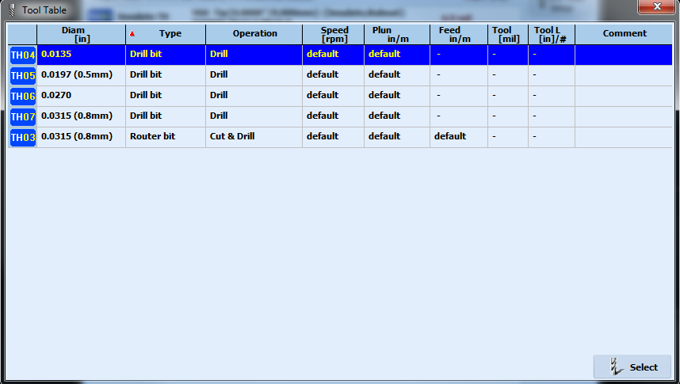

6. Click "Select" and move onto the next tool needing assignment. Once all tools have been assigned, close the Drill Tool Table and then the Project Tools window.

*Other Notes:*

* Generally use v60 V-Tip for 6/6 boards and v90 for 8/8 boards.

## Position Design on Blank

Now you will need to choose where on the board you will start the routing process. By default the design will be in the center of the board, but that might not be the best place to start drilling. You will also have to consider that the A406 cannot actually use the entire workspace, because it locks up when it moves too close to any edge, forcing you to hit emergency stop twice to home it. Make sure your design is positioned correctly to avoid these pitfalls.

1. Click on the "CNC" button. This will bring you to CNC mode.

2. Click on the Camera Follows Mouse button.

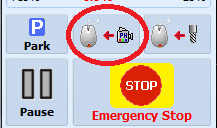

    1. If The Emergency Stop button will be lit because the machine has not been homed.

        1. While the machine is stopped, you cannot move the camera, change tools, or park the device. Click the emergency stop button. A dialog will appear similar to the one shown below.

        2. Choose ‘Yes’ to home the machine.

    2. You are now controlling the machine by camera location and the PhCNC Video window will appear.

        1. This window is a camera that will allow you to see the surface under the cutting arm.

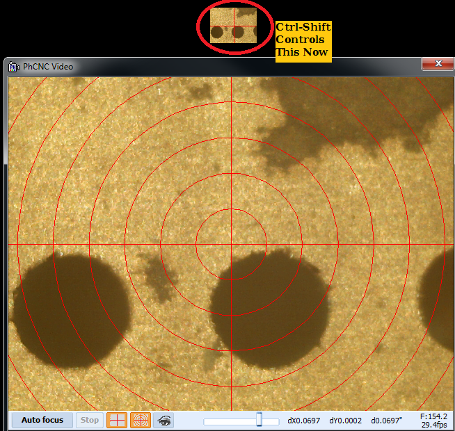

3. Hold down the Left "Control" key and right-click the mouse on the CAM view to move the camera to the upper left hand corner of where you want your design. 

    1. You can sight in exactly where you want you start cutting by using the translucent centering sheet.

4. Make sure the foot around the tool is solidly on the PCB material, and not on tape, or overhanging the board, or whatnot.

    1. You can use the +/- arrow buttons in the upper left hand corner to move the head in small steps.

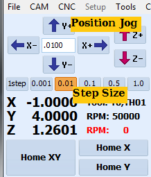

5. Right click and choose "Add Thumbtack at Camera Position". This will be for your own reference.

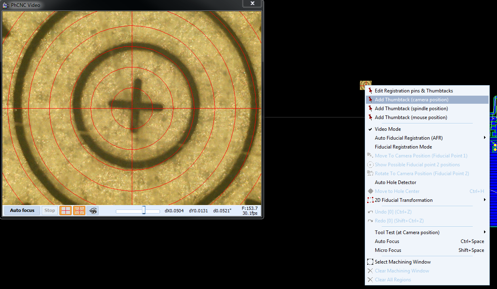

6. Click on "CNC" to back to CAM view.

7. Select the "Select/Move/Clone objects" button 

    1. Looks like a cursor arrow, see photo below.

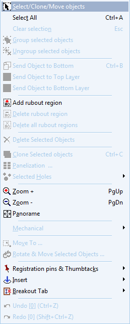

8. Select your design by click and dragging a selection box around it.

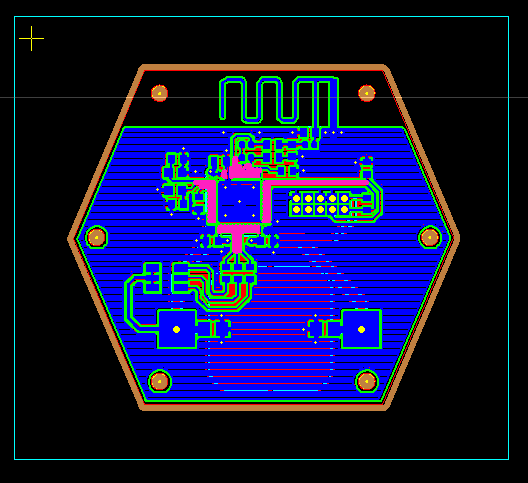

9. Left click and hold to drag your board to the thumbtack, which in this view looks like a small yellow cross.

10. Add your breakout tabs. When the router cuts out the outline of your board, the breakout tabs will be areas that aren’t cut. These will form "tabs" which will hold your board in place. This tabs will need to be broken in order to free your board design from the copper material.

    1. Hover over the outline of your board where you want the tabs

    2. Hit Ctrl-T. You should see a red "X" and broken line in your outline.

        1. Try zooming in if you can see the red "X".

    3. It is easiest to remove your board if you only use two breakout tabs opposite each other.

    4. Alternatively you can right click and select the option to add a breakout tab.

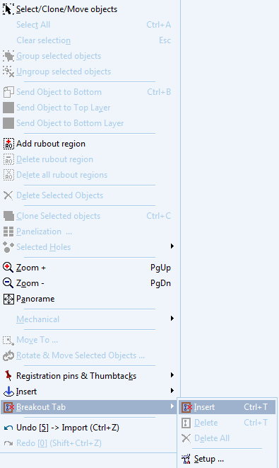

11. Click on "CNC" to go to CNC mode.

12. Click on the "Spindle follows mouse" button.

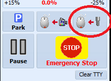

13. You are now controlling the machine spindle position.

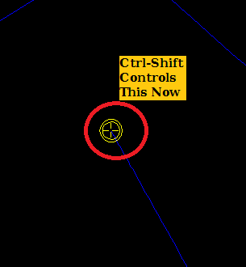

14. Hold down the "left Control" key and right-click the mouse on the CAM view to move the head to the lower right hand corner of your design. This will make sure that you don’t go off your material when you’re routing the opposite corner. If your board is too small or ill-positioned, the camera will go off the edge. Youll need to reposition the design or get a larger board if so. This is to make sure your design fits your board.

## Check Cut Depth

1. Click on the "Camera Follows Mouse" button.

2. "Left Control + right Mouse Click" move an area outside of your design on an unused part of the PCB material.

3. Zoom into the camera area.

4. In the camera area, right click and choose "Tool test at camera position".

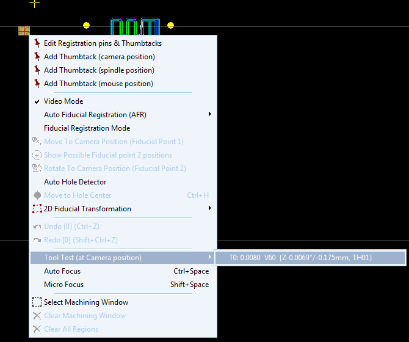

5. Click OK at the suggested penetration depth (2.4 mils).

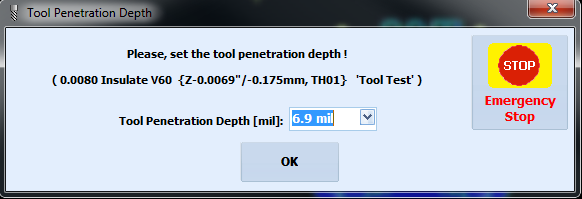

6. Hit Control-Space to focus the camera.

7. Make sure it’s around 7-9 mils.

    1. Click on the "0.001" button in the movement area in the upper left part of the screen.

    2. Move the red cross hairs to one edge of the calibration mark. Then count the number of times you need to move the camera using the arrow buttons in order to measure the width of the cut.

8. If it’s not a good penetration depth, then continue doing calibration cuts at different depths until you find a good one. The calibration mark should be very clean, no smeared coppers and no "bright outlines" around the edge of the copper (which is actually burs). You should be able to run your fingers over it and feel nothing at all - if you feel a bump, that’s a burr, which is bad. You should probably increase your depth and/or change your bit.

9. Once you find a good depth, then:

    1. Click on "ATC Control Panel" button

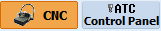

10. In the bottom section, in the Project Tools list, enter in the depth you found in the insulate tool’s "Depth" column entry box.

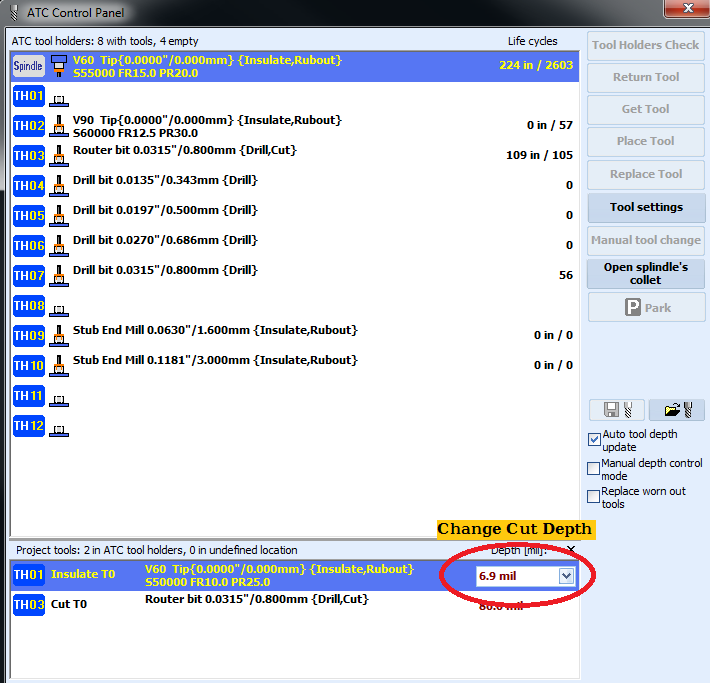

## Go!

1. Zoom out to see your design.

2. In the "Program" drop down list in the upper right corner of the screen, choose “Entire Top”.

    * " * " entries in this list are groups of phases.

3. Choose "RUN(GO)"

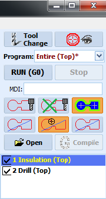

## Flip the Board

1. Hit "Park" to get the head out of the way.

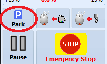

2. Remove your PCB.

3. Flip your board over. Doesn’t actually matter how you flip it, but we recommend flipping the edge that is towards you away from you.

4. IMPORTANT: Deburr the new surface! All of the drills will have little burrs that will cause the bottom layer to not route correctly. Gently sand the surface of the board..

## Register Your Flipped Board

1. Choose two holes on your board to be fiducials. It’s good if they’re medium sized - not larger than like a few millimeters. Small holes are OK, probably, too. You want the holes to be in the opposite corners of the board, to make the registration as accurate as possible. One note: you can’t have the fiducials be too close to the tool holder, because the head can’t move that far towards the front of the machine.

2. Place the "Hole Finder Tool" (the clear plastic sheet with circles and arrows printed on it) on top of your first fiducial hole you chose.

3. Choose "Entire (Bottom)*" from the “Program:” drop down in the upper right hand corner.

4. Click "camera follows mouse" button and then right click in the workspace area and choose “Fiducial Registration Mode” from the drop-down menu.

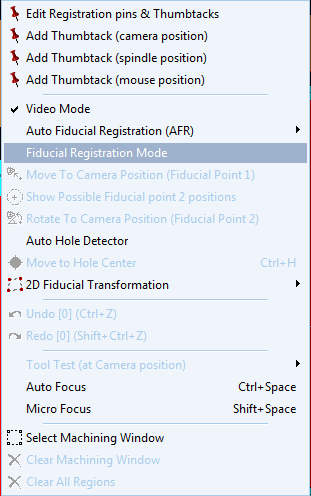

5. Move head to the first fiducial hole by clicking "Camera follows mouse" button and control-right click.

6. Focus the video using control-space bar.

7. Zoom into your fiducial hole following the arrows.

8. Now, zoom EXACTLY into the center of the hole using the red target circles. Use the "movement" arrow buttons in the upper left to get it exactly centered - “1 step” is the finest resolution you can get.

9. Right click in the CNC window and choose "Fiducial Registration Mode"

10. Go find the hole in your design that corresponds to this hole. Zoom WAY into the hole, center the mouse cursor right in the center of the cross hair in the hole, and right click and choose "Move to Camera Position (Fiducial 1)".

11. Now the yellow cross hair of the hole should be exactly in the center of the camera target circles.

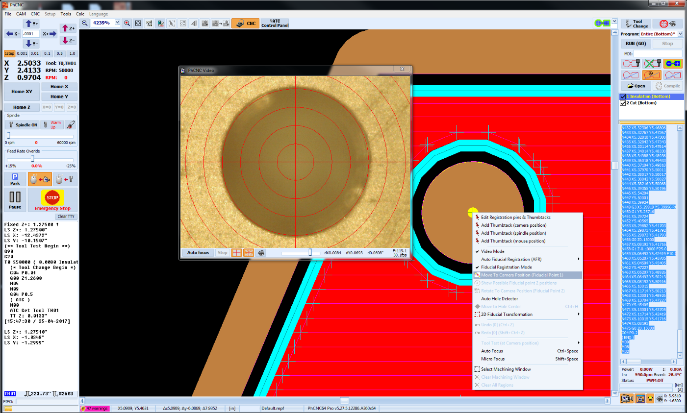

12. Put the Hole Finder tool over your second fiducial point.

13. Use ctrl-right click to center the camera over the hole. Ctrl-space to focus.

14. Center the camera EXACTLY over the second fiducial hole, using the movement arrows at the "1 step" resolution.

15. Find the hole in your design, and zoom in on that hole.

16. Put the mouse cursor in the exact middle of the yellow hole marker, right click, and choose "Rotate to camera position (fiducial 2)".

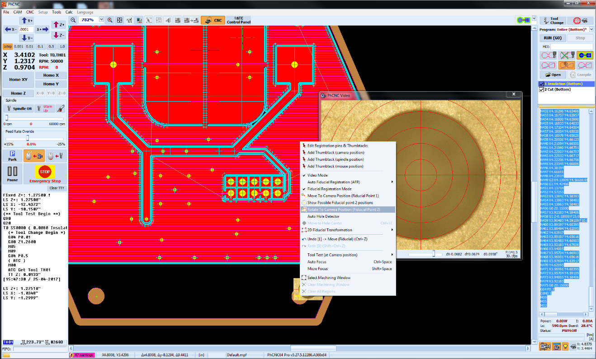

17. Now all of the yellow hole markers in your design should line up with the actual holes on your board.

18. You can go back and forth between holes at this point to optimize the fit, but don’t go nuts here.

19. That’s it, your registered.

20. At this point, we recommend doing another tool depth test just to make sure everything is OK (see above)

21. Choose "RUN(GO)" and it’ll do the bottom of your board.

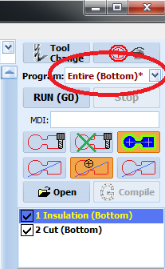
