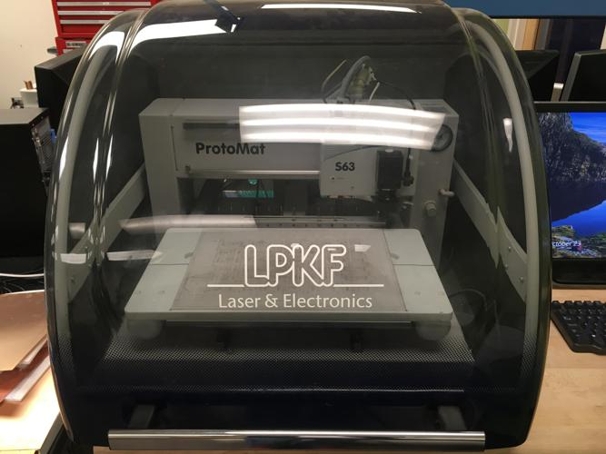
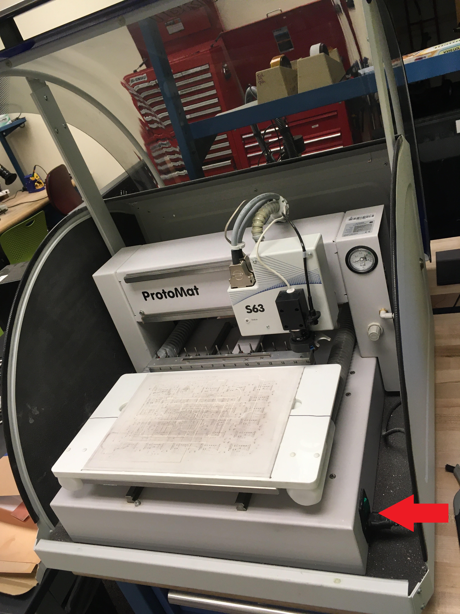
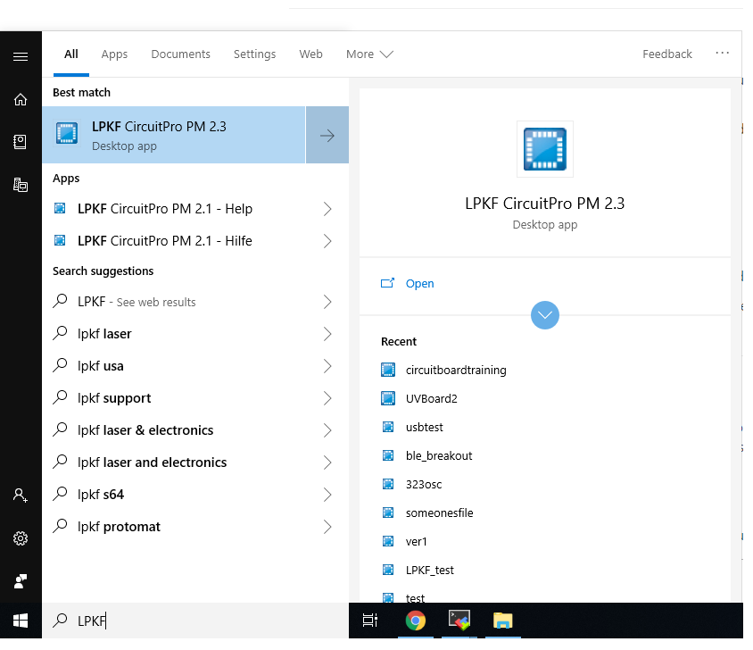
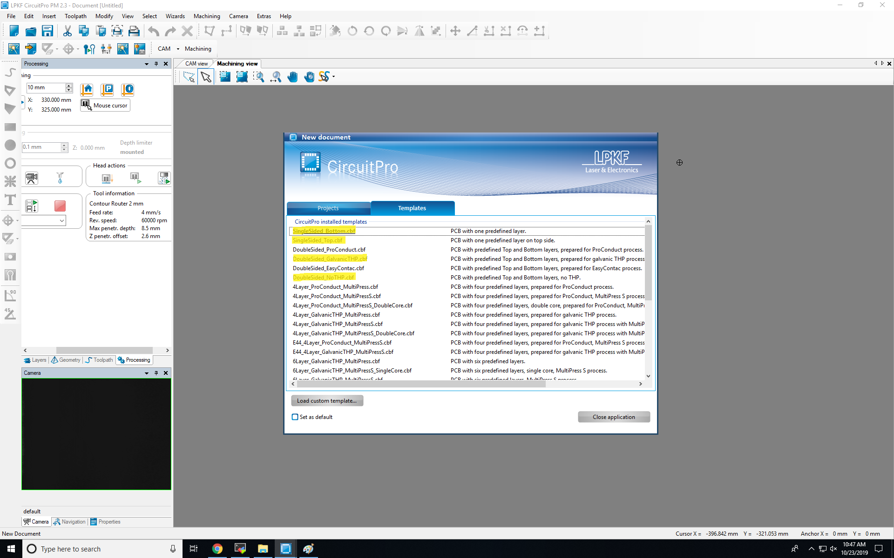

# Using the LPKF S63 Circuit Board Plotter

## Before You Start

 1. Login to controller PC
 2. Turn on the S63 (Open the machine cover, the power switch is on the bottom right front corner)

 3. Close the machine cover. Then start the LPKF CircuitPro software

 4. Select the job type (under the templates tab)
    - Single Sided: `single_sided_top` or `single_sided_bottom`
    - 2 layer (no plating): `double_sided_NoTHP`
    - 2 layer (plating machine): `double_sided_GalvonicTHP` (see plating SOP)

-----------------------------------------------------------------------------------------------

## Import Files

(Refer to https://github.com/psu-epl/psu-epl.github.com/wiki/Design-rules for generating Gerber files.)

 1. Select **File --> Import ...** or **CNTRL+I**
    - Navigate to the folder containing your files. For a two-sided board, you need 4 files:
        * Top Gerber
        * Bottom Gerber
        * Board Outline Gerber
        * Excellion Drill Data
        
 2. Select **Assign layers**

The import dialog will show a list of the four data files. There is a column labeled 'Layer/Template' which maps each data file to a processing layer. Make sure each of the files you imported is assigned to the correct layer in this column.
    These fields should be set to:
    - TopLayer
    - BottomLayer
    - BoardOutline
    - DrillUnplated (or DrillPlated if plating)

If you run into trouble assigning layers in a file gen, try editing the gerber file. Look for a line like %LNdefault*%. I've seen this string in gerbers generated by ADS, and it seems to force the LPKF software into assigning it to that named layer.

--------------------------------------------------------------------------------------------------------

## Add **Fiducials**

Fiducials are holes used to align your work piece during the routing process. These are typically needed when the board is flipped onto its second side so you can align all the drill holes (ie a two layer board).  You should use three or more fiducials, and we usually want to locate them near the corners of the board. This helps align the board easier and saves space on your blank material.

1. Make sure you are in CAM view
2. Select **Insert > Fiducial > Fiducial...**
    - Click on the 3 or more points where you would like the fiducial holes to be.
    - Choose **Close** (not apply)
    - Choosing **Apply** will simply add another fiducial in a random spot near the board

---------------------------------------------------------------------------------------------------------

## Generate Toolpath

Most of the options controlling how the board will be milled are set here. Let's open the Technology Dialog box so we can edit the insulation and routing settings for our board.

 - Select **Toolpath > Technology Dialog.**

#### Edit **Global Processing Settings**

   - Now we're going to edit the settings at the very top section of the newly opened dialog box.
   - Let's set the material thickness. The settings for the half-ounce **FR4** copper we sell in the EPL are: **18 um copper thickness** and **0.061 inch material thickness**

#### Set **Insulate** settings

The "Insulate" settings control how much copper will be removed around your features (pads or traces). 
   - Click the arrows to the right and left of the insulation picture to change the settings.
   - Option 2/4 (Basic, pads double) is often the best choice.
   - Next, Select the **Show Details** button below the insulation image.
   - If your board does not have spacing closer than 8 mil (0.2mm), **un-check the Micro Cutter 0, 1mm** in the Available Tools list.

#### **Contour Routing**

The "Contour Routing" settings control where your boards breakout tabs will be. These are needed to keep your board held in position while routing, but allowing you to easily remove or "break out" your board when it's finished.
   - Click on the arrows to the right and left of the Contour Routing picture to change the settings.
   - Be sure to keep tabs off of corners and usually having 2 tabs will do the job.
   - Options 2/6 (Horizontal Gaps), 3/6 (Vertical Gaps), and 4/6 (Edge Gaps) work best.
   - Next, select the **Show Details** button below the contour routing image.
   - In the "Tool" Dropdown Menu, select the **contour router 1mm bit**
   - Select **Hide Details**

#### Removing Processes

Uncheck steps you won't be using (Drills? Fiducials? Pockets?)
You probably are not using pockets

#### Select **Start** to begin generating the toolpath
 - A window will pop up with computation results. If they look okay, select **Close**

---------------------------------------------------------------------------------------------------------

## **Setup Machine** To Cut

 1. Check Tool Magazine

    Open Edit > Tool Magazine. Under the list of required tools, on the left-hand side, make sure there are no red X's. If there are, you need to physically add the tools (bits) to the tool magazine in the machine.
    In order to change a tool, there is a drawer with small boxes of bits, ask a manager for help before exchanging any tools, but when a tool is inserted or replaced, this must be registered in the software by clicking the dropdown menu for the numbered position in the Tool Magazine. Find the name of the tool that you need and be sure to place the tool in the correct slot.
    Verify the tool is the correct size by checking the numbers on the side of the colored band along the tool.

(Trouble shooting tip: If the router throws a connection error, be sure the lid to the LPKF is closed, then go to Machining > Connect... if errors come up, alert the manager on duty)

    Click 'OK'. You shouldn't need to recalculate the toolpaths. 

2. Physically Mount Material
    * Select a PCB blank

   Choose a flat, untwisted, blank PCB that has enough room on it for your board. In particular, don't forget that you may have fiducial holes outside of your board, and you will be placing some PCB ribbing (blue tape) around your board to hold it in place during routing. So, don't get to close to holes or edges in the blank. A good idea is to draw on your board where you want it to be.

3. Prepare backing surface

    This is **really important**: the white backing material must be as smooth and flat as possible. This machine has no idea where the material surface is, beyond what the user tells it. That is, it thinks it knows the height of the top of your blank, but it assumes it is a perfect plane. If it deviates even by 2 mils (.05mm), isolation **will not work**. So, with the PCB blank not mounted, run your fingers over the surface of the white backing material and feel for any bumps or debris. If you feel any, blow off the debris or use the razor blade tool to remove the bumps. Bumps occur because drills and routing bits grind out and lift backing material. This is especially noticeable in the routed grooves where a PCB was separated from the blank. It's a good idea to run the razor blade over the surface even if you can't feel any bumps. Lift the white backing material out and check the backside too. 

    Next, attach the PCB blank to the vacuum table. The vacuum table will not sufficiently hold a board for routing, so you must put masking tape along at least two sides. Typically, a 6 inch strip along the left and right edges is sufficient. 

4. Edit pattern placement on the PCB blank

    Find the blank spot where you plan to place the board and in the machining view, select the 'Mouse Cursor' mode in the left control panel. When you have the 'Mouse Cursor' mode selected you can click anywhere on the  to move the head to that location. The purpose of this exercise is to make sure the black collar around the bit will never go off the board or hit blue tape. De-select the 'Mouse Cursor' mode.

    In the machining view, right-click on the artwork and select 'Placement'. The design artwork should get a heavy line around it with a rotation handle on the top. Then click and drag the artwork's lower left-hand corner to the location of the head (which should be the appropriate place on the board). 

    Now reselect 'Mouse Cursor' and click on all four corners of the board artwork to verify that the black collar of the router stays on the board and away from tape or other obstacles. 

5. Check cut width

This step may not be necessary. If neither the material thickness nor the bit has been changed since the last job, the milling width will probably be fine. If it appears wrong (either leaving rough cut edges, or wrong isolation width, or both), the first thing to check is the bit. To do this, remove the bit from the tool magazine using the bit removal tool (the blue cylindrical thing which is stuck magnetically to the shelf support.) Look at it under the microscope under maximum zoom. If the straight V cutting edges look at all dented, the bit is finished. After the bit is verified/changed, if the milling width is still wrong, then do the following:
   * Edit > Tool Magazine
   * Check the blue check box next to 0.2 mm Universal Cutter
   * Click on the "Check Milling Width..." button below.
   * Click on the screen behind the dialog to move the yellow box to a place where the milling can be done on your PCB. MAKE SURE THERE ARE NO OTHER MILLING WIDTH CHECK LINES AROUND - if it chooses the wrong one, you're hosed.
   * Click OK. It'll mill the line and check it.
   * Accept the correction if it looks sane. 

6. Run Process

    Select Machining > Process All. It will warn you to tape the PCB blank down but you should have already done it because you're following this awesome guide. Hit 'OK'.
    The Material Settings dialog will come up but you've already done that too. Hit 'Continue'.
    The Placement dialog will come up but you've already done that too. Hit 'Continue'. 
    You'll be prompted to save. Go ahead, why not. 
    The machine should happily do its thing. 

* If you are plating through holes, the LPKF will drill holes first. Once all holes are drilled the material will be removed and run through the plating tank using [The Plating Tank SOP](https://github.com/psu-epl/psu-epl.github.com/wiki/LPKF-MiniContac-RS-Plating-Tank). When the plating process is finished re-mount the material with the bottom up and as close to the same position and orientation as when it was removed.

* Check Isolation

     Before going on, check that the traces are actually isolated by the router bit. Check all four corners of the board. Use the loop and a lamp. Use razor blade and/or sandpaper to make it smooth to the touch.

7. Flip Material

    Remove the tape and flip the material. Make sure the white backing material is smooth before you lay down the PCB material. The back edge of the PCB should end up at the front of the table. Tape the left and right sides again, use the razor blade and/or sandpaper to make the top of the material smooth, and wipe away any debris. Close the lid and click 'OK' on the FlipMaterial dialog. 

    There will be one more dialog to 'Confirm the Focus Height'. Follow the instructions and make your selection.  

8. Prepare backing surface

    Again, check and re-plane the backing if necessary. Follow dialogs and run process again. The head will automatically find the fiducials with its camera and align itself. 

9. Remove the board

     When finished, use the sandpaper and/or razor blade to debur the board. Check to be sure all the traces are isolated. Use a pair of dikes to cut the surface of the tabs, then a razor blade to separate the board from the PCB material. Use a file to smooth the edges. 

10. Safely exit and shut down the machine

     Click File > Exit. Close the lid and allow the machine to return its head to a safe position to shut down. Once the program has exited completely, open the lid and turn the power off using the switch on the lower left-hand front side of the machine. 

