## Table of Contents
{:.no_toc.nonumber}

1. ToC
{:toc}
{:.toc}

# Using the LPKF S104 Circuit Board Router

## Turning Everything On
The S104 expects things to be turned on in a particular on in a particular order. Please follow the correct order below. Do this BEFORE opening the router's software on the host computer.

### Turn on the air compressor.

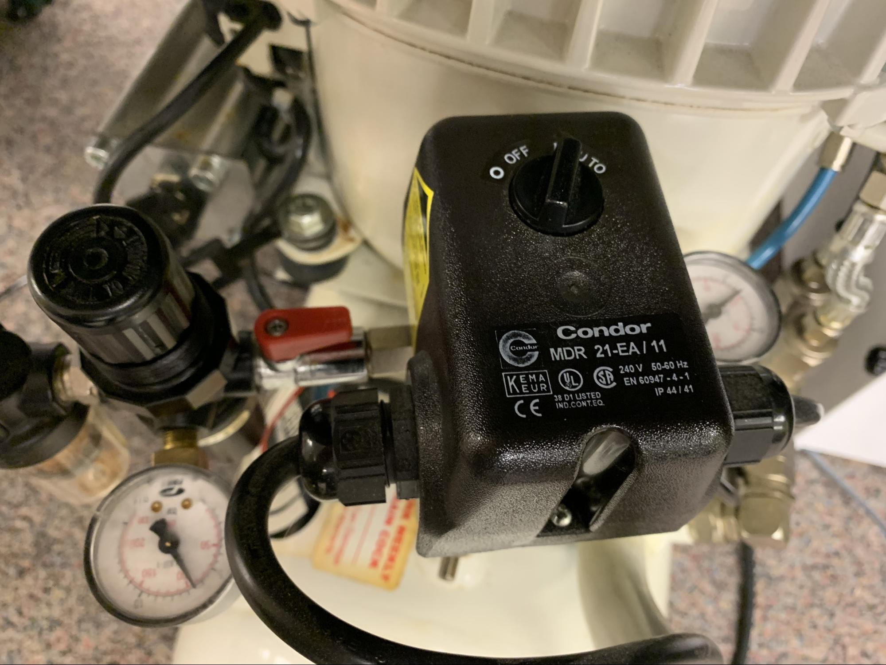

Turn on the air compressor by setting the operating mode to AUTO. Ensure the red valve is in the position shown above (parallel with the piping, not perpendicular) to allow the air to flow.

### Turn on the exhaust system.

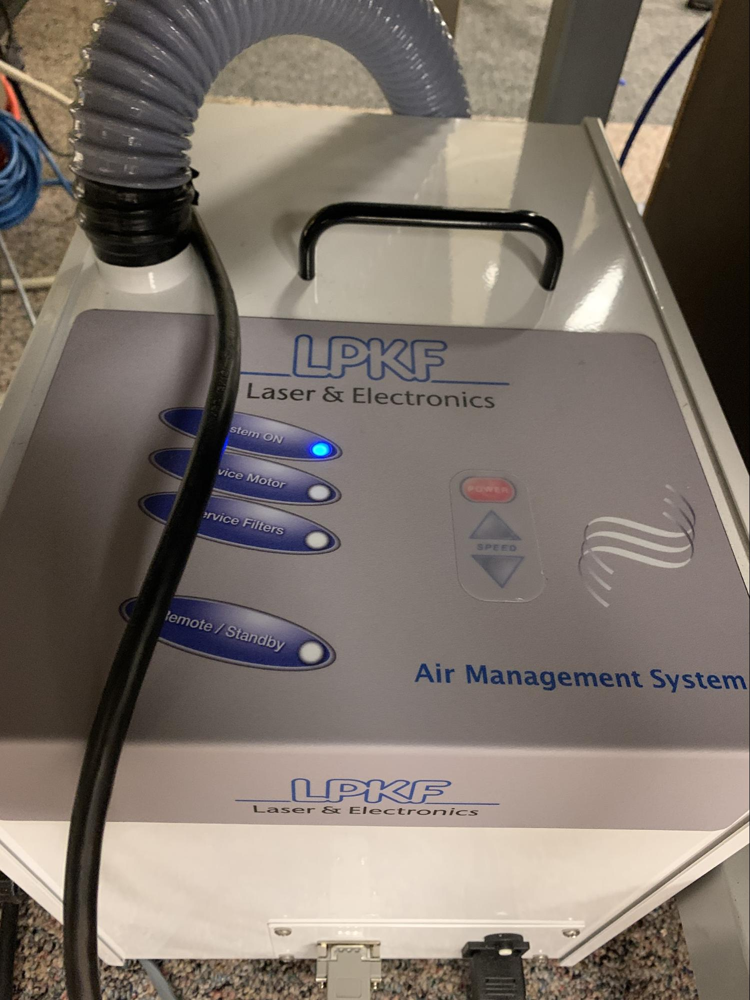

Turn the exhaust system on by pushing the power button until the "System ON" light is on.

### Turn on the S104.

The power switch for the S104 is on the back of the machine.

## Log Into the Host Computer and Connect to the S104

### Log into the host computer.

The log in information should be on the monitor. If it is not, ask a manager on duty.

### Launch LPKF CircuitPro PM 2.7.

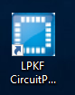

It might ask for your license key. Ask a manager for help if this happens.

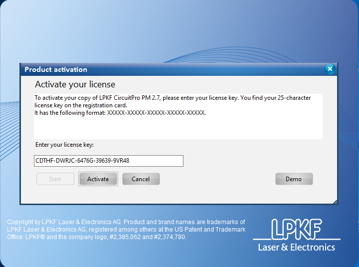

### Connect Circuit Pro to the S104.

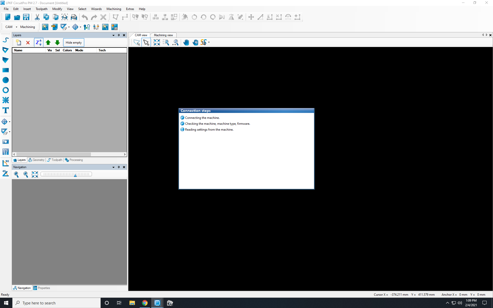

CircuitPro should attempt to connect to the S104 automatically. Be patient, it might take a few minutes. When it has finished connecting, it will go to the template selection menu.

Sometimes, CircuitPro might not attempt to connect to the S104. In that case, it will proceed directly to the template selection menu. We will connect to it manually in a moment.

Choose the appropriate template for your project. This will likely be SingleSided_Top, SingleSided_Bottom, or DoubleSided_NoTHP.

Next we will connect to the S104 manually. Do this by going to the "Machining" drop down menu, selecting "Connect...", and choosing S104 from the following menu.

## Import Your Project Files

For a two-sided board, you will (probably) require 4 files.

### A top Gerber file.
This file describes what parts of the copper on the top of your board will be milled away.
### A bottom Gerber file.
This file describes what parts of the copper on the bottom of your board will be milled away.
### A board outline Gerber file.
This file describes what the boundaries of your board will be - where the cuts that will remove it from the copper blank will be.
### An Excellion drilling file.
This file describes where holes will be drilled in your board.

Next, you will assign your files to the layers of the board.

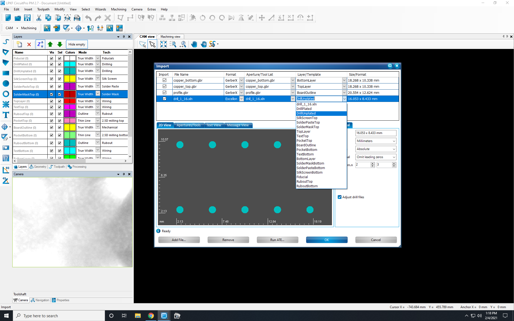

For your top Gerber file, select the "TopLayer" template. For your bottom Gerber file, select the "BottomLayer" template. For your board outline Gerber file, select the "BoardOutline" template. For your Excellion drilling file, select the "DrillUnplated" template. Click OK.

Finally, you need to add fiducials to your project.
Fiducials are holes drilled into your board which are used so the software can determine where your board is after you have flipped it onto the second side. Fiducials are not necessary if your board is single sided, because you won't be flipping it and routing a second side.

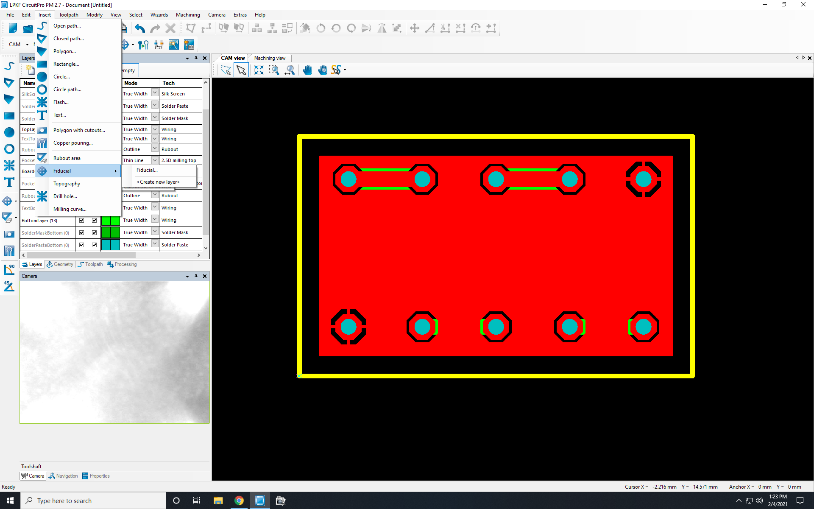

In the CAM view mode, select from the drop down menus "Insert" --> "Fiducial" --> "Fiducial". Now click on 3 points on your project where you have room to add fiducials. Click "Close", not "Apply" when you have added 3 fiducials. If you click "Apply" instead, it will add another fiducial at a random location. If you mistakenly add a fiducial in an unacceptable location, simply undo the action with Control + Z - note that this can only be done once the fiducial insertion tool has been closed.

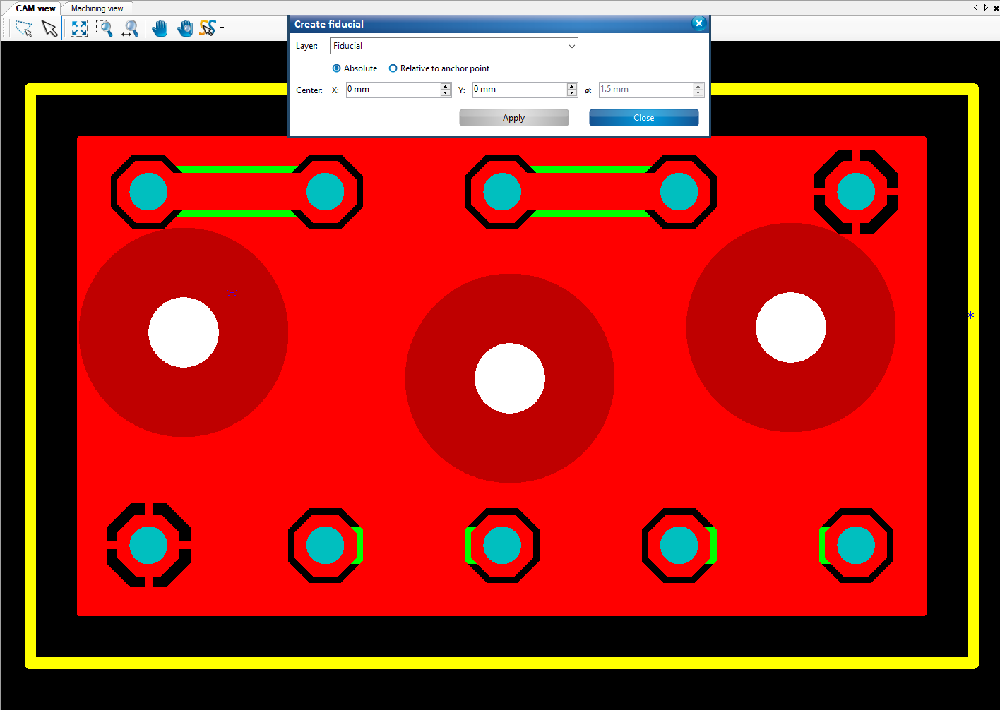

## Generate Your Toolpath

This is where we will set options that determine how the board is physically produced, such as the thickness of the board and the copper plating, as well as the tools being used and therefore the size of the features on the board.

Select from the drop down menus "Toolpath" --> "Technology Dialog"

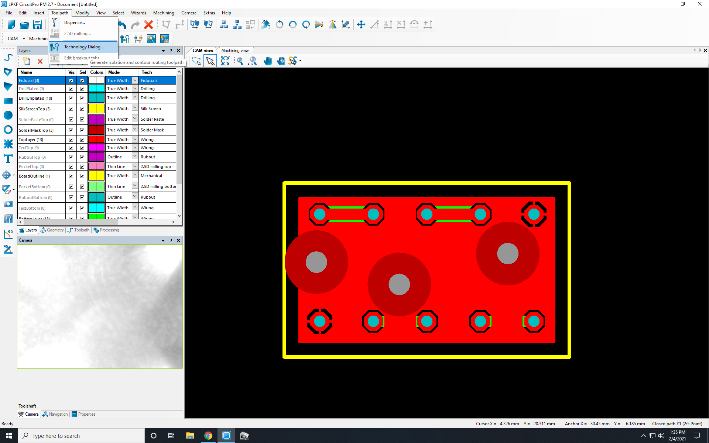

At the top, under Global Processing Settings, ensure the Material Type is set to FR4 copper with a Copper layer thickness of 18 um. Those are the specifications of the PCB blanks sold in the EPL. If you purchased your PCB blank somewhere else, you should enter the dimensions of your actual PCB blank.

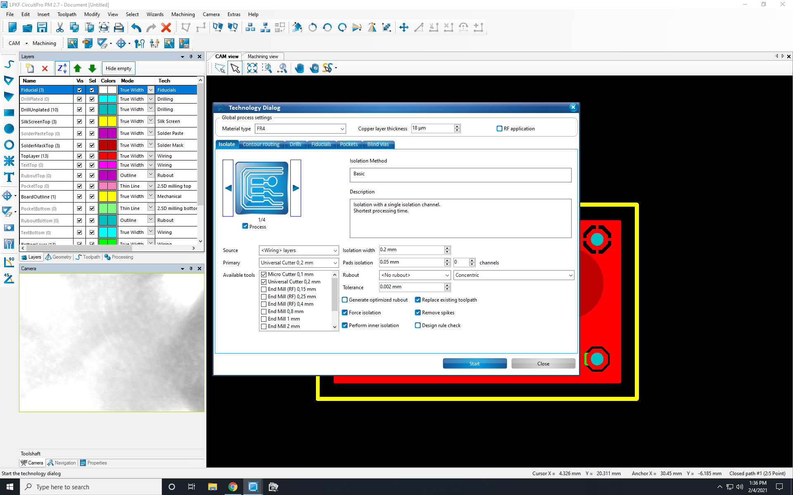

The Isolate settings control how much copper will be removed around your features. Basic, pads double is generally the best choice. If your board does not have spacing closer than 8 mil or 0.2 mm, un-check the Micro Cutter 0.1 mm in the available tools list.

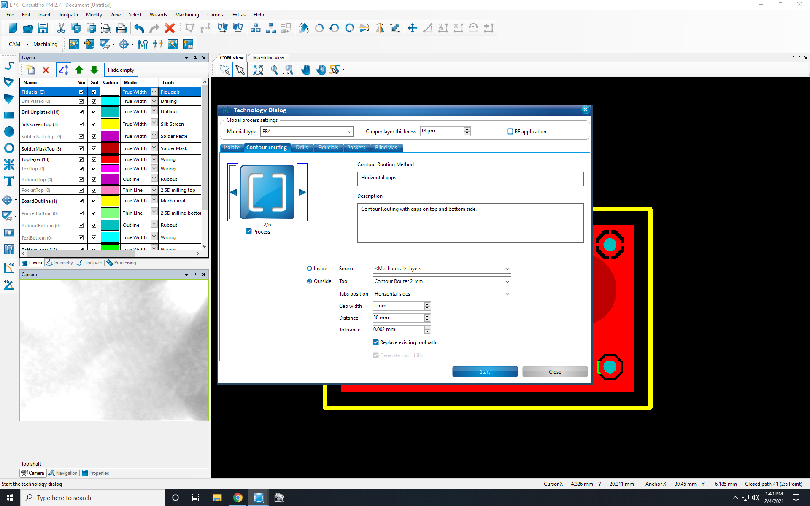

Contour Routing settings control where the breakout tabs on your board will be, so that your board can be removed when it is finished. Horizontal Gaps, Vertical Gaps, or Edge Gaps work best.

Adjust the drills and fiducial settings if necessary. If you don’t have any special considerations for those settings, the defaults should be fine.

### Remove Pocket Processing
Your board probably does not have pockets, so go to the pockets settings and deselect the “Process” box. Pockets are also known as Z-axis milling, and they are used to cut sections of the PCB out. They should not be needed for a one or two sided board.

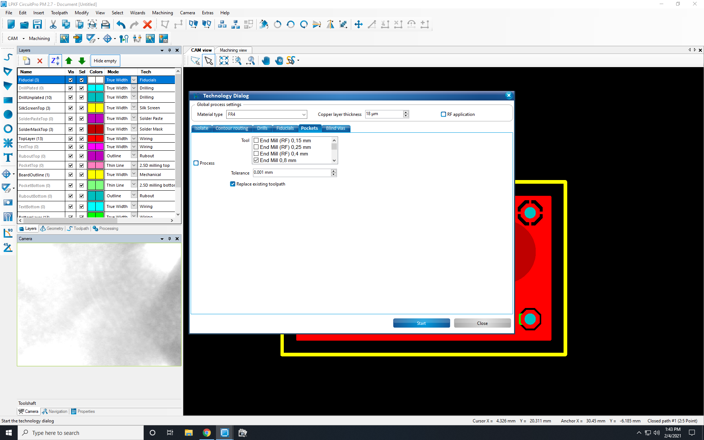

Push the Start button to generate the toolpath. A box will pop up with a summary of the toolpath, including the tools that will be necessary and how many times each will be used. If the results look sane, click close.

If there is a mistake, such as your board has 50 holes in it but a drill is only being used 3 times, it is likely that you made a mistake when assigning layers or de-selected the tool during the technology dialog. Review your layer assignment, then redo the technology dialog process and generate a new toolpath.

## Verify Tool Magazine

In this step, we will make sure the software knows which tools are actually holstered into the tool magazine and therefore available for use.

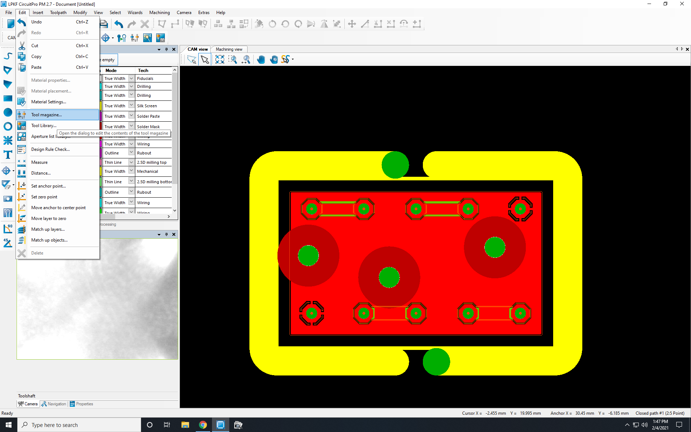

Select the tool magazine from the drop down menu, "Edit" --> "Tool Magazine".

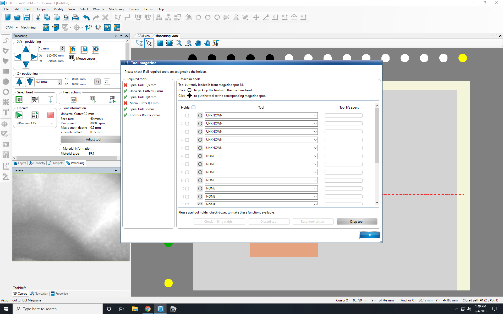

The left-hand side contains a list of the tools required for your toolpath. If any have a red X near them, the machine does not know if it possesses them. It may not have them or the machine may have been improperly shut down at some point, causing it to ‘forget’ what tools are currently loaded in its magazine.
If the bits your tool path requires are not available, ask a manager for help identifying the correct tools. If all is well, click OK.

## Prepare the Cutting Area and Mount Copper Blank

### Make sure the white backing surface is as smooth as possible.

This step is very important. The machine doesn't know where the backing surface actually is beyond what the user tells it, and it assumes it is a perfectly flat plane. Deviations as small as 0.5 mm can cause manufacturing defects which will make your board fail. While no PCB is mounted, open the machine cover and run your hands over the backing surface and feel for any deviations. Blow any debris off the surface, and it is a good idea to smooth it out with a razor blade.

### Mount your PCB blank

Place a flat, untwisted PCB blank with enough room for your board on the backing surface. Take it down in at least two locations to hold it in place during routing. Relying on the backing surface's vacuum is not sufficient to hold it securely. Close the machine cover when you are finished.

### Edit pattern placement on your PCB blank

This is where you tell the S104 where you want it to route your board. You need to be in Machining view to do this. Click the "Machining view" tab at the top of the work area. Click on the artwork representing your circuit and right click to select the contextual menu "Placement." Move the circuit to a location where you have enough PCB blank material to manufacture your circuit.

Next, select the "Mouse Cursor" mode in the left side menu. One at a time, making sure to wait for the machine to finish moving before clicking again, click on each of the four corners of your circuit. Ensure the tool head remains on material for the entire area and that the tool head will not need to cross through tape or any other obstacles while it is routing your PCB.

## Prepare to Process

Go to the "Machining" drop down menu and select "Process All." It will prompt you to mount the PCB blank and tape it down. If you have been following the instructions, you already did that so you can just click OK.

Next, it will prompt you for the location settings of the actual PCB blank. This is telling the machine how much total material is there.

Click to the front left corner of your material. It's ok to tell the machine there is less material available than is actually present, but be careful not to tell the machine you have a larger PCB blank than is physically available. Once the head has navigated to the front left region (the near side of the machine from which the user can access it, or the front side closest to the computer), click the "P1" button. It should shift the copper colored square's top-left anchor to your current mouse mode cursor camera location. Now navigate the machine head to the "rear"-right (away from the user and the computer) of of your material, and click the "P2" button. You should now have a copper rectangle drawn around your circuit's representation.

Click continue.

It will give you an opportunity to adjust your circuit's placement at this point. If you have been following instructions, it should already be within the acceptable work area. If necessary, you can adjust the circuit's location at this time, but afterwards ensure by using the mouse cursor mode on the four corners that it is still within an acceptable part of the PCB blank, without obstructions.

Click continue, and the S104 will begin the manufacturing process.

## Some Common Routing Interrupts

### Test Milling Width

During the machining process, CircuitPro may ask you to test the milling width. Select an area of the board which you do not need to perform the test in, and if necessary, adjust the tool. CircuitPro will probably ask you to adjust the tool more than is necessary. I recommend first trying half of the recommended adjustment and repeating the test if desired.

### Tool Holder Empty
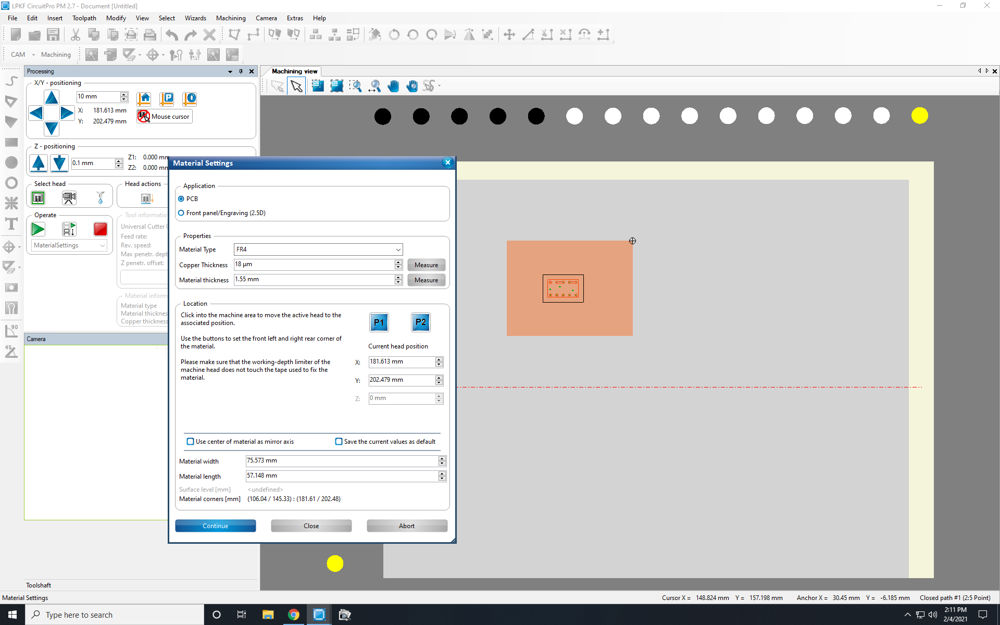

You may get a "Tool holder empty" error during the routing process. This is usually caused by the machine not fully inserting bits it has used into their holders. In this case, simply open the cover and push the loose bit firmly into its holder. Close the machine cover, click "Retry" and it should resume the routing process.

## Fiducial Alignment

You will have to go through fiducial alignment for all double sided boards. Correctly identifying the fiducials is critical to manufacturing your board correctly.

After the first side has been completed, the machine will prompt you to flip the board across its HORIZONTAL line of symmetry. Make sure to secure the PCB blank with tape again after you have flipped it. The machine will then guide you through finding the fiducials with the camera. Keep in mind that the S104's camera is in front of the tool collet. Make sure you are correctly identifying the fiducials, and not other drill holes on the board. If you incorrectly identify the fiducials, the machine will cut the second side offset from the first side, rendering your PCB unusable and requiring you to start the manufacturing process over.

CircuitPro will usually take you to approximately the correct ballpark, but unless you were extremely accurate when you flipped your PCB over you will still have to correctly identify the first fiducial manually with the camera. Use the X and Y camera seek tools in the left side toolbar. The camera will have a targeting reticle the expected size of the fiducials. When you have the camera near a fiducial, click identify and center. The machine will then be able to execute another spiral search to try to find the next fiducial. After you have identified the first fidicual, CircuitPro is much more likely to be able to identify the rest automatically.

PRO TIP: The picture of the machining view is where the S104 is EXPECTING your circuit to be. It is NOT an accurate reflection of where you have flipped your board.

When you have identified all your fiducials, the S104 will continue with the manufacturing process.

## Cleanup

When the S104 is done processing your board, you may remove the tape and remove your PCB blank. If there is any debris remaining, please carefully clean the station. Close the cover, but do NOT power off the S104 yet.

# POWERING OFF THE S104 BEFORE YOU QUIT CircuitPro CAUSES PROBLEMS FOR THE NEXT PERSON.

First, quit CircuitPro. This will properly disconnect the S104. When CircuitPro is done disconnecting the S104, it will quit. At this point it is safe to power off the system in the reverse order from how you turned it on.

### Turn off the S104 on the rear of the machine.
### Switch the exhaust system to Standby
### Turn off the air compressor.

Congratulations, you have (hopefully) successfully routed your PCB!
