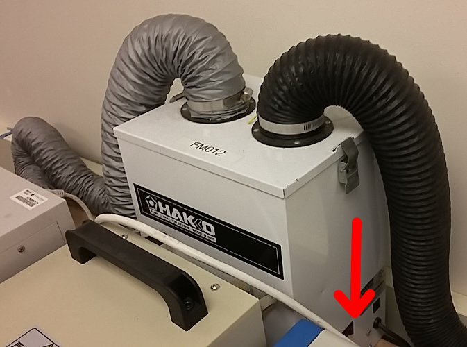
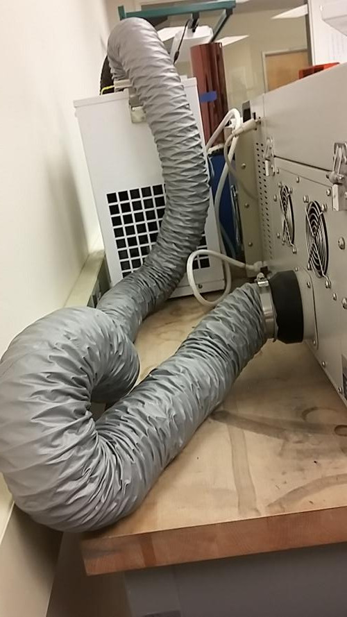

# Overview

The "Torch" reflow oven - worst name for a reflow oven, ever - is a temperature controlled oven used for soldering PCBs that use solder paste and surface mount parts. Essentially, you put solder paste on your PCB, you drop your components on the paste, put it in the oven, let it bring your board up to soldering temperatures, let it cool off, and voila, you have a soldered board.

# Reflow SOP for LEADED solder paste

1. Switch on the oven (switch on back, upper right corner).
1. Turn on the exhaust fan, located next to the oven.
   - 
1. Verify that one of the exhaust fan tubes is placed on the oven's vent on the back side.
   - 
1. Make sure the latch on the left side is closed so the lid is securely down.
1. Open the oven door using the red "Drawer in/out" button
   - 
1. Carefully put your board on the tray, centered on the tray.
1. Close the oven door using the red "Drawer in/out" button
   - **CAREFUL!** Don't let anything pinched, this thing will happily squash fingers.
1. Launch oven control software ("PyTorch").
1. Make sure the 'leaded-profile.prfl' is loaded. You can load other profiles if you want, but of course you need to know what you're doing or you'll, uh, "torch" your board.
1. Select COM 4, if prompted.
1. Hit "Start".
   1. Monitor the red temperature graph - it should basically mirror the green set points.
   1. If you do not see the red temperature graph after hitting the start button, the oven may not be connected. restart the oven and      attemp to connect to the COM port again
1. When the peak temperature is hit, and the temperature starts coming down, twist the latch on the left of the oven, remove the latch, and crack open oven's lid. Hold the lid open until your board is safely under 150 deg C. Then just leave the lid cracked open while the whole thing cools down.
1. When the temperature is less than about 50 deg C, your board is cool enough to move and pick up - the internal temperature of the oven is displayed in red on the front of the oven:
    - 
1. Close up the lid and twist the latch shut.
1. Open the oven door using the red "Drawer in/out" button
1. Remove your board.
1. Repeat the above steps to reflow another board, or shut down the machine
1. When you're done:
   1. Switch off the oven (switch on back, upper right corner).
   1. Switch off the exhaust fan.

# Reflow SOP for RoHS/LEAD-FREE solder paste

Same as above, just select the other reflow profile 

# Reflow Profiles

Reflow profiles are usually customized for each type of board and honed by years of experience working at a SMT contract manufacturer. Although not completely clueless, we don't have anywhere near that kind of experience. The generic reflow profile we created came from the following sources:

- [Berex RF IC's Reflow Soldering Guide](http://www.berex.com/Products/Documents/Guides/BeRex-Reflow_Soldering_Guide_for_Surface_Mount_Device.pdf)
- [Chipquik SMD291AX datasheet](http://media.digikey.com/pdf/Data%20Sheets/Chip%20Quik%20PDFs/SMD291AX(10\).pdf)

... and were shaped by the idea of soaking at a temperature that activates flux but doesn't reflow, and then a quick spike to soldering temperature and then a rapid cool down. Our oven has a maximum temperature rise, so we follow that as closely as possible. In terms of final cool down, we don't have N2 cooling, so all we can do is crack the oven top and let external air cool it down faster.

You can find our profiles here: <https://github.com/psu-epl/torch/tree/master/profiles>

# Python Torch Oven Controller

The software from the Torch Mfg people was... awful. Terrible. Unusable. It was literally the worst software we have ever used from a tool manufacturer, ever. Even more amazingly, it was locked to a USB fob.

After listening in on the modbus serial communication between the PC and the oven, Pat wrote a quick and easy Python GUI that reads in a profile as a CSV file, let's you edit it, and even graphs the temperature in real time. It's an AMAZING and DEAD SIMPLE interface that works brilliantly. Thanks Pat!

The source is [here](https://github.com/psu-epl/torch).

