# SOP under construction

The EPL has the three Oscilloscopes below available for use in the main lab. This page contains a general guide to Oscilloscopes and important information for each one available in the lab. Click the hyperlink to jump to the part of the page with information specific to each oscilloscope.

## Table of Contents
* [Introduction to Oscilloscopes](#introduction-to-oscilloscopes)
  * [DANGER!](#danger)
  * [Scope Probes](#probes)
  * [Reading a simple DC Square Wave Function](#reading-a-simple-dc-square-wave-function)
  * [Measuring a Simple DC Circuit]()
  * [Measuring an AC Waveform]()
  * [Triggers]()
* [Tektronix TDS7254 2.5GHz](#tektronix-tds7254)
* [Tektronix TDS3034 300MHz](#tektronix-tds3034)
* [Tektronix TDS380 400MHz](#tektronix-tds380)

## Introduction to Oscilloscopes
---
[Back to top](#table-of-contents)
 	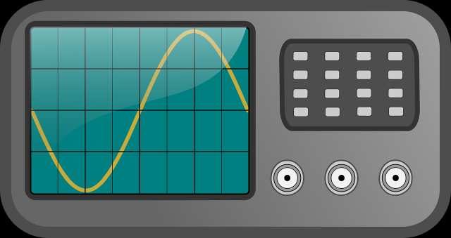

## **DANGER**
Well, not to you but electric measuring equipment is sensitive. Please be careful with the equipment. If it's given respect today it will be there tomorrow when you need it. If you're not sure, ask a manager whether a given oscilloscope will work for your needs.

### Probes
[Back to top](#table-of-contents)

An oscilloscope may be thought of as a sort of [digital multimeter(DMM)](../dmm) with a short term memory. Unlike a DMM, an oscilloscope uses probes as seen in the image below.

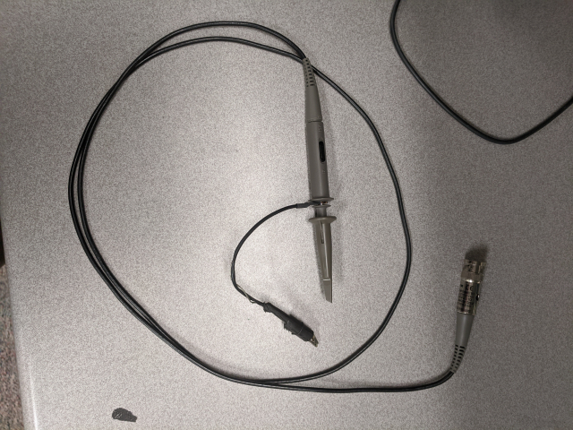

There are other types of probes but this is the most common and works for this guide. There are four key parts to the probe:
  * **Output connection:** A metal connector (usually BNC) connects the probe to one of the four channels on the oscilloscope (refer to images below). 
  * **Cable:** Scope probes use coaxial cable. Make sure the cable is not cut or frayed, this would impact the readings you take with it by changing circuit characteristics.
  * **Handle:** A handle, usually plastic, can be pulled back to expose a springloaded hook. It also has a switch to adjust the impedance of the probe. Generally higher impedance is more desirable so keep it on 10X unless you have a good reason such as needing to measure very low voltage signals.
  * **Ground connection:** A ground jumper with an alligator clip is held in the handle end by a clip and the alligator should be connected to the ground of the circuit you would like to test.

### Reading a simple DC Square Wave Function
[Back to top](#table-of-contents)

The [TDS 3034](#tektronix-tds3034) provides a calibration tool between the inputs for channel 2 and 3. hook up the probe and gorund as shown below.

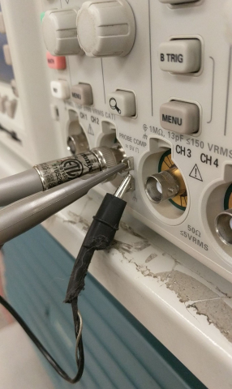

Now turn on the oscilloscope using the power button in the bottom left hand corner of the faceplate. (left and below the screen). After a splash screen you'll be confronted with some warnings. Just ignore the machine's pleas for calibration and press *menu/off* until you see the second image below.

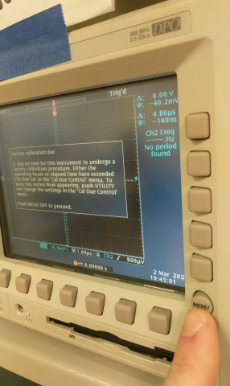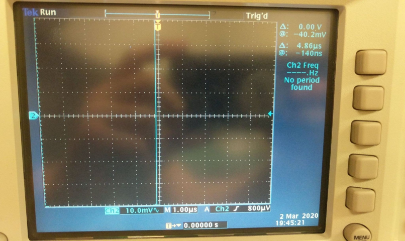

*Notice on the screen and under the black box are some numbers. You should see CH# followed by some voltage (10.0mV~ here) then after the M in this image is "1.00us". The "10.0mV~" refers to the vertical separation of the horizontal dashed grid lines on the screen. So from the top of the screen you can read voltages from 40mV to -40mV. The "1.00us" refers to the separation of the vertical grid lines. So from the left of the screen to the right you can read -10us to 0us.*

At this point the oscilloscope is reading a signal output to the calibration port we've attached the probe to. Let's find the signal and fit it to the window so we can admire it. [on the face panel]() is a knob to adjust the vertical(magnitude/voltage) scale. Our signal should be *5V* but we're working in 10*mV* increments. Turn the knob counter-clockwise to increase the increment we are viewing on the screen. Once you've adjusted it to about *1V* you should se something sort of similar to the image below.

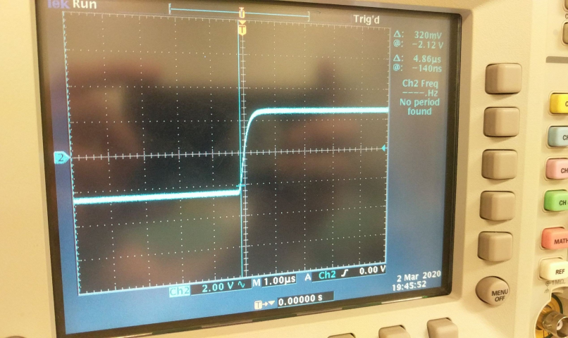
 *notice the 2V increments in the above image.*

Now adjust the [horizontal scale]() until you see something like the image below.

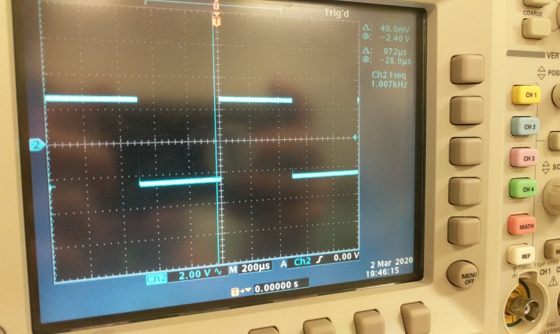
*Note the time scale is now 200us in the image above*

Next try playing around with the horizontal and vertical **position** knobs to see what they do.

### The Trigger
[Back to top](#table-of-contents)

## Tektronix TDS7254
---
[Back to top](#table-of-contents)

 	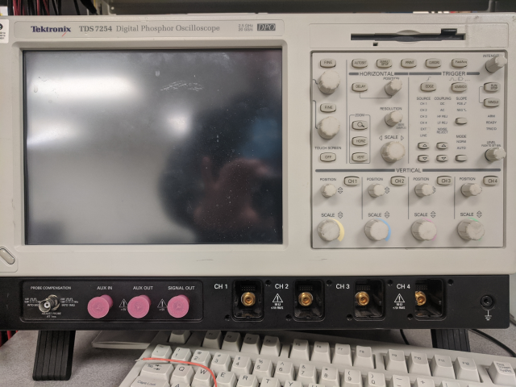

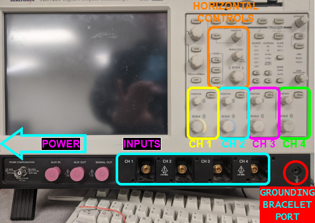

Block of text under construction

## Tektronix TDS3034
---
[Back to top](#table-of-contents)
 	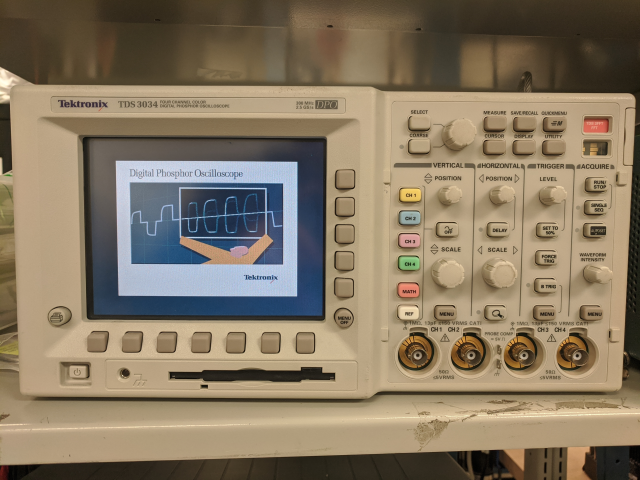

Block of text under construction

## Tektronix TDS380
---
[Back to top](#table-of-contents)
 	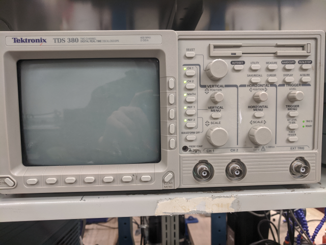

Block of text under construction

